# 卷积神经网络（Convolutional Neural Networks, CNN）
卷积神经网络是一种专为处理网格结构数据（如图像）设计的深度学习模型，通过卷积层提取局部特征、池化层压缩信息，并最终通过全连接层进行分类或回归等任务，广泛应用于图像识别、目标检测等领域。
## 一、概念
* 一类包含卷积计算且具有深度结构的**前馈神经网络**（Feedforward Neural Networks）广泛应用于图像识别和视觉任务，是深度学习（deep learning）的代表算法之一。
* 它通过卷积层、池化层和全连接层的层级结构，自动提取输入数据的局部特征，逐步压缩信息，减少冗余，并提升泛化能力。
* 多层感知机(MLP)的变种，本质是一个多层感知机。成功的原因在于其所采用的局部连接和权值共享的方式：一方面减少了权值的数量使得网络易于优化；另一方面降低了模型的复杂度、减小了过拟合的风险。

## 二、特点：
1. 各层中的神经元是3维排列的：宽度、高度和深度。
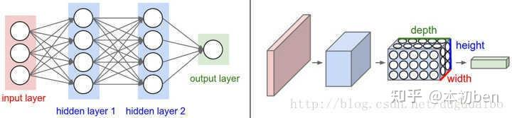
2. 对于输入层：宽度和高度指的是输入图像的宽度和高度，深度代表输入图像的通道数
3. 对于中间层：宽度和高度指的是特征图(feature map)的宽和高，通常由卷积运算和池化操作的相关参数决定；深度指的是特征图的通道数，通常由卷积核的个数决定。

## 三、基本概念
### 3.1 卷积
#### 3.1.1 卷积和卷积核
* 卷积操作其实就是每次取一个特定大小的矩阵**F**（卷积核，即convolutional kernel或**kernel**或**filter**或detector，它可以是一个也可以是多个），然后将其对输入**X**（图中蓝色矩阵）依次扫描并进行内积的运算过程。卷积后的结果**Y**称为特征图(feature map)。
* 卷积操作可以看作是对上一次输入的特征提取，即用来抓取输入中是否包含有某一类的特征。
#### 3.1.2 卷积的计算
##### 单通道单卷积核
得到右边形状为[3,3,1]的卷积特征图
|||
|-|-|
||
##### 单通道多卷积核
得到右边形状为[3,3,2]的卷积特征图
||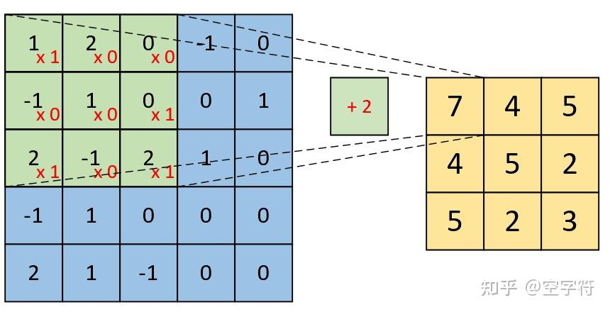||
|-|-|-|
##### 多通道单卷积核
得到右边形状为[3,3,1]的卷积特征图
||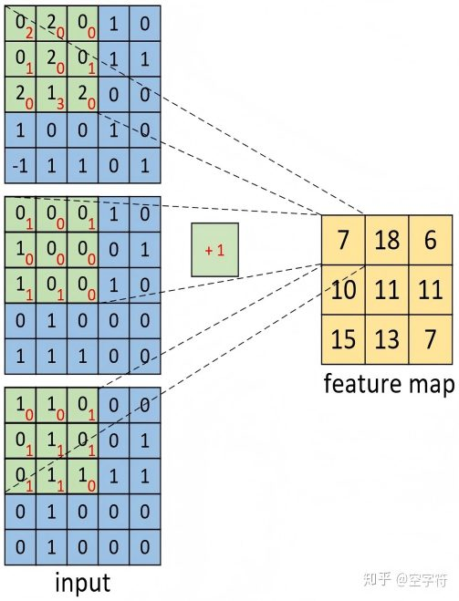|
|-|-|
|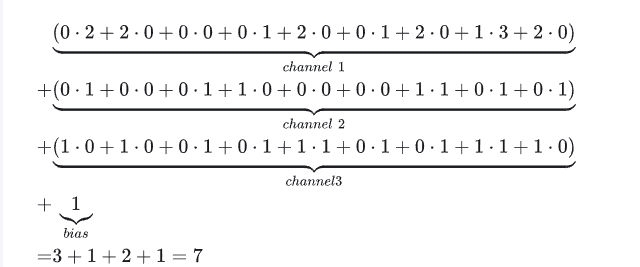|
##### 多通道多卷积核
得到右边形状为[3,3,2]的卷积特征图
||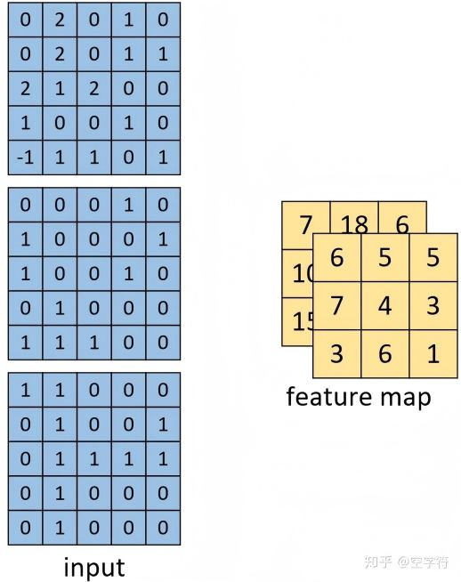|
|-|-|
##### 总结
1. 原始输入有多少个通道，其对应的一个卷积核就必须要有多少个通道。
2. 用k个卷积核对输入进行卷积处理，那么最后得到的特征图一定就会包含有k个通道。
#### 3.1.3 深度卷积
深度卷积就是卷积之后再卷积，然后再卷积。，卷积次数不限。
##### 作用
1. 通常情况下，输入的图像数据都是由一系列特征横向和纵向组合叠加起来的。因此，对于同一层次（横向）的特征我们需要通过多个卷积核对输入进行特征提取；而对于不同层次 **（纵向）的特征** 需要通过**卷积的叠加**来进行特征提取。
2. 对于输入的一张图片，我们可以通过取多次叠加卷积后的结果来进行物体的分类任务。
##### 应用场景
1. 不仅仅是用于图像的特征提取，在**相邻空间位置上具有依赖关系的数据**均可以通过卷积操作来进行特征提取。
2. 图像数据最重要的属性就是相邻位置上的像素之存在着空间上的依赖（space-correlation ）关系。
#### 3.1.4 总结
在卷积神经网络中，对于输入的图像
1. 需要多个不同的卷积核对其进行卷积，来提取这张图像不同的特征（多核卷积）。
2. 同时也需要多个卷积层进行卷积，来提取深层次的特征（深度卷积）。
### 3.2 感受野(Receptive Field)
1. 感受野指的是卷积神经网络每一层输出的特征图(feature map)上每个像素点映射回输入图像上的区域大小。
2.  **感受野的范围可以用来大致判断每一层的抽象层次。** 神经元感受野的范围越大表示其能接触到的原始图像范围越大，也意味着它能学习更为全局，语义层次更高的特征信息；相反，范围越小则表示其所包含的特征越趋向局部和细节。**网络越深，神经元的感受野越大。**

    
    从输入特征图到输出特征图尺寸的计算公式（其中$n_{in}$为输入size，$p$为padding大小，$f$为卷积核size，$s$为卷积步长）
    假设输入大小为5×5，f=3×3，padding为1×1，卷积步长为2×2，那么输出特征图size根据公式可计算为3×3。
    
    感受野的计算公式（其中$RF_{l+1}$为当前特征图对应的感受野大小，也就是我们要计算的目标感受野，$RF_l$为上一层特征图对应的感受野大小，$f_{l+1}$为当前卷积层卷积核大小，最后一项连乘项则表示之前卷积层的步长乘积。）
### 3.3 权值共享
在一个卷积核在和一个n通道的特征图进行卷积运算时，可以看作是用这个卷积核作为一个滑块去“扫”这个特征图，卷积核里面的数就叫权重，这个特征图每个位置是被同样的卷积核“扫”的，所以权重是一样的，也就是共享。
### 3.4 分辨率(Resolution)
* 分辨率是输入模型的图像尺寸，即长宽大小。根据模型下采样次数n和最后一次下采样后feature map的分辨率k×k来决定。
* 从输入r×r到最后一个卷积特征feature map的k×k，整个过程是一个信息逐渐抽象化的过程，即网络学习到的信息逐渐由低级的几何信息转变为高级的语义信息。
* k太大会增加后续的计算量且信息抽象层次不够高，影响网络性能，k太小会造成非常严重的信息丢失。
### 3.5 网络深度(Depth)
神经网络的深度决定了网络的表达能力，早期的backbone设计都是直接使用**卷积层堆叠**的方式，它的深度即神经网络的层数；后来的backbone设计采用了更高效的**module(或block)堆叠**的方式，每个module是由多个卷积层组成，它的深度也可以指module的个数。
### 3.6 网络宽度(Width)
网络的宽度指的是卷积神经网络中最大的通道数，由卷积核数量最多的层决定。
### 3.7 下采样(Down-Sample)
1. 作用：
    1. 减少计算量，防止过拟合
    2. 增大感受野，使得后面的卷积核能够学到更加全局的信息
1. 设计（两种）：
   1. 采用步长(stride)为2的池化层，如Max-pooling或Average-pooling，目前通常使用Max-pooling，因为它**计算简单且最大响应能更好保留纹理特征**。
   2.  采用步长(stride)为2的卷积层，下采样的过程是一个信息损失的过程，而池化层是不可学习的，用stride为2的**可学习**卷积层来代替pooling可以得到更好的效果，当然同时也增加了一定的计算量。
### 3.8 上采样(Up-Sampling)
输入图像通过卷积神经网络(CNN)提取特征后，输出的尺寸会变小，而我们需要将图像恢复到原来的尺寸以便进行进一步的计算。
使图像由小分辨率映射到大分辨率的操作。
实现方法：
 * **插值**，一般使用的是双线性插值，因为效果最好，虽然计算上比其他插值方式复杂，但是相对于卷积计算可以说不值一提；
* **转置卷积**又或是说反卷积，通过对输入feature map间隔填充0，再进行标准的卷积计算，可以使得输出feature map的尺寸比输入更大；
* **Max Unpooling**，在对称的max pooling位置记录最大值的索引位置，然后在unpooling阶段时将对应的值放置到原先最大值位置，其余位置补0。
### 3.9 参数量(Params)
参数量指的**网络中可学习变量的数量**。包括卷积核的权重weight，批归一化(BN)的缩放系数γ，偏移系数β，有些没有BN的层可能有偏置bias，这些都是可学习的参数，即在模型训练开始前被赋予初值，在训练过程根据链式法则中不断迭代更新。
整个模型的参数量主要由卷积核的权重weight的数量决定，参数量越大，则该结构对运行平台的内存要求越高，参数量的大小是轻量化网络设计的一个重要评价指标。
### 3.10 计算量(FLOPs)
神经网络的前向推理过程基本上都是乘累加计算，所以它的计算量也是指的**前向推理过程中乘加运算的次数**，通常用FLOPs(即“每秒浮点运算次数”)来表示，即floating point operations(浮点运算数)。

## 四、卷积结构类型
卷积结构是CNN的重要组成单元。
### 4.1 标准卷积 (Convolution)
即3.1.2写的。标准卷积中每个卷积核都需要与feature map的所有通道进行计算，所以每个卷积核的通道数等于输入feature map的通道数，同时通过设定卷积核的数量可以控制输出feature map的通道数。

- **定义**：最常见的卷积结构，每个卷积核会同时作用于输入特征图的所有通道。  
- **输入输出关系**：  
  - 输入特征图维度：\((1, iC, iH, iW)\)  
  - 卷积核维度：\((1, iC, k, k)\)  
  - 输出特征图维度：\((1, oC, oH, oW)\)，其中 \(oC\) 是卷积核数量。  
- **计算量**：公式为  
  \[
  iC \times k \times k \times oC \times oH \times oW
  \]  
  即通道数 × 卷积核大小 × 卷积核数量 × 输出空间大小。  
- **特点**：能提取跨通道的综合特征，但计算量和参数量较大。

### 4.2 深度卷积 (Depthwise Convolution)
- **定义**：与标准卷积不同，每个卷积核只作用于输入特征图的单个通道，而不是所有通道。  
- **输入输出关系**：  
  - 卷积核维度：\((1, 1, k, k)\)，每个卷积核只对应一个通道。  
  - 卷积核数量：等于输入通道数 \(iC\)。  
  - 输出维度：\((1, iC, oH, oW)\)，通道数保持不变。  
- **不足**：不能改变输出通道数，因此通常在深度卷积后接一个 \(1 \times 1\) 的标准卷积（Pointwise Convolution），形成 **深度可分离卷积 (Depthwise Separable Convolution)**。  
- **计算量**：  
  \[
  k \times k \times iC \times oH \times oW + iC \times 1 \times 1 \times oH \times oW \times oC
  \]  
  相比标准卷积大幅减少，约为普通卷积的 \(\frac{1}{oC} + \frac{1}{k^2}\)。  
- **应用**：这种结构在 **MobileNet V1** 中提出，成为轻量化网络设计的核心方法。
✅ 总结：标准卷积是“所有通道一起处理”，功能强但耗资源； 深度卷积是“每个通道单独处理”，省资源但需要后续融合。
好的，那我来以更学术化、技术化的方式总结这七类卷积结构，不做通俗化比喻：

### 4.3 分组卷积 (Group Convolution)
（顾名思义）
- **定义**：将输入特征图分为 \(g\) 组，每组独立进行卷积。  
- **输出**：各组结果拼接为 \((1, oC, oH, oW)\)。  
- **计算量**：iC/g×k×k×oC×oH×oW。为标准卷积的 \(1/g\)，参数量亦为 \(1/g\)。  
- **问题**：组间信息隔离，需通过 **channel shuffle** 操作增强信息交互。  
- **应用**：AlexNet 首次提出，ShuffleNet进一步优化。

### 4.4  空洞卷积 (Dilated Convolution)
（扩张卷积或者膨胀卷积）
- **定义**：在卷积核中插入空格或在特征图上间隔采样。  
- **特点**：在不增加参数量的情况下**扩大感受野**。  
- **应用**：针对图像语义分割问题中下采样会降低图像分辨率、丢失信息的问题。  
- **参数**：扩张率 (dilation rate) 控制采样间隔，标准卷积对应扩张率为 1。

### 4.5 转置卷积 (Transposed Convolution)
（反卷积(Deconvolution)）
- **目的**：为上采样而生，也应用于语义分割当中
- **定义**：通过在输入特征图中插入零，再进行标准卷积计算。  
- **特点**：实现上采样，输出特征图尺寸增大。  
- **应用**：语义分割、生成模型（如 GAN）中常用。

### 4.6 可变形卷积 (Deformable Convolution)
- **定义**：在卷积核采样点上引入在h和w方向上可学习的偏移量，使采样位置动态调整。  
- **特点**：卷积核可根据输入特征自适应选择采样点，提升对不规则形状的建模能力。  
- **应用**：复杂场景下的目标检测与分割，增强特征提取灵活性。

### 4.7 1×1卷积 (Pointwise Convolution)
- **定义**：卷积核大小为 \(1 \times 1\)，仅在通道维度上进行加权。  
- **作用**：  
  - **降维**：减少通道数，降低计算量。  
  - **升维**：增加通道数，增强表达能力。  
  - **增加非线性**：结合激活函数提升网络复杂度。  
- **应用**：Network in Network 首次提出，后广泛应用于 Inception、ResNet 等结构。
在计算机视觉中，常假设输入为形如\( H \times W \times C\) 的张量，分别代表图像的高、宽和通道数（如RGB图像中的3个颜色通道）。
## 五、卷积神经网络组成
CNN由多个层次组成，每一层执行特定的功能。基本层次包括：输入层、输出层以及隐含层。其中，隐含层包括卷积层（Convolutional Layer）、池化层（Pooling Layer）、全连接层（Fully Connected Layer）、归一化和正则化层（Normalization and Dropout Layers）以及激活函数（Activation）。

### 5.1 池化(pooling)层
通常在连续的卷积层之间会周期性地插入一个池化层（也称“汇聚”层）。作用是**逐渐降低数据体的空间尺寸**，这样的话就能减少网络中参数的数量，使得计算资源耗费变少，也能有效控制过拟合。一般在上采样和下采样的时候用到，没有参数，不可学习。
#### 5.1.1 最大池化(Max Pooling)和平均池化(Mean Pooling)
1. 最大池化,最常见的形式是使用尺寸2x2的滤波器，以步长为2来对每个深度切片进行降采样，将其中75%的激活信息都丢掉。对更大感受野进行池化需要的池化尺寸也更大，而且往往对网络有破坏性。
2. 平均池化现在已经很少使用了。最大池化的效果比平均池化要好。
  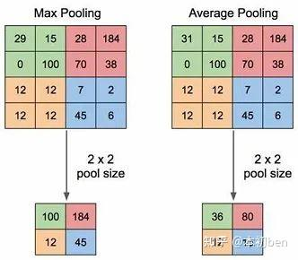
3. 池化层的反向传播：在反向传播时，梯度只会传递给这个最大值所在的位置，而其他位置的梯度为零。为了实现这一点，前向传播时会记录最大值的索引（页面中称为“道岔 switches”），这样在反向传播时就能快速把梯度路由到正确的位置。这种机制保证了训练过程的高效性，同时避免了梯度在错误位置传播。
4. 弃用池化层的趋势：一些研究认为池化操作并非必要，可以用步长较大的卷积层替代，从而完成降采样。尤其在生成模型（如 VAE、GAN）中，弃用池化层有助于保留更多信息。未来的卷积神经网络可能会减少甚至完全不使用池化层，而是依赖卷积层（stride 卷积、全局平均池化等）来实现特征压缩与抽象。
#### 5.1.2 全局平均池化(Global Average Pooling)
对一个维度为(C,H,W)的feature map，在H和W方向整个取平均，然后输出一个长度为C的向量。一般在分类模型的最后一个feature map之后出现，然后接一个全连接层就可以完成分类结果的输出了。会使计算量降低到了原来的1/HW。
### 5.2 全连接(Full Connected)层
1. 本质：矩阵乘法再加上偏差
2. 过程：输入一个(B, iC)的数据，权重为(iC, oC)，则输出为(B, oC)
3. 应用：多层感知机和分类模型最后一层
### 5.3 shortcut：Addition / Concatenate分支
1. Addition：两个**相同维度**的feature map相同位置点的值直接相加，得到新的相同维度feature map。**融合之前的特征，增加信息的表达**。
2. Concatenate：只要求两个feature map的**HW相同**，通道数可以不同，然后两个feature map在通道上直接拼接，得到一个更大的feature map。**保留了一些原始的特征，增加了特征的数量**，使得有效的信息流继续向后传递。
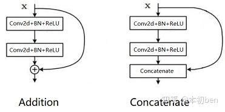
### 5.4 Channel shuffle
针对分组卷积中不同组之间信息不流通，对不同组的feature map进行混洗的一个操作，使得不同组的feature map间隔保存，增强了信息的交互。
### 5.5 常用激活函数
激活函数的非线性是神经网络发挥作用最重要的因素之一。
#### 5.5.1 ReLU系列（主要指常用的ReLU，ReLU6和leaky ReLU）
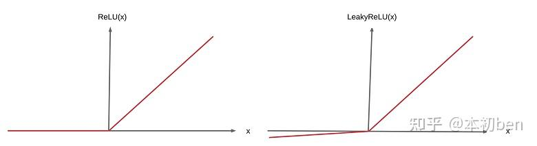
#### 5.5.2 Sigmoid系列（Logistic函数）

1. 优点是平滑、易于求导.
2. 缺点是激活函数计算量大，反向传播求误差梯度时，求导涉及除法，反向传播时，很容易就会出现梯度消失的情况，从而无法完成深层网络的训练。
3. 解决计算量大对低性能硬件不友好问题：h-sigmoid和h-swish函数
### 5.6 Dropout
1. 概念：在深度学习网络的**训练**过程中，对于神经网络单元，按照一定的概率将其**暂时**从网络中丢弃。当进行测试和推理时，Dropout将不起作用。
2. 作用：
   1. CNN中防止过拟合提高效果的一个重要方法。
   2. 由于神经元是随机选择的，所以可以减少神经元之间的相互依赖，从而确保提取出相互独立的重要特征。
3. 深度学习中抑制过拟合的方法：
     1. 加入正则化项——L1和L2正则化（不了解的可以参考文章： L1正则化和L2正则化 ）
     2. 提前终止(early stopping)训练（当验证集上的效果变差的时候）
     3. 参数绑定与参数共享（如CNN和RNN中都有用到参数共享
     4. Dropout
     5. Batch Normalization
     6. bagging等集成方法
### 5.7 Batch Normalization（BN）
1. 目标：解决以前的model training因一些系统性的问题导致很多算法收敛速度都非常慢，甚至根本就不能工作的问题。
   1. 解决Internal Covariate shift（ICS）：一个神经元输出的数据分布发生改变一定会使其他神经元跟着改变，这样相互影响的调参很容易使调参过程乱套。
   2. 解决上一层输出值太大或太小，其经过sigmoid激活函数时会落在饱和区域，反向传播会有梯度消失的问题。
2. 位置：通常添加在每个神经网络层和激活层之间。
3. 作用：对神经网络层输出的数据分布进行统一和调整，变成均值为0方差为1的标准正态分布,使输出位于激活层的非饱和区，达到加快收敛的效果。
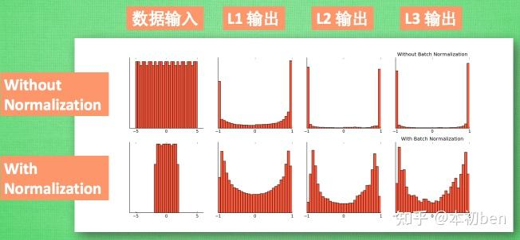
4. 算法
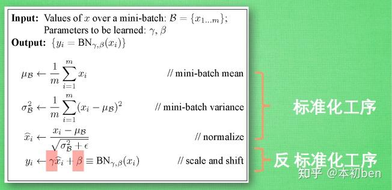
反标准化工序，即对标准化后的数据再扩展和平移。扩展参数γ和平移参数β是**可学习**的，能够让模型在训练过程中自己去修改，这样神经网咯就能够自己琢磨出前面的标准化工序有没有起到优化的作用，如果没有，就可以通过调整γ和β参数来在一定程度上抵消标准化操作。
5. Layer Normalization(LN)
另一个常见的深度学习标准化方法，和BN的主要区别在于Normalize的方向不同。
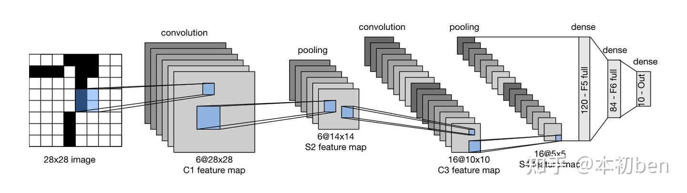
LN用于RNN效果比较明显，但是在CNN上最常用的还是BN。

## 六、经典CNN网络
### 6.1 [LeNet-5](https://link.zhihu.com/?target=http%3A//yann.lecun.com/exdb/lenet/)
LeNet-5是第一个成功的卷积神经网络应用，是Yann LeCun在上世纪90年代实现的。它由两个卷积层组成和三个全连接层组成，组合使用卷积层、非线性激活函数和汇聚层。
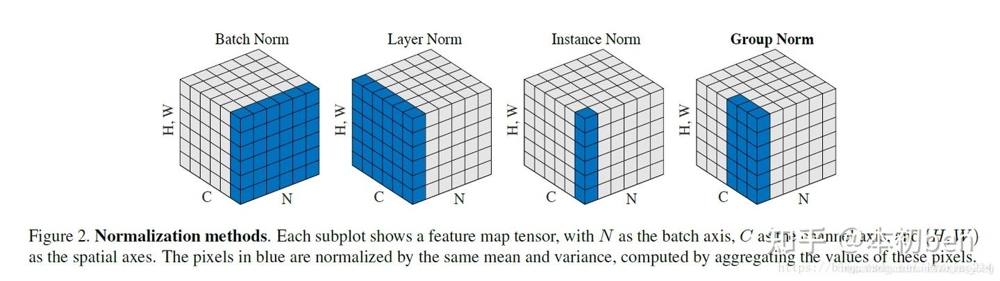
在小数据集上取得了很好的效果。
### 6.2 [AlexNet](https://link.zhihu.com/?target=https%3A//papers.nips.cc/paper/4824-imagenet-classification-with-deep-convolutional-neural-networks)
AlexNet是第一个在大规模视觉竞赛中击败传统计算机视觉模型的大型神经网络，它使得卷积神经网络在计算机视觉领域中备受欢迎。
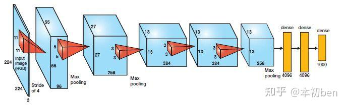
特点：
1. 网络的结构和LeNet非常类似，但是更深更大，并且使用了层叠的卷积层来获取特征（之前通常是只用一个卷积层并且在其后马上跟着一个汇聚层）；
2. 由八层组成——五个卷积层、两个全连接隐藏层和一个全连接输出层；
3. 使用ReLU而不是sigmoid作为其激活函数；
4. 在全连接层处使用了Dropout来抑制过拟合。

没有提供一个通用的模板来指导后续的研究人员设计新的网络。 
### 6.3  [VGG](https://link.zhihu.com/?target=https%3A//arxiv.org/abs/1409.1556)
用于设计深层神经网络的启发式概念。
使用块的想法，通过使用循环和子程序，可以很容易地在任何现代深度学习框架的代码中实现这些重复的结构。
结构特点：
1. VGG16相比AlexNet的一个改进是**采用连续的几个3x3的卷积核**代替AlexNet中的较大卷积核（11x11，5x5）。对于给定的感受野（与输出有关的输入图片的局部大小），采用堆积的小卷积核是优于采用大的卷积核，因为多层非线性层可以增加网络深度来保证**学习更复杂的模式**，而且代价还比较小（参数更少），即深层且窄的卷积（即3×3）比较浅层且宽的卷积更有效。
2. VGG使用**可复用的卷积块构造网络**。不同的VGG模型可通过每个块中卷积层数量和输出通道数量的差异来定义。块的使用导致网络定义的非常简洁。使用块可以有效地设计复杂的网络。
### 6.4  [NiN（Network in Network）](https://link.zhihu.com/?target=http%3A//arxiv.org/abs/1312.4400)
先前的LeNet、AlexNet 和 VGG 都有一个共同的设计模式：通过一系列的卷积层与汇聚层来提取空间结构特征；然后通过全连接层对特征的表征进行处理。AlexNet 和 VGG 对 LeNet 的改进主要在于如何扩大和加深这两个模块。
NiN 提供了一个非常简单的解决方案：**在每个像素的通道上分别使用多层感知机**。提出了1×1卷积和全局平均池化(GAP)。
结构特点：
1. NiN使用由**一个卷积层和多个1×1卷积层组成的块**。该块可以在卷积神经网络中使用，以允许更多的每像素非线性；
2. NiN去除了容易造成过拟合的全连接层，将它们替换为**全局平均池化层**（即在所有位置上进行求和）。移除全连接层可**减少过拟合**，同时显著**减少NiN的参数**。
### 6.5 [GoogleNet](https://link.zhihu.com/?target=https%3A//arxiv.org/pdf/1409.4842v1.pdf)
GoogLeNet吸收了NiN中串联网络的思想，并在此基础上做了改进。**解决了什么样大小的卷积核最合适的问题**。本文的一个观点是，有时使用不同大小的卷积核组合是有利的。
1. GoogleNet设计了一种称为 Inception 的基本卷积模块。Inception块由**四条并行路径组成**。前三条路径使用窗口大小为 1X1、3X3 和5X5 的卷积层，从不同空间大小中提取信息。中间的两条路径在输入上执行 1X1卷积，先减少通道数，从而降低模型的复杂性。然后使用3X3(5×5)卷积增加通道数。这四条路径都使用合适的填充来使输入与输出的高和宽一致，最后将每条线路的输出在通道维度上连结，并构成Inception块的输出。在Inception块中，通常调整的超参数是每层输出通道的数量。每条路径的通道数不尽相同。
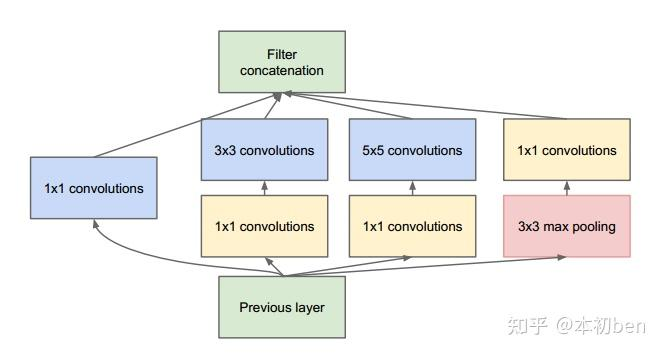
2. GoogLeNet 一共使用 9 个Inception块和全局平均汇聚层的堆叠来生成其估计值。Inception块之间的最大汇聚层可降低图片大小维度。 第一个模块类似于 AlexNet 和 LeNet，Inception块的栈从VGG继承，全局平均汇聚层避免了在最后使用全连接层。
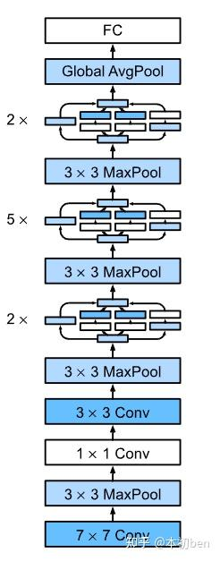
结构特点：
1. Inception 块相当于一个**有4条路径的子网络**。它通过不同窗口形状的卷积层和最大汇聚层来并行抽取信息，并使用 1×1卷积层减少每像素级别上的通道维数从而降低模型复杂度。
2. GoogleNet在最后使用了**全局池化层**，来代替全连接层（最后的全连接输出层仍保留），减少模型的参数量，抑制过拟合。
3. GoogLeNet将**多个设计精细的Inception块**与其他层（卷积层、全连接层）串联起来。其中Inception块的通道数分配之比是在 ImageNet 数据集上通过大量的实验得来的。
4. GoogLeNet 和它的后继者们一度是 ImageNet 上最有效的模型之一：它以**较低的计算复杂度提供了类似的测试精度**。
### 6.6 [ResNet](https://link.zhihu.com/?target=https%3A//arxiv.org/abs/1512.03385)
随着网络深度增加,会出现一个是随着层数的增加出现的梯度消失问题，二是网络更深时意味着参数空间更大，优化问题变得更难。
残差网络ResNet设计一种残差模块让我们可以训练更深的网络。
核心思想：**残差连接机制**。每个附加层都应该更容易地包含原始函数作为其元素之一。在残差块中，输入可通过跨层数据线路更快地向前传播。
结构特点：
1. 利用残差块（residual blocks）可以训练出一个有效的深层神经网络：输入可以通过层间的残余连接更快地向前传播。
2. ResNet在每个卷积层和ReLU激活层之间添加了**Batch Normalization层**，缓解梯度消失问题，加快模型收敛。
3. 学习嵌套函数（nested function）是训练神经网络的理想情况。在深层神经网络中，学习另一层作为恒等映射（identity function）较容易（尽管这是一个极端情况）。
4. 残差映射可以更容易地学习同一函数，例如将权重层中的参数近似为零。
### 6.7 [DenseNet](https://link.zhihu.com/?target=https%3A//arxiv.org/pdf/1608.06993.pdf)
稠密连接网络（DenseNet）在某种程度上是 ResNet 的逻辑扩展。ResNet 和 DenseNet 的关键区别在于，DenseNet 输出是连接（而不是如 ResNet 的简单相加。
结构特点：
1. 在跨层连接上，不同于 ResNet 中将输入与输出相加，稠密连接网络（DenseNet）在通道维上连结输入与输出。
2. DenseNet 的主要构建模块是稠密块（dense block）和过渡层（transition layer）。
3. 在构建 DenseNet 时，我们需要通过添加过渡层来控制网络的维数，从而再次减少信道的数量。
### 6.8 总结
1. AlexNet，它是第一个在大规模视觉竞赛中击败传统计算机视觉模型的大型神经网络；
2. 使用重复块的网络（VGG）。它利用许多重复的神经网络块和小卷积核的有效性；
3. 网络中的网络（NiN）。它重复使用由卷积层和1×1卷积层来构建深层网络；同时使用全局平均池化层替代全连接层；
4. 含并行连结的网络（GoogLeNet）。它使用并行连结的网络，通过不同窗口大小的卷积层和最大汇聚层来并行抽取信息；
5. 残差网络（ResNet）。它通过残差块构建跨层的数据通道，是计算机视觉中最流行的体系结构；
6. 稠密连接网络（DenseNet）。它的计算成本很高，但给我们带来了更好的效果。

## CNN网络架构(backbone)设计思路
根据具体任务的数据集特点以及相关的评价指标来确定一个网络结构的输入图像分辨率，深度，每一层宽度，拓扑结构等细节。
1. 层的排列规律
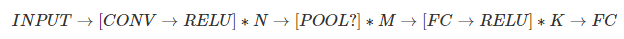
2. 卷积层的大小选择
几个小滤波器卷积层的组合比一个大滤波器卷积层好
3. 层的尺寸设置规律
     1. 输入层 ，应该能被2整除很多次。
     2. 卷积层 ，应该使用小尺寸滤波器（比如3x3或最多5x5），使用步长S=1。对输入数据进行零填充。P=(F-1)/2。
     3. 汇聚层 ，负责对输入数据的空间维度进行降采样。最常用的设置是用用2x2感受野（即F=2）的最大值汇聚，步长为2（S=2）。

## 参考学习链接
1. （2023-12-11）[【综述】一文读懂卷积神经网络(CNN) ](https://zhuanlan.zhihu.com/p/561991816)
2. （2022-08-26）[原来卷积是这么计算的](https://zhuanlan.zhihu.com/p/268179286?ivk_sa=1024320u)
3. （2025-05-21）[卷积神经网络](https://baike.baidu.com/item/%E5%8D%B7%E7%A7%AF%E7%A5%9E%E7%BB%8F%E7%BD%91%E7%BB%9C/17541100)
4. （2025-12-05）[卷积神经网络（CNN）全面解析 - 实践
](https://www.cnblogs.com/ljbguanli/p/19310072)