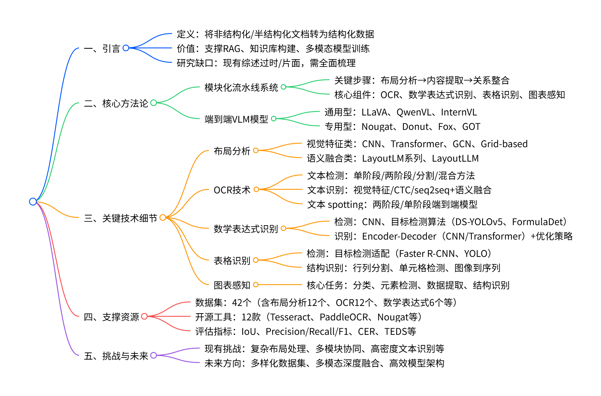
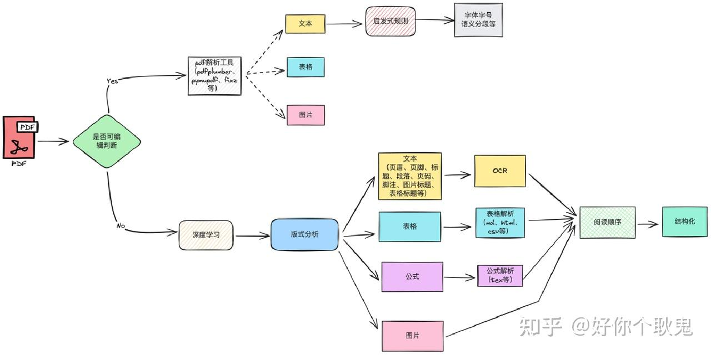

# 文档布局分析（DLA）
## 学习
### 2025-11-25
1. (2025-01-17)对主流两大类文档解析技术的介绍：模块化 pipeline 系统和基于大型视觉-语言模型的端到端处理方法。https://zhuanlan.zhihu.com/p/18834545888 
 （原文应该得是2024年11月7日了）
    
    * 模块化 pipeline 系统将文档解析任务拆分为多个独立阶段，每个阶段针对特定的功能和任务。
      * 布局分析（Layout analysis）
      * 内容提取：
        * 光学字符识别（Optical Character Recognition, OCR）技术：将文档图像转换为机器可读文本的核心。
        * 数学表达式的识别与检测旨在识别和解释文档中的数学符号。
        * 图表处理：任务包括图表分类、元素识别和数据提取等。
      * 关系整合：在保持元素间空间和语义关系的基础上，将提取的文本、表格和图表等元素进行整合。
      > 大型文档提取模型（DELMs）
    * 端到端视觉-语言模型（VLMs）则致力于通过多模态大模型统一处理任务，从而简化文档解析流程。
### 2025-11-26  
1. (2025-03-29) 探讨文档解析的终极形态——基于多模态大模型（VLM）的解析技术，包括Mistral-OCR、OlmOCR等前沿工具的实现与实践，并展望该领域的技术发展趋势，和对于RAG的影响。https://zhuanlan.zhihu.com/p/29761721645
    文章一个观点：既有的复杂解析架构逐渐失去存在价值，也被端到端范式所取代。 
    1. 根据benchmark和实际测试结果，目前几个值得关注的开源VLM：
    * Qwen2.5-VL
    * Phi-4-multimodal
    * Llama 3.2 Vision
    * olmocr
    2. 当前基于VLM的方案依旧存在一些问题：在不同领域和场景下的文档处理中，需要调整解析的prompt或增加相应的LLM优化内容。这些prompt或工作流通常是定制化的，缺乏良好的泛化能力

2.（2025-04-16）智能文档解析综述：结构化信息提取的技术、挑战与前景https://arxiv.org/abs/2410.21169
 
3.  (2025-10-09)介绍阿里的Logics-Parsing。https://zhuanlan.zhihu.com/p/1959728920111879603
    具体实现没细看，用了下他给的演示，感觉和MonkeyOCR效果差不多，感觉更好一点？不过MonkeyOCR尝试了章节标题的分级，这个没有。识别内容准确度哪个更好不知道，但那个跨页的表格识别上，阿里这个效果感觉更好一点。
    采用了两阶段先SFT后RL的训练策略以确保模型的有效性。
        首先，通过将普通文本、数学公式、表格、化学公式和手写汉字等多种数据类型纳入训练，使用超过30万张高质量的页面级文档图像对Qwen2.5-VL-7B 进行微调。
        其次，通过布局感知的多组件奖励机制，强制模型在识别出的布局下遵循自然的阅读顺序，显著提升了模型在多栏报纸和海报等复杂布局上的性能。
4. (2025-07-18)字节的Dolphin。https://mp.weixin.qq.com/s?__biz=MzU4MzU2MDg0NA==&mid=2247488679&idx=1&sn=28b984716be16ccc412813c86230e943&scene=21&poc_token=HEv9JmmjEhXrvUbLVWypXcNfsnTIQhy78ezE-cTw        

5. (2024-07-30)文档解析的技术路线以及痛点 。https://zhuanlan.zhihu.com/p/711144228
  
 痛点：版式，表格，公式，阅读顺序。

 ### 2025-11-27
1. (2025-09-10)TextIn vs. DeepDoc性能测评：RAGFlow解析 https://www.xiaohongshu.com/explore/68c0e9dd000000001c0064a2?app_platform=android&ignoreEngage=true&app_version=9.10.0&share_from_user_hidden=true&xsec_source=app_share&type=normal&xsec_token=CBjdwsbnd93id0KdFIZaxP_znKO1YjOwxc4WnhiqzTqDI=&author_share=1&xhsshare=WeixinSession&shareRedId=ODhGODU4STo2NzUyOTgwNjY2OTpHODc-&apptime=1764207422&share_id=9da8a66cf3294f0396c65368e053752f&share_channel=wechat
（似乎不开源，遂放弃）
2. （2025-10-02）MinerU2.5源码拆解：双后端架构设计与企业 https://www.xiaohongshu.com/explore/68de97f10000000004007e89?app_platform=android&ignoreEngage=true&app_version=9.10.0&share_from_user_hidden=true&xsec_source=app_share&type=normal&xsec_token=CB3DPycnL3Hnnu_OYHeg9I7XAYv5tEIoW4Sz9VXGf4a4c=&author_share=1&xhsshare=WeixinSession&shareRedId=ODhGODU4STo2NzUyOTgwNjY2OTpHODc-&apptime=1764207507&share_id=090b14d5a6984c828857d640314d6e89&share_channel=wechat
（感觉两阶段分析有点成为趋势？看的几个比较新的开源模型都是先解析文档结构再根据分类结果解析具体内容两个阶段。）
3. (2025-11-05)开源OCR模型对比分析报告【基于多模态大模型】https://zhuanlan.zhihu.com/p/1969342407054197277

### 2025-12-02
1. (2024-05-18)[NLP] 自然语言处理 --- NLP入门指南https://blog.csdn.net/zwqjoy/article/details/103546648
NLP技术（Natuarl Language Processing）：自然语言处理，计算机如何准确并快速地处理大量的自然语言语料库。

3. （2025-05-22）在机器学习领域“token”到底是什么意思?https://zhuanlan.zhihu.com/p/667023483
Token:词元”，它是语言类模型中用数字来表示单词的最小语义单位。
4. （2022-09-25）什么是token？https://blog.csdn.net/sunyctf/article/details/126509232
作为计算机术语时，是“令牌”的意思。Token是服务端生成的一串字符串，以作客户端进行请求的一个令牌，当第一次登录后，服务器生成一个Token便将此Token返回给客户端，以后客户端只需带上这个Token前来请求数据即可，无需再次带上用户名和密码。token其实说的更通俗点可以叫暗号。
5. （2023-10-09）一文搞懂prompt https://zhuanlan.zhihu.com/p/652632988
在人工智能（AI）领域中，"prompt" 是指向模型提供输入以引导其生成特定输出的文本或指令。它是与模型进行交互时用户提供的文本段落，用于描述用户想要从模型获取的信息、回答、文本等内容。Prompt 的目的是引导模型产生所需的回应，以便更好地控制生成的输出。
6. 什么是 URL？https://developer.mozilla.org/zh-CN/docs/Learn_web_development/Howto/Web_mechanics/What_is_a_URL
 统一资源定位符（URL），是因特网中的唯一资源的地址。它是浏览器用于检索已发布资源（例如 HTML 页面、CSS 文档、图像等）的关键机制之一。
7. (2024-12-16)使用Python自动识别和合并PDF中的跨页表格https://blog.csdn.net/weixin_44733966/article/details/140347225
 跑了一下他的代码，跨页表格合并效果不是特别理想，识别表格应该还可以。

### 2025-12-04
1. (2020-03-27)理解python中的self，这一篇就够了 https://blog.csdn.net/luanfenlian0992/article/details/105146518
self 就是指实例本身，self.name就是Student类的属性变量，是Student类所有。而 self.__ class __ 则指向类。
在Python中
    1. 实例的变量名如果以__开头，就变成了一个私有变量（private）
    2. 变量名类似__ xxx __的，也就是以双下划线开头，并且以双下划线结尾的，是特殊变量，特殊变量是可以直接访问的，不是private变量，所以，不能用__name __、 __score __这样的变量名
    3. 看到以一个下划线开头的实例变量名，比如_name，这样的实例变量外部是可以访问的，但是，按照约定俗成的规定，当你看到这样的变量时，意思就是，“虽然我可以被访问，但是，请把我视为私有变量，不要随意访问”。

    self 在定义时不可以省略。当然，如果我们的定义和调用时均不传类实例是可以的，这就是类方法。
2. Python 为初学者解释’self’变量 https://geek-docs.com/python/python-ask-answer/527_python_explaining_the_self_variable_to_a_beginner.html
’self’变量允许我们在方法定义中访问对象的属性和其他方法。通过’self’，我们能够在类内部引用和操作对象的数据，以及在对象中引用自身的属性和方法。

## 调研
1. MonkeyOCR v1.5 
    1. 对文字、公式和表格的识别精确度还可以，但无法识别合并跨页内容。
    2. 对部分标题属于几级标题的分析会出错。
    3. 嵌套表格不涉及跨页还能识别，跨页了识别就会出错。
    4. 运行速度较快，解析一个几十页的文档仅需几分钟。
    5. 只能处理pdf或图片，输出为markdown和JSON
2.  MinerU2.5 目前来说比FluxOCR和MonkeyOCR v1.5的效果更好
    1. 支持处理三页跨页文档
    2. 在表格识别上存在问题，对于复杂表格处理会出现问题，比如说上下两行单元格数量不同，生成的表格就会与原格式不同，不对齐。无法处理所有跨页表格的情况。
    3. 无法实现跨页文本合并。

3. Qwen2.5-VL
https://github.com/jzh15/Qwen2.5-VL

1. FluxOCR
    1.  在提取文字、表格内容上的准确性很高，不论是分栏还是跨页，还有页面边竖着的文字都能较好地处理识别。
    2.  不过在跨栏且中间有图片解释干扰时识别就会出现一点问题。
    3.  跨页表格只能合并部分
2. 

