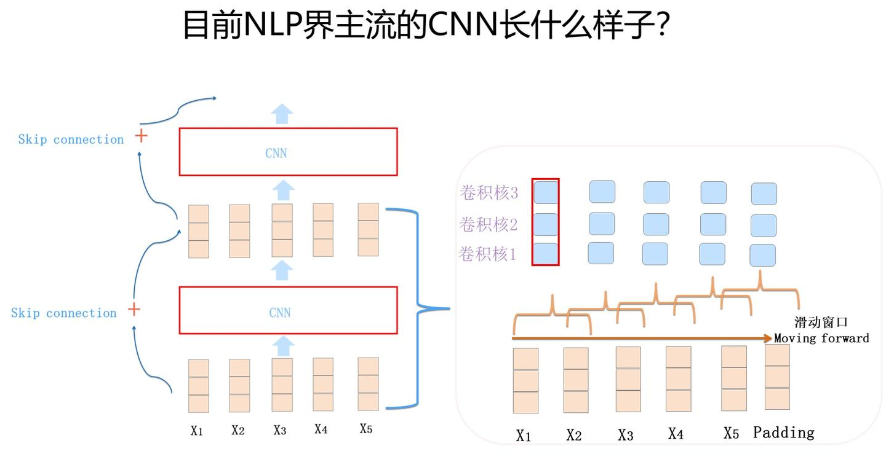
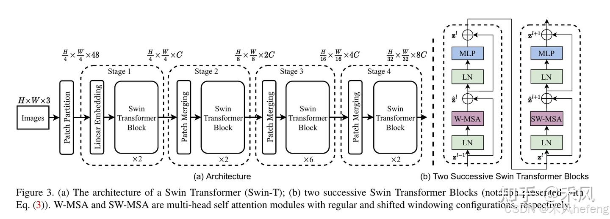
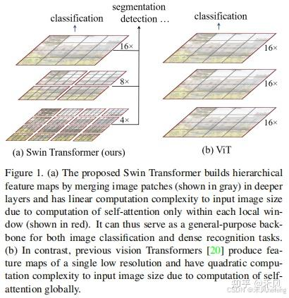
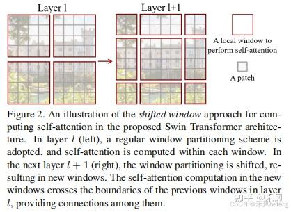
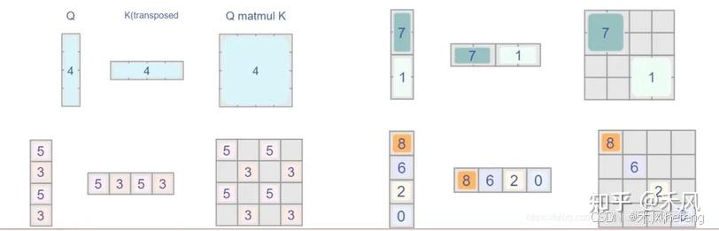
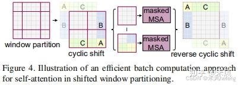

## Transformer
### 一、 前言
Transformer是谷歌在2017年的论文《Attention Is All You Need》中提出的，用于NLP（自然语言处理Natural Language Processing）的各项任务。
#### 1.1 NLP介绍
NLP的输入是个一维线性序列；输入是不定长的；单词或者子句的相对位置关系很重要，两个单词位置互换可能导致完全不同的意思；特征抽取器能否具备长距离特征捕获能力这一点对于解决NLP任务来说是很关键的。

1. 序列标注：句子中每个单词要求模型根据上下文都要给出一个分类类别。
2. 分类任务：不管文章有多长，总体给出一个分类类别即可。
3. 句子关系判断：给定两个句子，模型判断出两个句子是否具备某种语义关系。
4. 生成式任务：输入文本内容后，需要自主生成另外一段文字。
#### 1.2 端到端
深度学习最大的优点是“端到端（end to end）”，意思是以前研发人员得考虑设计抽取哪些特征，而端到端时代后，这些你完全不用管，把原始输入扔给好的特征抽取器，它自己会把有用的特征抽取出来。
因此身为算法工程师，你需要做的事情就是：选择一个好的特征抽取器，喂给它大量的训练数据，设定好优化目标（loss function），告诉它你想让它干嘛，然后等结果，再大量时间用在调参上。
#### 1.3 RNN
##### 1.3.1 问题
原始的RNN采取线性序列结构不断从前往后收集输入信息，但这种线性序列结构在反向传播的时候存在优化困难问题，因为反向传播路径太长，容易导致严重的梯度消失或梯度爆炸问题。
为了解决这个问题，后来引入了LSTM和GRU模型，通过增加中间状态信息直接向后传播，以此缓解梯度消失问题，获得了很好的效果，于是很快LSTM和GRU成为RNN的标准模型。

RNN很难具备高效的并行计算能力

RNN，能将其和其它模型区分开的最典型标志是：T时刻隐层状态的计算，依赖两个输入，一个是T时刻的句子输入单词 $X_t$，所有模型都要接收这个原始输入；关键的是另外一个输入，**T时刻的隐层状态 $S_t$ 还依赖T-1时刻的隐层状态 $S_{t-1}$ 的输出。CNN和Transformer就不存在这种序列依赖问题。**
##### 1.3.2 改造思路
改造RNN使其具备并行计算能力：
1. 一种是仍然保留任意连续时间步（T-1到T时刻）之间的隐层连接；
    代表：论文“Simple Recurrent Units for Highly Parallelizable Recurrence”中提出的SRU方法。最本质的改进是把隐层之间的神经元依赖由全连接改成了哈达马乘积，这样T时刻隐层单元本来对T-1时刻所有隐层单元的依赖，改成了**只是对T-1时刻对应单元的依赖**。
3. 另外一种是部分地打断连续时间步（T-1到T时刻）之间的隐层连接 。
    部分打断，加深层深。
    代表性模型比如下图展示的Sliced RNN。

#### 1.4 CNN

输入的字或者词用Word Embedding的方式表达，这样本来一维的文本信息输入就转换成了二维的输入结构，假设输入 $X$ 包含 $n$ 个字符，而每个字符的Word Embedding的长度为 $d$，那么输入就是 $d \times n$ 的二维向量。
Max Pooling的操作逻辑是：从一个卷积核获得的特征向量里只选中并保留最强的那一个特征，所以到了Pooling层，位置信息就被扔掉了。所以在NLP领域里，目前CNN的一个发展趋势是抛弃Pooling层，靠全卷积层来叠加网络深度。

CNN的进化方向，一句话归纳：想方设法把CNN的深度做起来，随着深度的增加，很多看似无关的问题就随之解决了。

### 二、 整体结构
机器翻译中，Transformer可以将一种语言翻译成另一种语言。
**Transformer由若干个编码器和解码器组成：**

**Encoder和Decoder拆开（论文《Attention Is All You Need》里一张非常经典的图）:**

Encoder包含一个Muti-Head Attention模块，是由多个Self-Attention组成，而Decoder包含两个Muti-Head Attention。Muti-Head Attention上方还包括一个 Add & Norm 层，Add 表示残差连接 (Residual Connection) 用于防止网络退化，Norm 表示 Layer Normalization，用于对每一层的激活值进行归一化。
**Transformer整体结构（输入两个单词的例子）:**

**举例**（将法语"Je suis etudiant"翻译成英文"i am a student"）
1. 第一步：获取输入句子的每一个单词的表示向量 $\mathbf{x}$ ，$\mathbf{x}$ 由单词的Embedding和单词位置的Embedding 相加得到。

1. 第二步：将单词向量矩阵传入Encoder模块，经过N个Encoder后得到句子所有单词的编码信息矩阵 $\mathbf{C}$ ，如下图。输入句子的单词向量矩阵用 $\mathbf{X} \in \mathbb{R}^{n\times d}$ 表示，其中 $n$ 是单词个数，$d$ 表示向量的维度（论文中 $d=512$ ）。每一个Encoder输出的矩阵维度与输入完全一致。

1. 第三步：将Encoder输出的编码矩阵 $\mathbf{C}$ 传递到Decoder中，Decoder会根据当前翻译过的单词 $1\sim i$ 翻译下一个单词 $i+1$ ，如下图所示。

Decoder接收了Encoder的编码矩阵，然后首先输入一个开始符 "<Begin>"，预测第一个单词，输出为"I"；然后输入翻译开始符 "<Begin>" 和单词 "I"，预测第二个单词，输出为"am"，以此类推。

### 三、具体细节
#### 3.1 输入表示
Transformer中单词的输入表示由单词Embedding和位置Embedding（Positional Encoding）相加得到。

##### 3.1.1 单词Embedding
通过Word2vec等模型预训练得到，可以在Transformer中加入Embedding层。
每个输入单词通过词嵌入算法转换为词向量。
##### 3.1.2 位置Embedding
1. 作用表示单词出现在句子中的位置。
2. 使用原因：Transformer不采用RNN结构，而是使用全局信息，不能利用单词的顺序信息，而这部分信息对于NLP来说非常重要。所以Transformer中使用位置Embedding保存单词在序列中的相对或绝对位置。
3. 表示：用 $PE$ 表示，$PE$ 的维度与单词Embedding相同。$PE$ 可以通过训练得到，也可以使用某种公式计算得到。在Transformer中采用了后者，计算公式如下：

$$
\begin{aligned}
PE_{(pos,2i)} &= \sin\left(\frac{pos}{10000^{2i/d}}\right) \\
PE_{(pos,2i+1)} &= \cos\left(\frac{pos}{10000^{2i/d}}\right)
\end{aligned}
$$

其中，$pos$ 表示单词在句子中的位置，$d$ 表示 $PE$ 的维度。
#### 3.2 Multi-Head Attention（多头注意力机制）
由多个Self-Attention组成，具体结构如下图：

##### 3.2.1 Self-Attention结构

Self-Attention结构，最下面是 $\mathbf{Q}$ (查询)、$\mathbf{K}$ (键值)、$\mathbf{V}$ (值)矩阵，是通过输入矩阵 $\mathbf{X}$ 和权重矩阵 $\mathbf{W^Q},\mathbf{W^K},\mathbf{W^V}$ 相乘得到的。

得到 $\mathbf{Q},\mathbf{K},\mathbf{V}$ 之后就可以计算出Self-Attention的输出，如下图

##### 3.2.2 Multi-Head Attention输出

Multi-Head Attention的结构图
首先将输入 $\mathbf{X}$ 分别传递到 $h$ 个不同的Self-Attention中，计算得到 $h$ 个输出矩阵 $\mathbf{Z}$ 。下图是 $h=8$ 的情况，此时会得到 8 个输出矩阵 $\mathbf{Z}$ 。

得到8个输出矩阵 $\mathbf{Z}_0 \sim \mathbf{Z}_7$ 后，Multi-Head Attention将它们拼接在一起（Concat），然后传入一个Linear层，得到Multi-Head Attention最终的输出矩阵 $\mathbf{Z}$ 。

#### 3.3 编码器Encoder结构

$N$ 表示Encoder的个数，由Multi-Head Attention、Add & Norm、Feed Forward、Add & Norm组成的。
##### 3.3.1 单个Encoder输出
**Add & Norm**是指残差连接后使用LayerNorm

Sublayer表示经过的变换，比如第一个Add & Norm中Sublayer表示Multi-Head Attention。
**Feed Forward**是指全连接层

输入矩阵 $\mathbf{X}$ 经过一个Encoder后，输出表示如下：

##### 3.3.2 多个Encoder输出
通过上面的单个Encoder，输入矩阵 $\mathbf{X} \in \mathbb{R}^{n\times d}$ ，最后输出矩阵 $\mathbf{O} \in \mathbb{R}^{n\times d}$ 。通过多个Encoder叠加，最后便是编码器Encoder的输出。
#### 3.4 解码器Decoder结构

在Decoder的时候，需要根据之前翻译的单词，预测当前最有可能翻译的单词。
Transformer的Decoder结构，与Encoder相似，但是存在一些区别：
* 包含两个Multi-Head Attention
* 第一个Multi-Head Attention采用了Masked操作
* 第二个Multi-Head Attention的 $\mathbf{K},\mathbf{V}$ 矩阵使用Encoder的编码信息矩阵$\mathbf{C}$ 进行计算，而 $\mathbf{Q}$ 使用上一个 Decoder的输出计算
* 最后有一个Softmax层计算下一个翻译单词的概率
##### 3.4.1 第一个Multi-Head Attention
采用了Masked操作，因为在翻译的过程中是顺序翻译的，即翻译完第 $i$ 个单词，才可以翻译第 $i+1$ 个单词。通过 Masked 操作可以防止第 $i$ 个单词知道 $i+1$ 单词之后的信息。（以法语"Je suis etudiant"翻译成英文"I am a student"为例。）
首先根据输入"<Begin>"预测出第一个单词为"I"，然后根据输入"<Begin> I" 预测下一个单词 "am"。（右图有问题，应该是Decoder 1）

Decoder在预测第 $i$ 个输出时，需要将第 $i+1$ 之后的单词掩盖住，**Mask操作是在Self-Attention的Softmax之前使用的。**
1. 第一步：Decoder的输入矩阵和Mask矩阵，输入矩阵包含"<Begin> I am a student"4个单词的表示向量，Mask是一个 $4\times4$ 的矩阵。在Mask可以发现单词"<Begin>"只能使用单词"<Begin>"的信息，而单词"I"可以使用单词"<Begin> I"的信息，即只能使用之前的信息。

2. 第二步：接下来的操作和之前Encoder中的Self-Attention一样，只是在Softmax之前需要进行Mask操作。

3. 第三步：通过上述步骤就可以得到一个Mask Self-Attention的输出矩阵 $Z_{i}$，然后和Encoder类似，通过Multi-Head Attention拼接多个输出 $Z_{i}$ 然后计算得到第一个Multi-Head Attention的输出 $\mathbf{Z}$ ，$\mathbf{Z}$ 与输入 $\mathbf{X}$ 维度一样。
##### 3.5.2 第二个Multi-Head Attention
Decoder的第二个Multi-Head Attention的Self-Attention的 $\mathbf{K},\mathbf{V}$ 矩阵不是使用上一个Multi-Head Attention的输出，而是使用Encoder的编码信息矩阵 $\mathbf{C}$ 计算的。根据Encoder的输出 $\mathbf{C}$ 计算得到 $\mathbf{K},\mathbf{V}$ ，根据上一个Multi-Head Attention的输出 $\mathbf{Z}$ 计算 $\mathbf{Q}$。
好处：在Decoder的时候，每一位单词（这里是指"I am a student"）都可以利用到Encoder所有单词的信息（这里是指"Je suis etudiant"）。
#### 3.5 Softmax预测输出

编码器Decoder最后的部分是利用 Softmax 预测下一个单词，在Softmax之前，会经过Linear变换，将维度转换为词表的个数。
假设我们的词表只有6个单词，最后的输出可以表示如下：

### 四、总结
Transformer由于可并行、效果好等特点，如今已经成为机器翻译、特征抽取等任务的基础模块，目前ChatGPT特征抽取的模块用的就是Transformer。

---

## Swin Transformer
Swin Transformer 是一种基于 Transformer 的视觉模型，由 Microsoft 研究团队提出，旨在解决传统 Transformer 模型在计算机视觉任务中的高计算复杂度问题。其全称是 Shifted Window Transformer，通过引入**分层架构和滑动窗口机制**，Swin Transformer 在性能和效率之间取得了平衡，广泛应用于图像分类、目标检测、分割等视觉任务.
### 一、 介绍
#### 1.1 问题
Transformer 最初在自然语言处理（NLP）领域大获成功，但直接将 Transformer 应用于计算机视觉任务存在很多挑战。
1. 传统Transformer中，将图片进行划分成一个个尽可能细的patch。但是图像中像素点太多了，如果需要更多的特征，就必须构建很长的序列。而越长的序列算起注意力肯定越慢，自注意力机制的计算复杂度是 $O(n^{2})$，当处理**高分辨率图像**时，这种**复杂度会快速增长**，这就导致了**效率问题**。（详细解释见[附录1](#解释)）
   
2. 图像中许多视觉信息依赖于局部关系，而标准 Transformer 处理的是全局关系，可能**无法有效捕获局部特征**。
#### 1.2 Swin Transformer整体框架

Swin Transformer 核心改进是**以窗口机制+分层下采样**替代传统Transformer的长序列全局注意力计算，同时借鉴CNN的感受野思想，通过分层操作实现特征的逐步抽象：
1.  **分层下采样逻辑**
    模型会执行多轮（$L$ 次）分层操作，每轮对token进行两两合并，token数量逐层递减（如 400→200→100），窗口尺寸同步增大，以此模拟CNN中**卷积+池化**的特征降维与感受野扩大的效果。
2.  **与传统Transformer的核心差异**
    传统Transformer各层的token尺寸、计算方式完全一致，无下采样过程；而Swin Transformer的分层设计让不同层级的token数量和窗口大小动态变化，在降低计算复杂度的同时提升了模型对多尺度特征的捕捉能力。
#### 1.3 Swin Transformer 与 CNN、传统 Transformer 特征对比表
| **对比维度** | **CNN** | **传统 Transformer** | **Swin Transformer** |
| ---- | ---- | ---- | ---- |
| **核心计算单元** | 卷积核（局部滑动计算） | 自注意力机制（全局关联计算） | 窗口自注意力+分层计算 |
| **感受野/上下文范围** | 随网络层数增加逐步扩大，依赖卷积核堆叠 | 天然全局感受野，可捕捉长距离依赖 | 分层下采样扩大窗口尺寸，模拟 CNN 感受野递增特性 |
| **序列/特征尺度变化** | 依靠池化或步长卷积实现下采样，特征图尺寸逐层缩小 | 各层 token 数量、尺寸完全固定，无内置下采样机制 | 分层两两合并 token，token 数量逐层递减（如 400→200→100），窗口同步扩大 |
| **计算复杂度** | 复杂度与特征图尺寸、卷积核大小正相关，局部计算成本低 | 复杂度与 token 数量的平方正相关（$O(n^2)$），长序列下成本极高 | 窗口内局部注意力+分层下采样，复杂度降至 $O(n)$，长序列场景更高效 |
| **多尺度特征捕捉** | 天然支持多尺度，通过不同层级输出获取 | 无原生多尺度能力，需额外引入金字塔结构 | 分层设计自带多尺度特征，不同层级对应不同分辨率 token |
| **归纳偏置** | 强归纳偏置（平移不变性、局部性），适合网格类数据（图像） | 弱归纳偏置，通用性强但对图像等网格数据适配性弱 | 融合局部性归纳偏置（窗口机制），更适配图像类任务 |
| **典型适用场景** | 图像分类、目标检测、语义分割等传统计算机视觉任务 | 自然语言处理、长序列建模 | 兼顾 CV 与序列任务，适用于大尺寸图像的检测、分割等 |

* CNN：就像用小放大镜（3x3）逐层扫描图片，每次扫描后缩小图片（池化），放大镜视野（感受野）自然变大；
* 传统 Transformer：就像用超大放大镜（全局）一次性扫描所有像素，但图片尺寸始终不变，扫描成本极高；
* Swin Transformer：就像用中等放大镜（7x7）扫描图片，每次扫描后缩小图片（分层合并），放大镜视野（窗口）同步变大，成本可控且效果好。

### 二、各模块详细介绍

#### 2.1 Patch Embedding
1. 作用：负责将输入图像分割成多个小块（patches），并将这些小块的像素值嵌入到一个高维空间中，形成适合 Transformer 处理的特征表示。**获取图像特征**
2. 具体操作：对输入图像进行分块。通常将图像通过卷积操作分割成不重叠的小块（patches）。每个小块对应一个特征向量。
3. 根据不同的卷积参数（如 `kernel_size` ：决定了每个 patch 的空间大小和` stride`：决定了每个 patch 之间的间隔，即步长），可以控制生成的 patch 的数量和每个 patch 的维度。
#### 2.2 window_partition
1. 目的：窗口划分（Window Partition） 进一步细化和处理，通过窗口内的局部注意力机制来**增强计算效率**并**捕捉局部特征Token**。
2. 具体操作将输入的图像经过卷积处理后得到的特征图划分为多个小窗口（window），每个窗口包含一部分局部信息。
#### 2.3  W-MSA（Windwow multi-head self attention）
1. 作用：通过在每个窗口内部独立地计算自注意力（Self-Attention）来减少计算复杂度，并捕捉局部特征。**局部化自注意力机制**，核心是 “在小窗口内计算注意力”。
2. 具体操作：
   1. **窗口划分**：先将特征图（比如尺寸为56×56、通道96）拆分为多个不重叠的小窗口（比如7×7），示例中56×56的特征图会被划分为 \( (56/7) \times (56/7) = 64 \) 个窗口，每个窗口包含 \( 7×7=49 \) 个token。
   2. **多头拆分**：将每个窗口的96维特征，按头数（示例中3头）平均拆分，每个头负责 \( 96/3=32 \) 维特征。
   3. **窗口内自注意力计算**：
      - 对每个窗口的49个token，独立计算Q/K/V（每个头32维）；
      - 按公式 \( \text{Attention Score} = \frac{Q \cdot K^T}{\sqrt{d_k}} \)（\( d_k=32 \) 是每个头的维度）计算窗口内的注意力得分；
      - 经Softmax归一化后，与V加权求和，得到窗口内的注意力输出。
   4. **输出形状**：每个窗口的输出是“窗口数×头数×窗口内token数×每个头的维度”，示例中为 \( 64×3×49×32 \)，最终拼接后恢复为原特征图尺寸。
3. W-MSA与传统Transformer自注意力的对比

    | 对比维度                | 传统Transformer自注意力                | Swin Transformer的W-MSA                |
    |-------------------------|----------------------------------------|----------------------------------------|
    | **计算范围**            | 全局所有token（比如196个token）| 每个小窗口内的token（示例中每个窗口49个） |
    | **计算复杂度**          | \( O(N^2 \cdot d) \)（\( N \)是全局token数） | \( O((H/W \times W/H) \times w^2 \cdot d) = O(N \cdot w \cdot d) \)（\( w \)是窗口尺寸，示例中\( w=7 \)） |
    | **实际计算量（示例）**  | 若全局token数\( N=196 \)，复杂度为\( 196^2×96≈370万 \) | 若窗口数64、每个窗口\( w=7 \)，复杂度为\( 64×7^2×96≈30万 \)（仅为传统的1/12） |
    | **特征捕捉能力**        | 天然全局特征，但局部特征捕捉效率低      | 专注局部特征，后续通过分层下采样扩大感受野 |
    | **适用场景**            | 短序列（如NLP句子）或低分辨率图像      | 高分辨率图像（如目标检测、语义分割）|
    简单说：W-MSA通过“把全局计算拆成多个小窗口内的局部计算”，将传统自注意力的**平方级复杂度**降到了**线性级**，同时保留了自注意力捕捉局部关联的能力，是Swin Transformer适配高分辨率图像的核心优化。
#### 2.4 window_reverse
1. 作用：将计算得到的(64, 49, 96)特征图恢复回原始的空间维度(56, 56, 96)。**W-MSA计算后的 “逆操作”**，保证特征图的空间结构不丢失。
2. 步骤：
* Reshape 操作： 每个窗口的特征图形状是 (49, 96)**一维序列特征**，我们将其转换成 (7, 7, 96) 的**二维窗口形状**，表示每个窗口中的每个像素点都有一个 96 维的特征向量。
* 按窗口拼接： 将所有 64 个窗口按照它们在特征图中的位置重新排列成 56x56 的大特征图。原始的输入特征图大小是 56x56，这意味着 64 个窗口将按照 8x8 的网格排列，并恢复到一个 (56, 56, 96) 的特征图。

`56x56` 是恢复后的空间维度，代表每个像素点在特征图中的位置；`96 `是每个像素点的特征维度，表示每个位置的特征信息。
#### 2.5 SW-MASA
1. 作用：SW-MSA（Shifted Window MSA，滑动窗口多头自注意力）是为解决**原始 W-MSA 窗口间信息封闭**的问题。 
2. 核心：**让窗口滑动后重叠，实现窗口间的信息交互**
2. **滑动窗口（Shifted Window）**的作用：原始 W-MSA 的窗口是固定不重叠的，每个窗口内的注意力只计算局部信息，窗口之间没有关联，容易 “局限在小区域”；而滑动窗口让窗口位置偏移，使新窗口包含原窗口的部分区域，从而实现窗口间的信息融合。

3. 位移操作（Shift Operation）：
   * 先对特征图做循环位移（比如窗口从 7×7 平移一定距离），让原窗口的边缘区域进入新窗口；
   * 对位移后的特征图重新划分窗口，此时新窗口会包含原属于不同窗口的区域；
   * 为避免重复计算（Shifted Window MSA 会导致计算量的增加，特别是在窗口滑动后，窗口数量从 4x4 变为 9x9，计算量几乎翻倍。），用**Mask 操作**屏蔽窗口内 “不属于同一原窗口” 的区域（把这些区域的注意力得分设为负无穷，Softmax 后权重接近 0）。

4. 效果：既保留了 W-MSA“局部计算、低复杂度” 的优势，又通过窗口重叠实现了**跨窗口的信息交互**，让模型能**捕捉更大范围的特征关联**，同时**输出特征图的尺寸（比如 56×56×96）与输入保持一致**。
#### 2.6  PatchMerging
1. 作用：PatchMerging 是 Swin Transformer 中的一种**下采样操作**，但是不同于池化，这个相当于间接的（对H和W维度进行间隔采样后拼接在一起，得到H/2，W/2，C*4），目的是**将输入特征图的空间维度（即高和宽）逐渐减小，同时增加通道数**，从而在**保持计算效率**的同时获得**更高层次的特征表示**。
2.操作：通过将相邻的 patch 拼接在一起，并对拼接后的特征进行线性变换，从而实现下采样。

---
## 参考链接
1. 字节开源的多模态端到端文档解析模型-Dolphin：https://www.51cto.com/aigc/5741.html
2. 一文了解Transformer全貌（图解Transformer）：https://zhuanlan.zhihu.com/p/703292893
3. 放弃幻想，全面拥抱Transformer：自然语言处理三大特征抽取器（CNN/RNN/TF）比较：https://zhuanlan.zhihu.com/p/54743941
4. 【深度学习】深刻理解Swin Transformer：https://zhuanlan.zhihu.com/p/12205721797

## 附录
1. 解释。[返回正文](#返回1)
    <a id="解释">
    要理解传统Transformer处理高分辨率图像时的效率问题，核心在于**自注意力的计算复杂度公式**和**图像patch序列的长度特性**，我们可以分两步拆解：
    ##### 一、先明确两个关键前提
    1.  **图像到token的转换逻辑**
        传统Transformer无法直接处理二维图像，必须先将图像切分为固定大小的 **patch（补丁）**，再把每个patch展平为一个一维token。
        - 假设输入图像尺寸为 $H \times W$，patch大小为 $P \times P$
        - 最终生成的token数量 $N = \frac{H \times W}{P^2}$
        - 举个例子：224×224的图像，用16×16的patch → $N=\frac{224 \times 224}{16 \times 16}=196$ 个token；若用4×4的小patch → $N=\frac{224 \times 224}{4 \times 4}=3136$ 个token。

    2.  **自注意力的计算复杂度公式**
        自注意力的核心操作是**查询向量(Q)和键向量(K)的矩阵相乘**，以此计算每个token与其他所有token的关联权重。
        其时间复杂度为：
        $$O(N^2 \cdot d)$$
        其中：
        - $N$ = token数量
        - $d$ = 每个token的维度（固定值，如768）

        这个公式的关键是 **复杂度和 $N^2$ 成正比** —— token数量的增长会带来复杂度的**平方级爆炸**。

    ##### 二、效率问题的根源：patch越细 + 图像分辨率越高 → $N^2$ 增长越恐怖
    你提到的“patch尽可能细一些”和“需要更多特征”，恰恰是推高 $N$ 的两个核心因素，最终导致计算效率崩塌，我们分场景验证：

    | 场景 | patch大小 | token数量 $N$ | 自注意力复杂度（$N^2$ 相对值） | 结论 |
    |------|-----------|--------------|--------------------------------|------|
    | 低分辨率+粗patch | 16×16，224×224图像 | 196 | $196^2=38416$ | 复杂度低，可接受 |
    | 低分辨率+细patch | 4×4，224×224图像 | 3136 | $3136^2≈10^7$ | 复杂度是前者的 **250倍** |
    | 高分辨率+细patch | 4×4，1024×1024图像 | $\frac{1024×1024}{16}=65536$ | $65536^2≈4×10^9$ | 复杂度是224图像细patch的 **400倍** |

    ##### 关键痛点总结
    1.  **“要更多特征→用更细patch”的矛盾**：更细的patch能保留更多图像细节（对应更多特征），但会让 $N$ 急剧增大，$N^2$ 带来的复杂度增长是**非线性的**，远超过特征收益。
    2.  **“高分辨率图像”的雪上加霜**：实际任务中（如目标检测、语义分割）常需要处理1024×1024甚至更大的图像，此时哪怕用中等大小的patch，$N$ 也会突破万级，$N^2$ 会达到亿级甚至十亿级，普通硬件根本无法承受。
    3.  **传统Transformer无下采样的缺陷**：和Swin Transformer不同，传统Transformer的所有层都使用**同一长度的token序列**，没有逐层合并token的机制，无法在网络前向过程中降低 $N$，只能硬扛高复杂度。

    ##### 一句话概括
    传统Transformer处理图像的效率瓶颈，本质是**自注意力“$N^2$ 复杂度”与图像“高分辨率、细粒度patch”需求的根本性冲突** —— 序列长度的小幅增长，会引发计算量的指数级飙升。

    自注意力机制的计算复杂度 $O(N^2 \cdot d)$ 来源于其**核心矩阵运算步骤**，其中 $N$ 是 token 序列长度，$d$ 是每个 token 的特征维度。我们可以通过拆解自注意力的计算流程，一步步推导复杂度的来源。

    #### 自注意力复杂度
    ##### 前提定义
    - 输入：一个长度为 $N$ 的 token 序列，每个 token 的特征维度为 $d$，输入矩阵记为 $X \in \mathbb{R}^{N \times d}$
    - 三个可学习的投影矩阵：$W_Q,W_K,W_V \in \mathbb{R}^{d \times d}$（为简化推导，假设 Q/K/V 维度均为 $d$）
    - 输出：注意力加权后的特征矩阵 $Z \in \mathbb{R}^{N \times d}$

    ##### 自注意力的核心计算步骤
    自注意力的计算分为 **4步**，每一步的复杂度累加就是最终的总复杂度：

    1. 计算 Q、K、V 矩阵（投影操作）
    这一步是将输入矩阵 $X$ 分别与 $W_Q,W_K,W_V$ 相乘，得到查询（Q）、键（K）、值（V）矩阵：
    $$
    Q = X \cdot W_Q, \quad K = X \cdot W_K, \quad V = X \cdot W_V
    $$
    - 单个矩阵乘法（如 $X \cdot W_Q$）的复杂度：$X$ 是 $N \times d$，$W_Q$ 是 $d \times d$，乘法次数为 $N \times d \times d = O(N \cdot d^2)$
    - 3个矩阵（Q/K/V）的总复杂度：$3 \times O(N \cdot d^2) = O(N \cdot d^2)$

    1. 计算注意力分数矩阵（Q与$K^T$相乘）
    这是**复杂度的核心来源**，目的是计算每个 token 与所有 token 的关联程度：
    $$
    \text{Score} = Q \cdot K^T
    $$
    - $Q$ 是 $N \times d$，$K^T$ 是 $d \times N$，矩阵乘法的次数为 $N \times d \times N = O(N^2 \cdot d)$
    - 这一步的复杂度是**平方级**的，因为要让每个 token（共 $N$ 个）和所有 $N$ 个 token 计算相似度。

    1. 对注意力分数做 Softmax 归一化
    Softmax 是逐行计算的，每行有 $N$ 个元素，主要是指数和求和操作，无矩阵乘法。
    - 复杂度为 $O(N^2)$，**远小于第二步的 $O(N^2 \cdot d)$**（因为 $d$ 通常是数百到数千，如 768、1024），所以这一步可忽略。

    1. 注意力分数与 V 矩阵相乘（加权求和）
    将归一化后的注意力分数与 $V$ 矩阵相乘，得到最终的注意力输出：
    $$
    Z = \text{Softmax}(\text{Score}) \cdot V
    $$
    - 归一化后的 Score 矩阵是 $N \times N$，$V$ 矩阵是 $N \times d$，乘法次数为 $N \times N \times d = O(N^2 \cdot d)$

    ##### 总复杂度推导
    将各步骤的复杂度累加，忽略低阶项（如 Softmax 的 $O(N^2)$）和系数：
    $$
    \text{总复杂度} = O(N \cdot d^2) + O(N^2 \cdot d) + O(N^2 \cdot d)
    $$
    在实际的 Transformer 应用中，**$N$ 通常远大于 $d$**（比如处理高分辨率图像时 $N$ 可达上万，$d$ 一般为 768/1024），此时 $O(N^2 \cdot d)$ 会**主导总复杂度**，而 $O(N \cdot d^2)$ 可忽略。

    因此，自注意力的计算复杂度可简化为 **$O(N^2 \cdot d)$**。

    ##### 关键结论
    自注意力复杂度的核心是 **$Q \cdot K^T$ 和 $\text{Softmax(Score)} \cdot V$ 这两步矩阵乘法**，它们都与 $N^2$ 成正比。
    这也是为什么当 token 序列长度 $N$ 增大（比如高分辨率图像切分细粒度 patch）时，计算量会**平方级爆炸**。
</a>
---

