## Transformer
### 一、 前言
Transformer是谷歌在2017年的论文《Attention Is All You Need》中提出的，用于NLP（自然语言处理Natural Language Processing）的各项任务。
#### 1.1 NLP介绍
NLP的输入是个一维线性序列；输入是不定长的；单词或者子句的相对位置关系很重要，两个单词位置互换可能导致完全不同的意思；特征抽取器能否具备长距离特征捕获能力这一点对于解决NLP任务来说是很关键的。
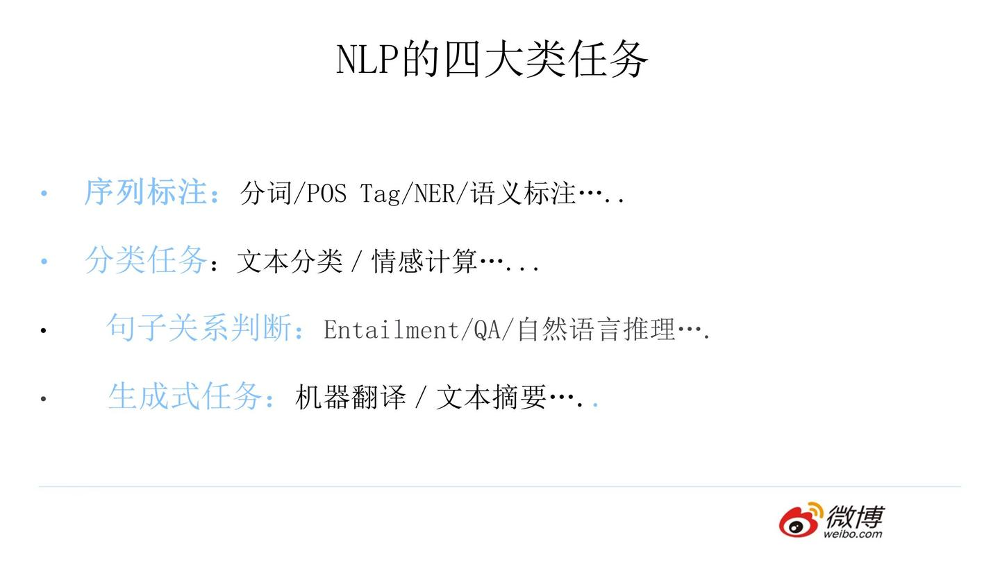
1. 序列标注：句子中每个单词要求模型根据上下文都要给出一个分类类别。
2. 分类任务：不管文章有多长，总体给出一个分类类别即可。
3. 句子关系判断：给定两个句子，模型判断出两个句子是否具备某种语义关系。
4. 生成式任务：输入文本内容后，需要自主生成另外一段文字。
#### 1.2 端到端
深度学习最大的优点是“端到端（end to end）”，意思是以前研发人员得考虑设计抽取哪些特征，而端到端时代后，这些你完全不用管，把原始输入扔给好的特征抽取器，它自己会把有用的特征抽取出来。
因此身为算法工程师，你需要做的事情就是：选择一个好的特征抽取器，喂给它大量的训练数据，设定好优化目标（loss function），告诉它你想让它干嘛，然后等结果，再大量时间用在调参上。
#### 1.3 RNN
##### 1.3.1 问题
原始的RNN采取线性序列结构不断从前往后收集输入信息，但这种线性序列结构在反向传播的时候存在优化困难问题，因为反向传播路径太长，容易导致严重的梯度消失或梯度爆炸问题。
为了解决这个问题，后来引入了LSTM和GRU模型，通过增加中间状态信息直接向后传播，以此缓解梯度消失问题，获得了很好的效果，于是很快LSTM和GRU成为RNN的标准模型。
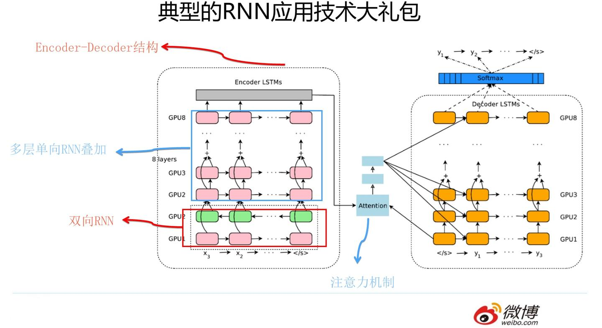
RNN很难具备高效的并行计算能力
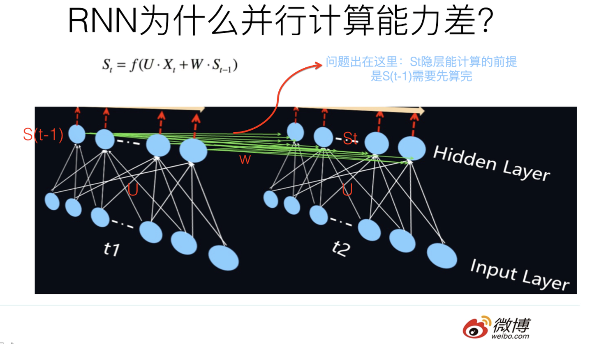
RNN，能将其和其它模型区分开的最典型标志是：T时刻隐层状态的计算，依赖两个输入，一个是T时刻的句子输入单词Xt，所有模型都要接收这个原始输入；关键的是另外一个输入，**T时刻的隐层状态St还依赖T-1时刻的隐层状态S(t-1)的输出。CNN和Transformer就不存在这种序列依赖问题。**
##### 1.3.2 改造思路
改造RNN使其具备并行计算能力：
1. 一种是仍然保留任意连续时间步（T-1到T时刻）之间的隐层连接；
    代表：论文“Simple Recurrent Units for Highly Parallelizable Recurrence”中提出的SRU方法。最本质的改进是把隐层之间的神经元依赖由全连接改成了哈达马乘积，这样T时刻隐层单元本来对T-1时刻所有隐层单元的依赖，改成了**只是对T-1时刻对应单元的依赖**。
3. 另外一种是部分地打断连续时间步（T-1到T时刻）之间的隐层连接 。
    部分打断，加深层深。
    代表性模型比如下图展示的Sliced RNN。
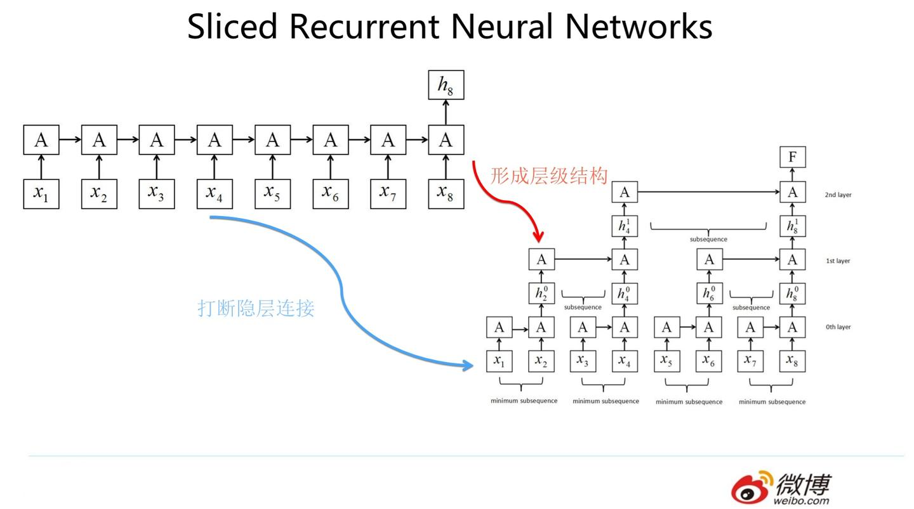
#### 1.4 CNN
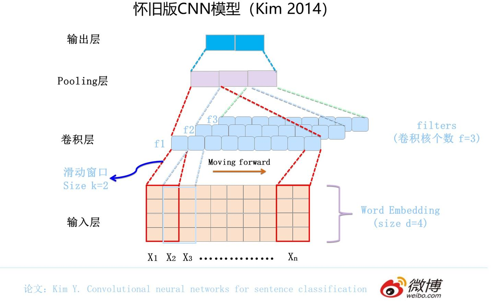
输入的字或者词用Word Embedding的方式表达，这样本来一维的文本信息输入就转换成了二维的输入结构，假设输入X包含n个字符，而每个字符的Word Embedding的长度为d，那么输入就是d*n的二维向量。

### 二、 整体结构
机器翻译中，Transformer可以将一种语言翻译成另一种语言。
**Transformer由若干个编码器和解码器组成：**
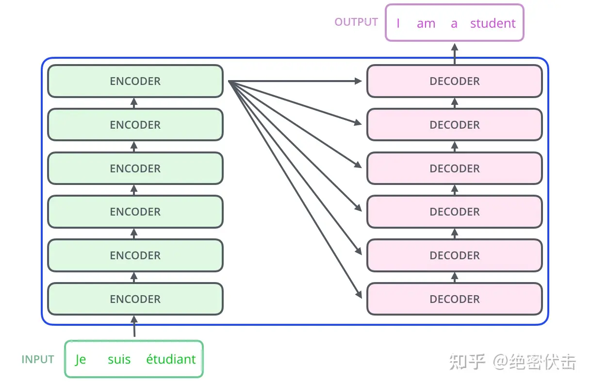
**Encoder和Decoder拆开（论文《Attention Is All You Need》里一张非常经典的图）:**

Encoder包含一个Muti-Head Attention模块，是由多个Self-Attention组成，而Decoder包含两个Muti-Head Attention。Muti-Head Attention上方还包括一个 Add & Norm 层，Add 表示残差连接 (Residual Connection) 用于防止网络退化，Norm 表示 Layer Normalization，用于对每一层的激活值进行归一化。
**Transformer整体结构（输入两个单词的例子）:**
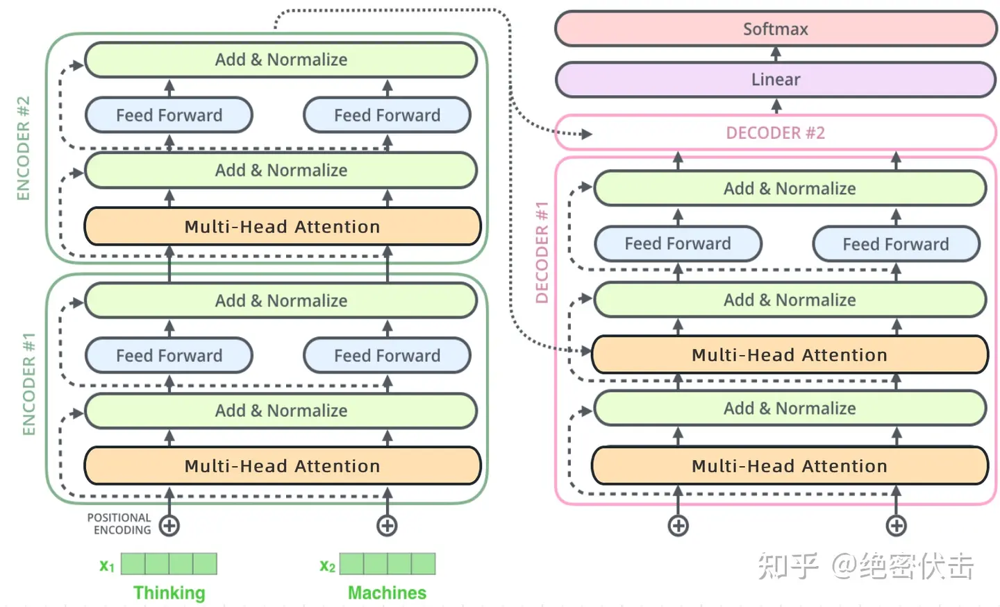
**举例**（将法语"Je suis etudiant"翻译成英文"i am a student）
1. 第一步：获取输入句子的每一个单词的表示向量 \bm{x} ， \bm{x} 由单词的Embedding和单词位置的Embedding 相加得到。
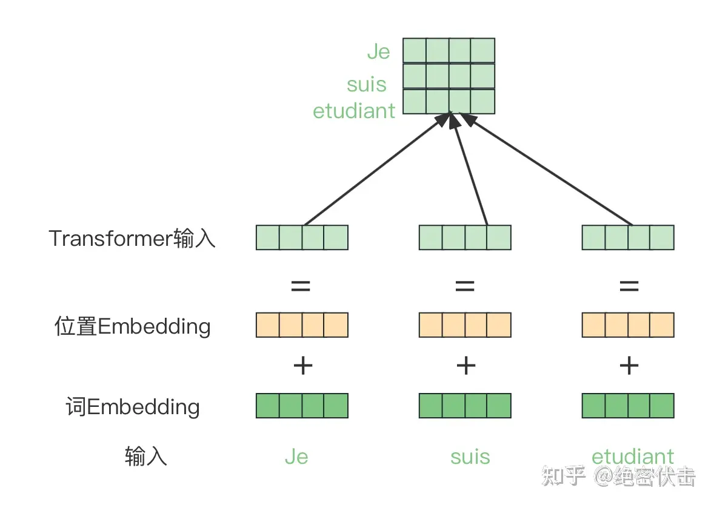
1. 第二步：将单词向量矩阵传入Encoder模块，经过N个Encoder后得到句子所有单词的编码信息矩阵 \bm{C} ，如下图。输入句子的单词向量矩阵用 \bm{X}\in\mathbb{R}^{n\times d} 表示，其中 n 是单词个数， d 表示向量的维度（论文中 d=512 ）。每一个Encoder输出的矩阵维度与输入完全一致。
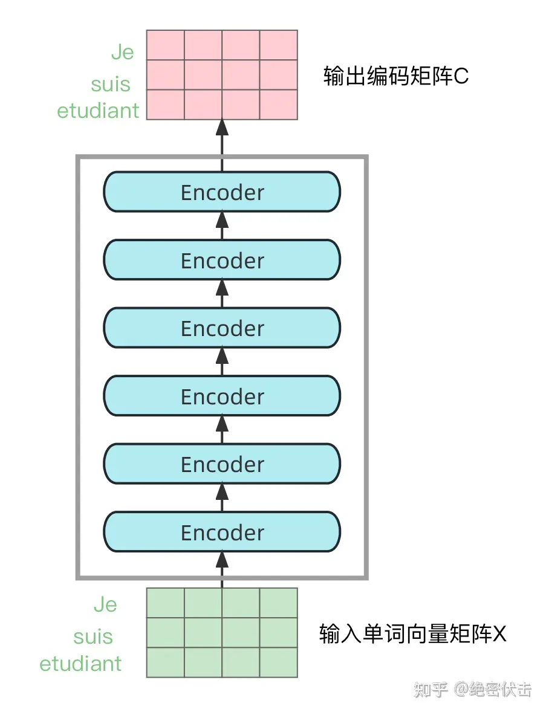
1. 第三步：将Encoder输出的编码矩阵 \bm{C} 传递到Decoder中，Decoder会根据当前翻译过的单词 1\sim i 翻译下一个单词 i+1 ，如下图所示。
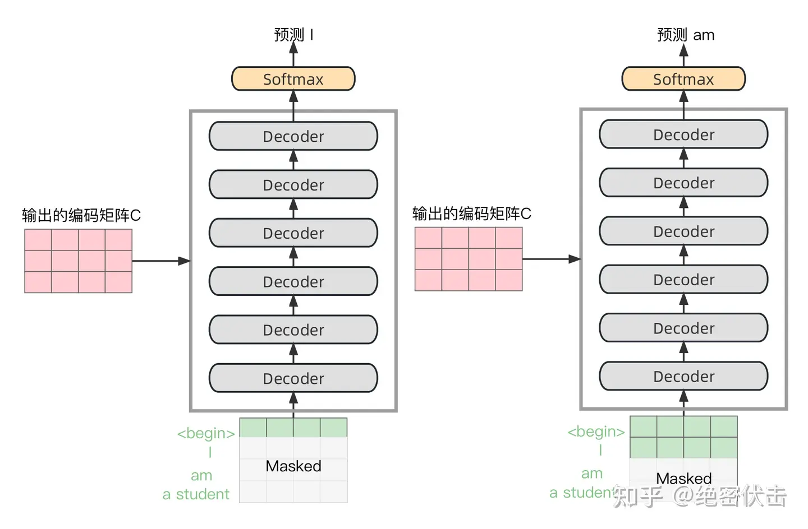
Decoder接收了Encoder的编码矩阵，然后首先输入一个开始符 "<Begin>"，预测第一个单词，输出为"I"；然后输入翻译开始符 "<Begin>" 和单词 "I"，预测第二个单词，输出为"am"，以此类推。

### 三、具体细节
#### 3.1 输入表示
Transformer中单词的输入表示由单词Embedding和位置Embedding（Positional Encoding）相加得到。

##### 3.1.1 单词Embedding
通过Word2vec等模型预训练得到，可以在Transformer中加入Embedding层。
##### 3.1.2 位置Embedding
1. 作用表示单词出现在句子中的位置。
2. 使用原因：Transformer不采用RNN结构，而是使用全局信息，不能利用单词的顺序信息，而这部分信息对于NLP来说非常重要。所以Transformer中使用位置Embedding保存单词在序列中的相对或绝对位置。
3. 表示：用PE 表示， PE的维度与单词Embedding相同。 PE可以通过训练得到，也可以使用某种公式计算得到。在Transformer中采用了后者，计算公式如下：

 其中， pos 表示单词在句子中的位置， d 表示 PE 的维度。
#### 3.2 Multi-Head Attention（多头注意力机制）
由多个Self-Attention组成，具体结构如下图：
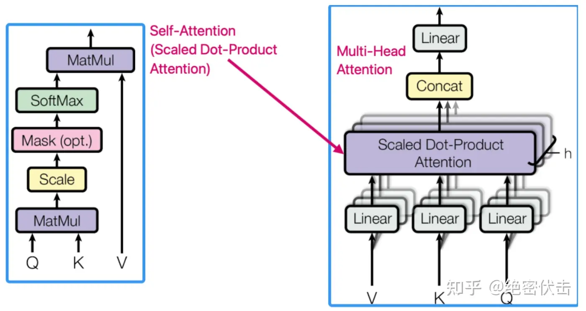
##### 3.2.1 Self-Attention结构
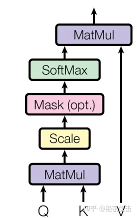
Self-Attention结构，最下面是 \bm{Q} (查询)、 \bm{K} (键值)、 \bm{V} (值)矩阵，是通过输入矩阵 \bm{X} 和权重矩阵 \bm{W^Q},\bm{W^K},\bm{W^V} 相乘得到的。
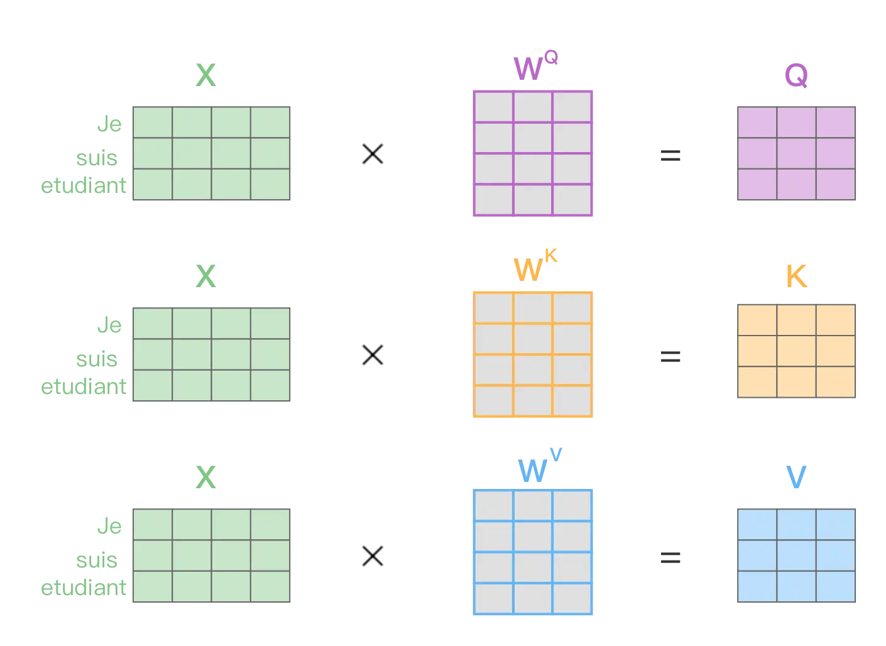
得到 \bm{Q},\bm{K},\bm{V} 之后就可以计算出Self-Attention的输出，如下图
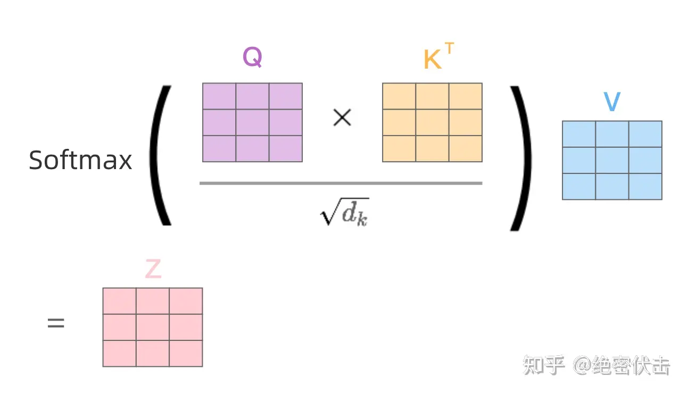
##### 3.2.2 Multi-Head Attention输出
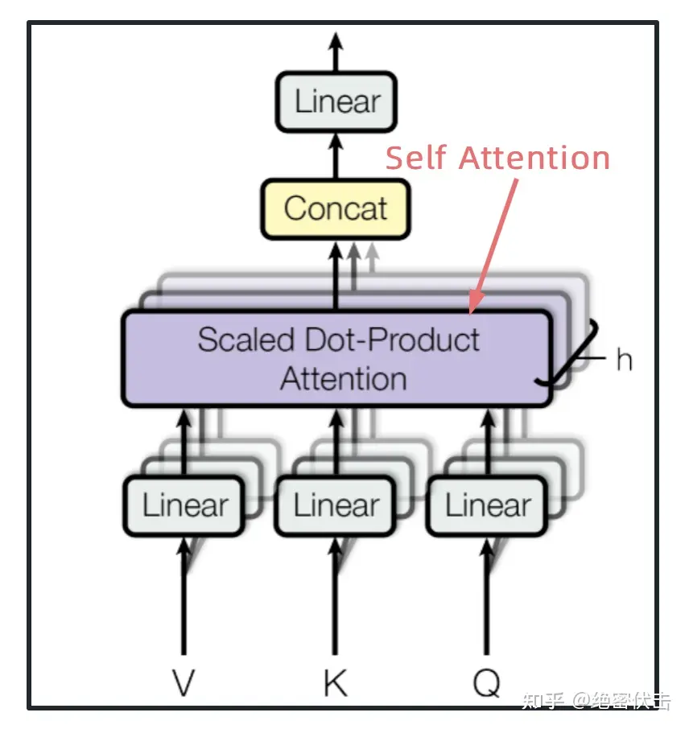
Multi-Head Attention的结构图
首先将输入 \bm{X} 分别传递到 h 个不同的Self-Attention中，计算得到 h 个输出矩阵 \bm{Z} 。下图是 h=8 的情况，此时会得到 8 个输出矩阵 \bm{Z} 。
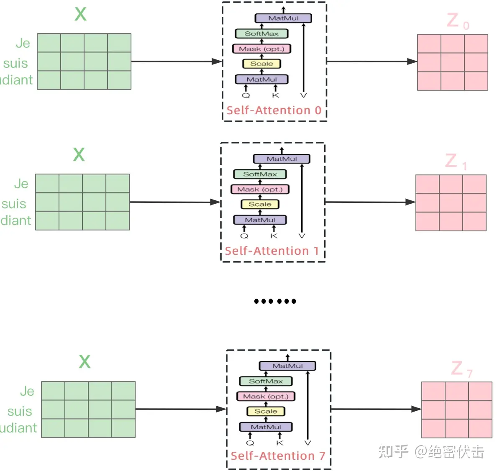
得到8个输出矩阵 \bm{Z}_0\sim \bm{Z}_7 后，Multi-Head Attention将它们拼接在一起（Concat），然后传入一个Linear层，得到Multi-Head Attention最终的输出矩阵 \bm{Z} 。

#### 3.3 编码器Encoder结构
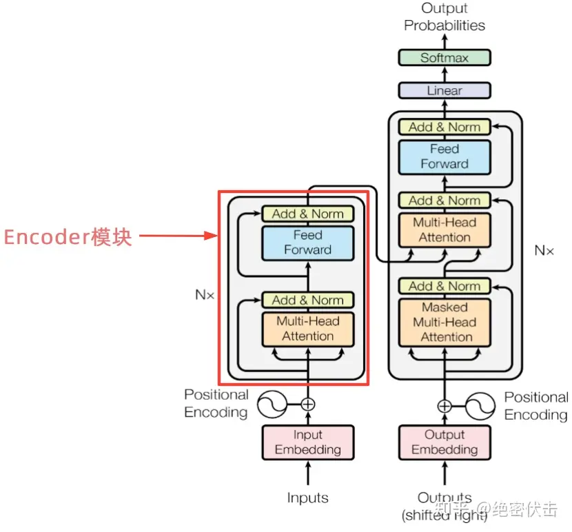
N 表示Encoder的个数，由Multi-Head Attention、Add & Norm、Feed Forward、Add & Norm组成的。
##### 3.3.1 单个Encoder输出
**Add & Norm**是指残差连接后使用LayerNorm

Sublayer表示经过的变换，比如第一个Add & Norm中Sublayer表示Multi-Head Attention。
**Feed Forward**是指全连接层

输入矩阵 \bm{X} 经过一个Encoder后，输出表示如下：

##### 3.3.2 多个Encoder输出
通过上面的单个Encoder，输入矩阵 \bm{X}\in \mathbb{R}^{n\times d} ，最后输出矩阵 \bm{O}\in \mathbb{R}^{n\times d} 。通过多个Encoder叠加，最后便是编码器Encoder的输出。
#### 3.4 解码器Decoder结构
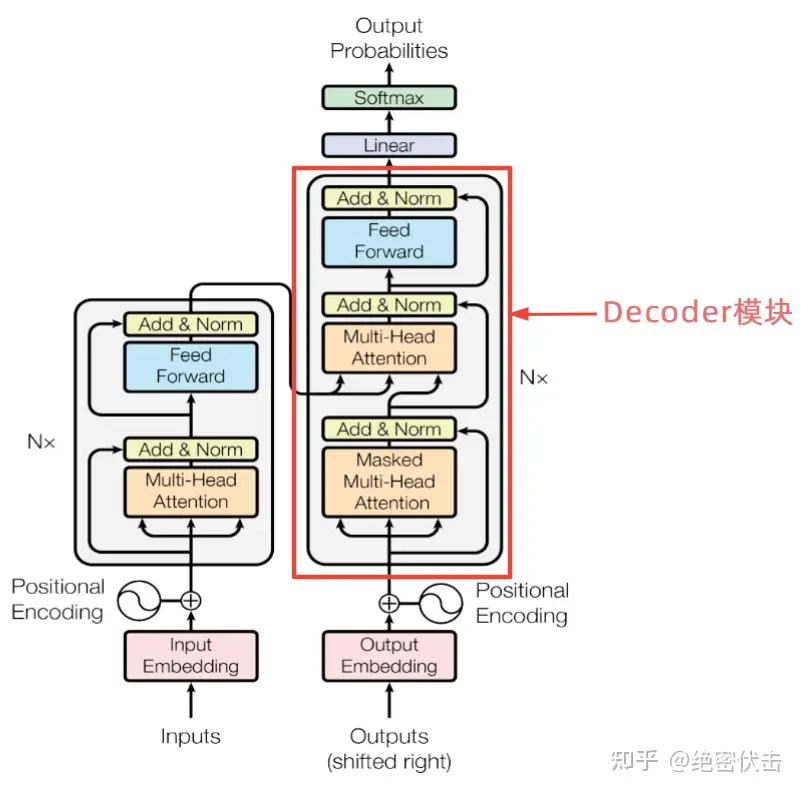
在Decoder的时候，需要根据之前翻译的单词，预测当前最有可能翻译的单词。
Transformer的Decoder结构，与Encoder相似，但是存在一些区别：
* 包含两个Multi-Head Attention
* 第一个Multi-Head Attention采用了Masked操作
* 第二个Multi-Head Attention的 \bm{K},\bm{V} 矩阵使用Encoder的编码信息矩阵\bm{C} 进行计算，而 \bm{Q} 使用上一个 Decoder的输出计算
* 最后有一个Softmax层计算下一个翻译单词的概率
##### 3.4.1 第一个Multi-Head Attention
采用了Masked操作，因为在翻译的过程中是顺序翻译的，即翻译完第 i 个单词，才可以翻译第 i+1 个单词。通过 Masked 操作可以防止第 i 个单词知道 i+1 个单词之后的信息。（以法语"Je suis etudiant"翻译成英文"I am a student"为例。）
首先根据输入"<Begin>"预测出第一个单词为"I"，然后根据输入"<Begin> I" 预测下一个单词 "am"。（右图有问题，应该是Decoder 1）
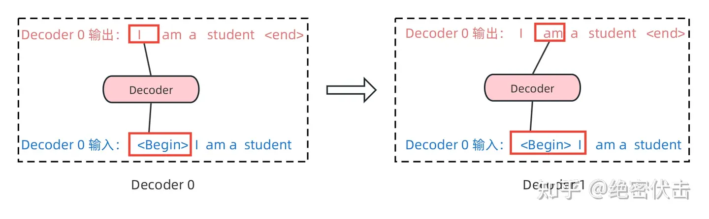
Decoder在预测第 i 个输出时，需要将第 i+1 之后的单词掩盖住，**Mask操作是在Self-Attention的Softmax之前使用的。**
1. 第一步：Decoder的输入矩阵和Mask矩阵，输入矩阵包含"<Begin> I am a student"4个单词的表示向量，Mask是一个 4\times4 的矩阵。在Mask可以发现单词"<Begin>"只能使用单词"<Begin>"的信息，而单词"I"可以使用单词"<Begin> I"的信息，即只能使用之前的信息。
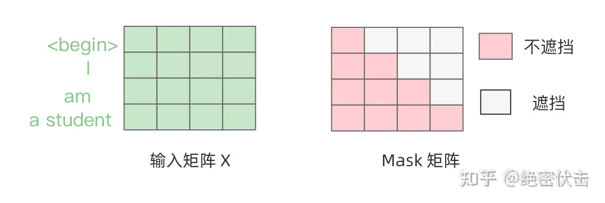
2. 第二步：接下来的操作和之前Encoder中的Self-Attention一样，只是在Softmax之前需要进行Mask操作。
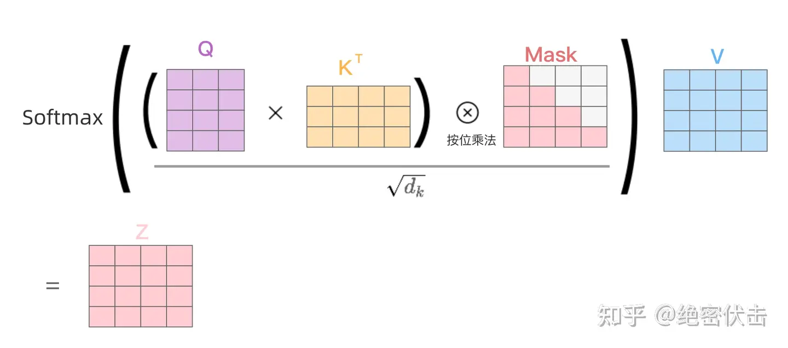
3. 第三步：通过上述步骤就可以得到一个Mask Self-Attention的输出矩阵Z_{i}，然后和Encoder类似，通过Multi-Head Attention拼接多个输出Z_{i}然后计算得到第一个Multi-Head Attention的输出 \bm{Z} ， \bm{Z} 与输入 \bm{X} 维度一样。
##### 3.5.2 第二个Multi-Head Attention
Decoder的第二个Multi-Head Attention的Self-Attention的 \bm{K},\bm{V} 矩阵不是使用上一个Multi-Head Attention的输出，而是使用Encoder的编码信息矩阵 \bm{C} 计算的。根据Encoder的输出 \bm{C} 计算得到 \bm{K},\bm{V} ，根据上一个Multi-Head Attention的输出 \bm{Z} 计算 \bm{Q}。
好处：在Decoder的时候，每一位单词（这里是指"I am a student"）都可以利用到Encoder所有单词的信息（这里是指"Je suis etudiant"）。
#### 3.5 Softmax预测输出

编码器Decoder最后的部分是利用 Softmax 预测下一个单词，在Softmax之前，会经过Linear变换，将维度转换为词表的个数。
假设我们的词表只有6个单词，最后的输出可以表示如下：
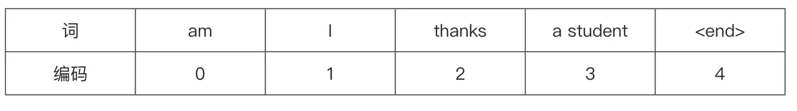
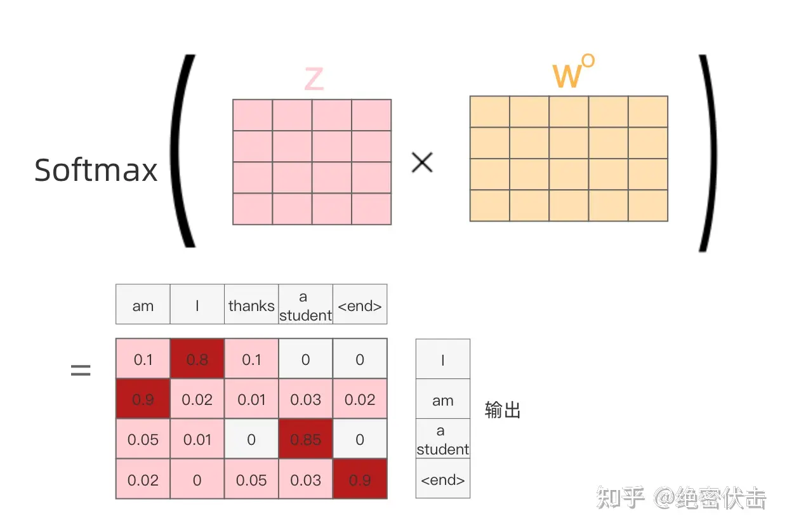

### 四、总结
Transformer由于可并行、效果好等特点，如今已经成为机器翻译、特征抽取等任务的基础模块，目前ChatGPT特征抽取的模块用的就是Transformer。

## 参考链接
1. 字节开源的多模态端到端文档解析模型-Dolphin：https://www.51cto.com/aigc/5741.html
2. 一文了解Transformer全貌（图解Transformer）：https://zhuanlan.zhihu.com/p/703292893
3. 放弃幻想，全面拥抱Transformer：自然语言处理三大特征抽取器（CNN/RNN/TF）比较：https://zhuanlan.zhihu.com/p/54743941

