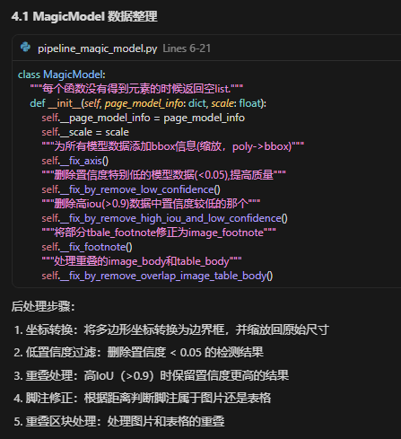
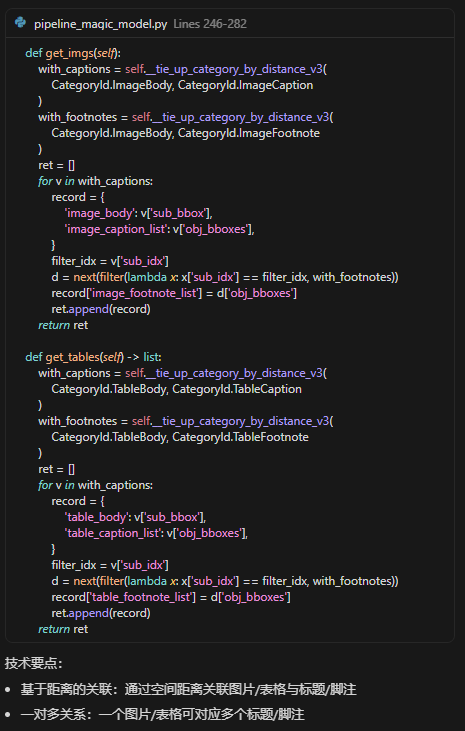

# MinerU
https://github.com/opendatalab/MinerU
```
conda deactivate
git clone https://github.com/opendatalab/MinerU.git
cd MinerU
conda create -n mineru python=3.12
conda activate mineru
pip install uv
uv pip install -U "mineru[core]" -i https://mirrors.aliyun.com/pypi/simple 
python analyze.py   # config 路径记得修改，这个是师兄直接弄好的情况下的操作，其实也相当于调用了下面那条命令了，只是会根据config文件路径来自动填充命令
mineru -p <input_path> -o <output_path>                         # 这个是自己复现的情况
mineru -p /home/hsr/福大课题数据包/福大课题数据包/基于业务本体的智能文档解 析/带批注的采购需求或采购文件/泉州  -o /home/hsr/MinerU/output
```

## 进一步优化思路
1. 这里是否可以考虑将脚注的基于距离判定改成用调用AI判定？

这里同理

2. 标题分级只有一级，没有二三四级
3. 表格识别可以考虑增加一个上下行单元格数量不同时，看几个合并起来会不会和上一行的宽度一样。
4. 