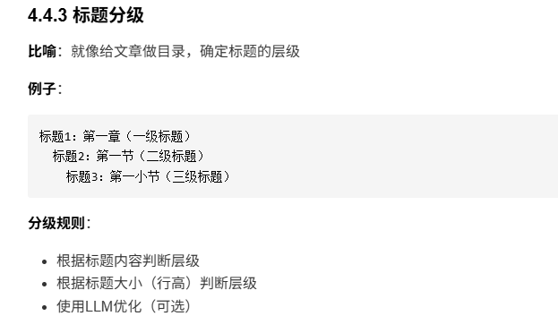
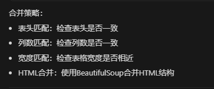
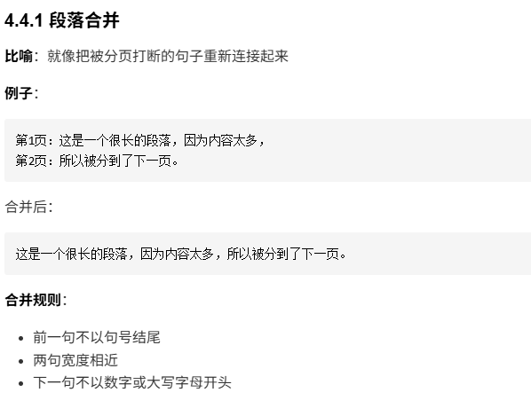
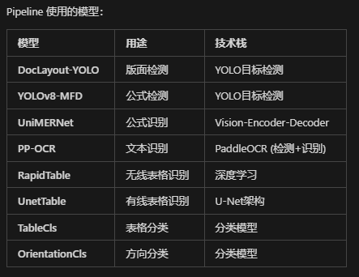
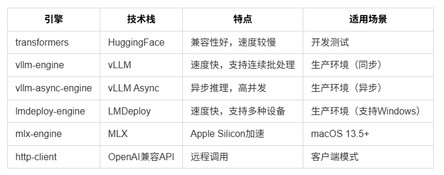
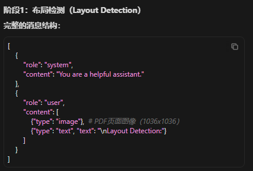
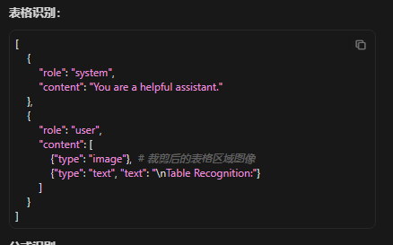
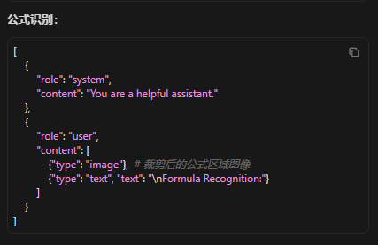

# MinerU
## 一、链接
https://github.com/opendatalab/MinerU
## 二、代码复现
```
conda deactivate
git clone https://github.com/opendatalab/MinerU.git
cd MinerU
conda create -n mineru python=3.12
conda activate mineru
pip install uv
uv pip install -U "mineru[core]" -i https://mirrors.aliyun.com/pypi/simple 
python analyze.py   # config 路径记得修改，这个是师兄直接弄好的情况下的操作，其实也相当于调用了下面那条命令了，只是会根据config文件路径来自动填充命令
mineru -p <input_path> -o <output_path>                         # 这个是自己复现的情况
mineru -p /home/hsr/福大课题数据包/福大课题数据包/基于业务本体的智能文档解 析/带批注的采购需求或采购文件/泉州  -o /home/hsr/MinerU/output
```

## 三、进一步优化思路
1. 这里是否可以考虑将脚注的基于距离判定改成用调用AI判定？

这里同理

2. 标题分级只有一级，没有二三四级

3. 表格识别可以考虑增加一个上下行单元格数量不同时，看几个合并起来会不会和上一行的宽度一样。
表格识别有时会吞掉空单元格啊。
一行表格的右边内容又被分成多行且跨页时合并效果差，但普通有按序号、表格内容没有被中间截断的合并效果还不错。
 
这个续有点不好说啊

1. 这里合并规则？还没看原始代码，先保留疑惑
 

## 四、学习
### 4.1 涉及的模型学习
#### 4.1.1 pipeline

##### YOLO学习
1. 相关概念：YOLO（You Only Look Once）是一组实时目标检测机器学习算法。目标检测是一种计算机视觉任务，它使用神经网络来定位和分类图像中的物体。[卷积神经网络(CNN)](https://github.com/luuxiann/RAG-learning/blob/main/CNN.md) 是任何 YOLO 模型的基础(基于卷积神经网络（CNN）的目标检测方法)。
YOLO作为一种单阶段目标检测器，能够在一次前向传播中完成图像中所有目标的检测与分类任务，相比于其他两阶段的目标检测方法，如Faster R-CNN，YOLO的实时性和检测效率显得尤为突出。
2. 作用：旨在解决目标检测过程中速度和精度之间的平衡问题。**传统的目标检测方法**，如R-CNN、Fast R-CNN（首先生成候选区域，然后对这些区域进行分类和边界框回归），虽然在检测精度上表现优异，但由于其两阶段的检测流程，导致处理速度较慢，**难以满足实时应用的需求**。YOLO则通过将整个检测过程简化为**单一的回归问题**，从而显著**提升了检测速度**，具体来说，YOLO模型**通过一次前向传播即可同时预测出目标的类别和位置**，这种高效的设计使得YOLO在目标检测领域中占据了重要地位。
3. 工作原理：基于将目标检测任务转化为一个回归问题。
具体来说，YOLO模型将输入图像划分为S×S的网格，每个网格单元负责预测多个边界框及其对应的类别置信度，模型的输出是一系列边界框、类别标签以及对应的置信度分数。
   * 输入与输出：YOLO的输入通常是一个固定尺寸的图像（例如416×416像素），而输出则是一个包含边界框坐标、类别标签和置信度的张量。
   * 网络架构：YOLO的核心架构是一个卷积神经网络（CNN），通常包括多层卷积、池化和全连接层。
4. 核心技术：
   1. **Anchor Boxes**：一种预定义的边界框集合，用于处理不同大小和形状的目标，YOLO模型在每个网格单元上预设多个anchor boxes，并为每个box预测其偏移量和类别，这种设计允许YOLO在处理多尺度目标时更加灵活。
   2. **损失函数与优化**：YOLO的损失函数包括位置误差、置信度误差和类别误差的组合，通过优化这些误差，YOLO模型能够在训练过程中不断提高预测精度。
   3. **Non-Maximum Suppression (NMS)**：NMS是一种后处理技术，用于消除多个重叠的边界框，保留置信度最高的那个，这一过程能够有效减少检测结果中的冗余和重复，提高检测结果的准确性。
5. YOLO的优势与挑战
     1. 优势：
        1. 实时性：YOLO最大的优势在于其**实时处理能力**，与其他目标检测算法相比，YOLO采用单阶段检测方法，能够快速生成检测结果，因此非常适合自动驾驶、视频监控等需要实时响应的应用场景。
        2. 易用性：YOLO的架构设计相对简单，模型结构易于理解和实现，加上YOLOv5等版本提供了开箱即用的工具和预训练模型，开发者可以轻松上手进行训练和部署。
        3. 广泛的应用场景：YOLO能够在多种硬件平台上高效运行，从高性能服务器到移动设备，均能流畅工作，它已广泛应用于安防监控、无人机、智能家居、零售分析等领域。
    2. 挑战：
        1. 小目标检测：YOLO在检测小目标时存在不足，特别是在图像中目标较小且数量较多的情况下，YOLO的检测精度可能明显下降。这是由于YOLO的网格划分策略导致小目标的特征容易被忽略。
        2. 复杂场景中的性能：在复杂场景中，尤其是存在大量重叠目标或背景杂乱时，YOLO的检测性能可能下降。此时，误检和漏检的几率增加，影响整体检测效果。


#### 4.1.2 VLM 端到端


#### 4.1.3 中间格式转换
##### 后处理阶段
1. 跨页表格合并：BeautifulSoup
2. 阅读顺序排序 (sort_blocks_by_bbox)

    排序方法：
    1. LayoutReader排序（优先）：
        使用LayoutLMv3模型
        支持最多512行
    精度高
    2. XY-Cut排序（备选）：
        当行数 > 200 时使用
        基于递归分割算法
### 4.2 涉及的python库
#### 4.2.1 pypdfium


### 参考学习链接
1. （2025-01-18）   [ YOLO 详解：从 v1 到 v11 ](https://zhuanlan.zhihu.com/p/13491328897)
2.  （2025-08-11）[一文搞懂YOLO系列目标检测！万字长文（附YOLOv8实操教程）](https://blog.csdn.net/HUANGXIN9898/article/details/150222920)
3.  

## 五、具体代码学习
### 5.2 Pipeline后端详细流程
```
PDF输入
  ↓
【阶段1】PDF分类与预处理
  ├─ PDF类型判断（文本型/图像型）
  ├─ OCR需求判断
  └─ 页面范围裁剪
  ↓
【阶段2】图片提取与批处理
  ├─ 从PDF提取PIL图像
  ├─ 图像预处理
  └─ 批处理组织
  ↓
【阶段3】模型推理流水线
  ├─ Layout检测（DocLayout-YOLO）
  ├─ 公式检测（YOLOv8-MFD）
  ├─ 公式识别（UniMERNet）
  ├─ 表格识别（RapidTable/UnetTable）
  └─ OCR识别（PP-OCR）
  ↓
【阶段4】结果整合与后处理
  ├─ MagicModel处理
  ├─ 坐标转换
  ├─ 置信度过滤
  └─ 重叠处理
  ↓
【阶段5】中间格式转换
  ├─ Span处理
  ├─ 文本提取
  ├─ 图片裁剪
  └─ 区块排序
  ↓
【阶段6】段落合并与排序
  ├─ 段落识别
  ├─ 列表识别
  └─ 跨页合并
  ↓
【阶段7】输出生成
 ```

### 5.3 VLM后端详细流程
```
PDF输入
  ↓
【阶段1】模型初始化与配置
  ├─ 推理引擎选择
  ├─ 模型加载
  └─ 批处理配置
  ↓
【阶段2】PDF图片提取
  ├─ 提取PIL图像
  └─ 图像列表组织
  ↓
【阶段3】两阶段推理           # 代码文件路径：/home/hsr/anaconda3/envs/mineru/lib/python3.12/site-packages/mineru_vl_utils/mineru_client.py
  ├─ 阶段3.1：布局分析
  └─ 阶段3.2：内容识别
  ↓
【阶段4】模型输出解析
  ├─ JSON格式解析
  └─ 区块提取
  ↓
【阶段5】MagicModel处理
  ├─ 坐标转换
  ├─ 类型映射
  ├─ 内容解析
  └─ 区块分类
  ↓
【阶段6】中间格式转换
  ├─ 标题优化
  ├─ 图片裁剪
  └─ 区块排序
  ↓
【阶段7】后处理
  ├─ 跨页表格合并
  └─ LLM标题分级
  ↓
【阶段8】输出生成
```
```
# 推理引擎是执行模型推理的底层库/框架。
# 同一个模型（MinerU2.5-2509-1.2B）可以用不同的引擎运行，差异在于执行方式和性能。

# 基于 Qwen2VLForConditionalGeneration（Qwen2-VL 架构的多模态生成模型）
from transformers import (
    AutoProcessor,
    Qwen2VLForConditionalGeneration,
)

model = Qwen2VLForConditionalGeneration.from_pretrained(
    model_path,  # "opendatalab/MinerU2.5-2509-1.2B"
    device_map={"": device},
    dtype="auto",
)
```

 #### 5.3.4 两阶段推理
 ```
batch_two_step_extract(images)
  ↓
根据batching_mode选择模式
  ├─ concurrent模式（异步后端）
  │   └─ 并发执行每个图片的two_step_extract
  │       ├─ layout_detect（布局检测）
  │       ├─ prepare_for_extract（准备提取）
  │       ├─ batch_predict（内容提取）
  │       └─ post_process（后处理）
  │
  └─ stepping模式（同步后端）
      ├─ batch_layout_detect（批量布局检测）
      ├─ batch_prepare_for_extract（批量准备提取）
      ├─ batch_predict（批量内容提取）
      └─ batch_post_process（批量后处理）
```
MinerU的prompt相较之前看的MDocAgent可以说是简洁了很多。
|||
|-|-|
|||

