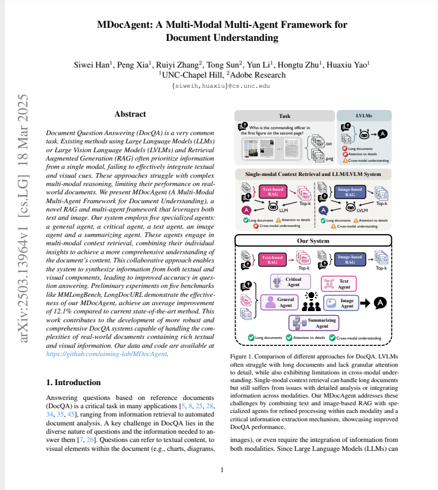
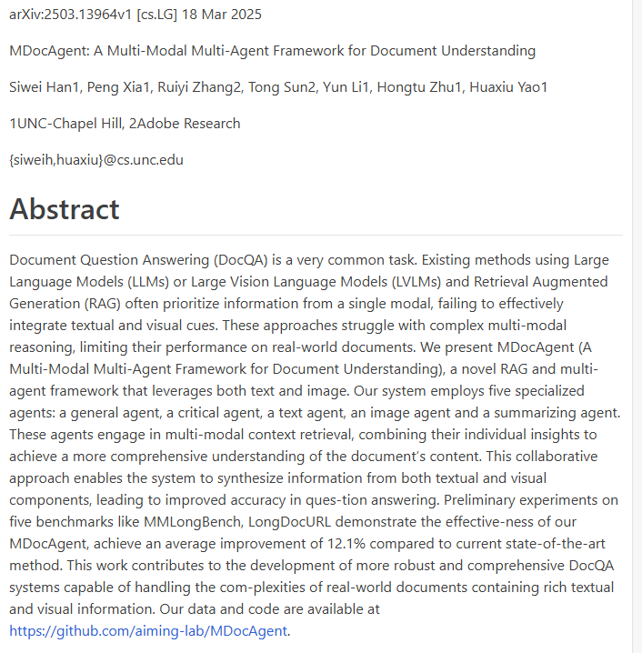
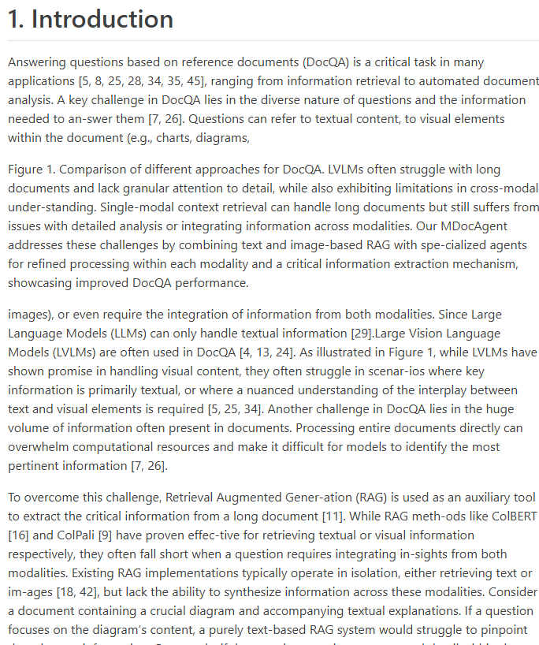
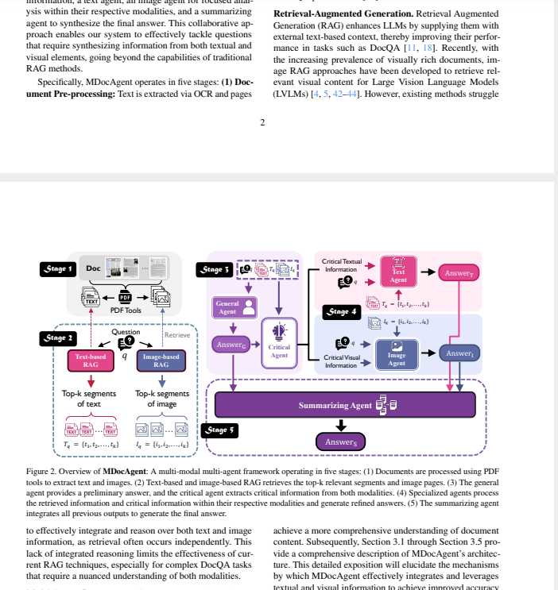
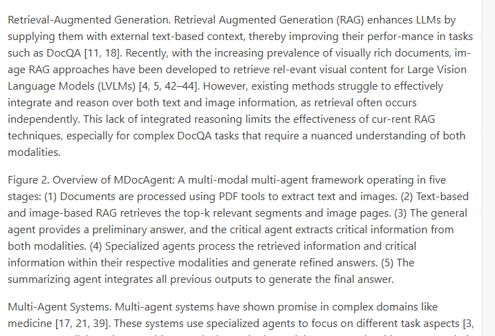
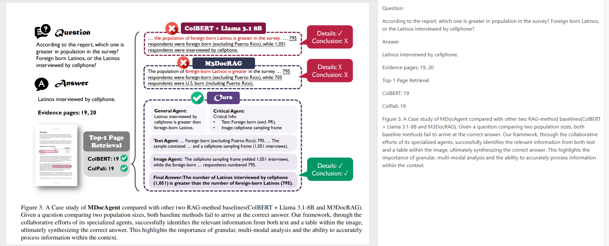

# OCRFlux
作用：将 PDF 和图片转换为干净、可读、纯洁的 Markdown 文本
演示地址：https://ocrflux.pdfparser.io/#/
根据所给示例的尝试了一下，可以看到其在提取文字、表格内容上的准确性很高，不论是分栏还是跨页，还有页面边竖着的文字都能较好地处理识别。不过在跨栏且中间有图片解释干扰时识别就会出现一点问题。
||||
|--|--|--|
|||
||

