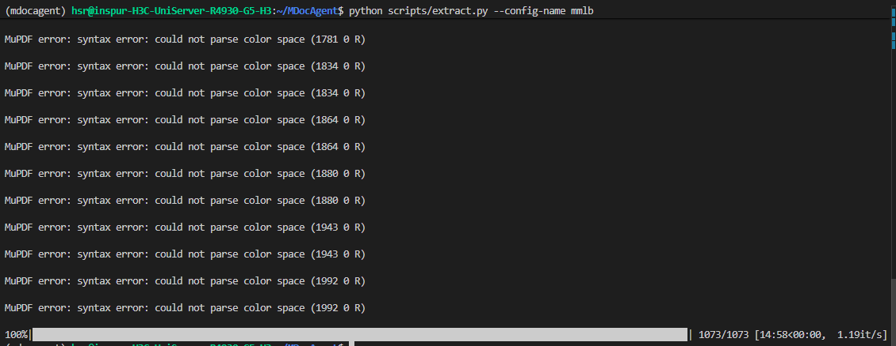
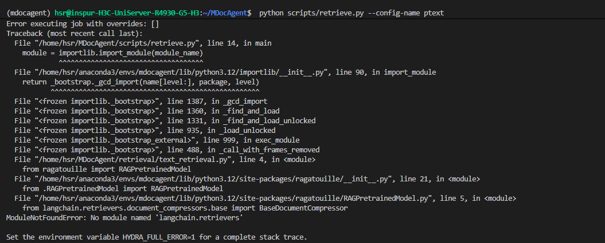
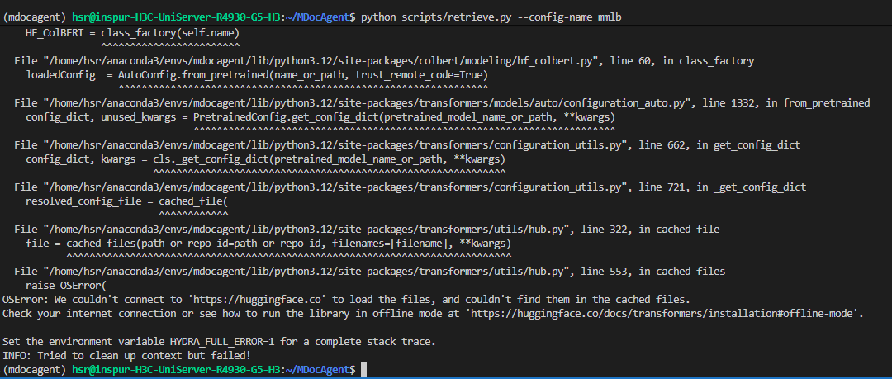

# DAY 3


## 遇到问题
1. 运行MutimodelRAG的代码时，无法下载hugging face使用其CLIP模型
直接克隆到本地，再转移到服务器里。
```  git clone https://huggingface.co/openai/clip-vit-base-patch32 ```
有点慢，但有效。
2. 似乎出现了一点小问题，不知道影不影响结果。

PDF文件中包含损坏或无法解析的颜色空间定义
3. 报错

 ragatouille 库与新版 langchain 的接口不兼容,安装兼容版本的 langchain.
``` 
pip uninstall langchain
pip install langchain==0.0.300                  # 这个也还是报错
pip uninstall langchain langchain-core langsmith -y
pip install langchain==0.0.300 langchain-core==0.0.6 langsmith==0.0.92  # 然后报错说hugging face 版本太低？
pip uninstall huggingface-hub -y
pip install huggingface-hub==0.34.0                 # 好像可以了，继续跑吧，刚好继续看代码去
# 又是因为访问不了hugging face出的问题
``` 

最后参考这个给服务器搞了个代理
https://www.bilibili.com/video/BV1mJ1sYKEoK/?spm_id_from=333.337.search-card.all.click&vd_source=301feeee8ee482b3882c9f098e564491
最后问了一下，是因为用的实验室服务器是内网，没办法连hugging face的，只能下在本地。