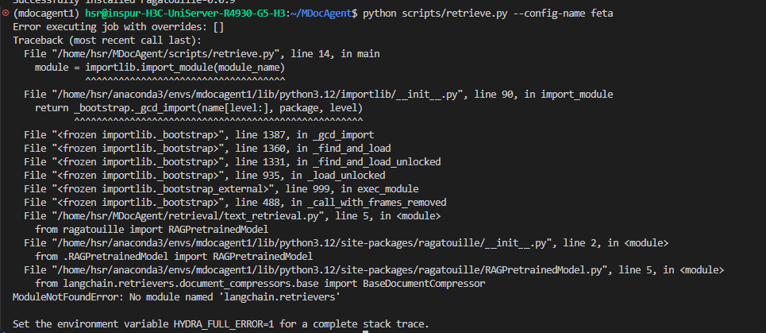
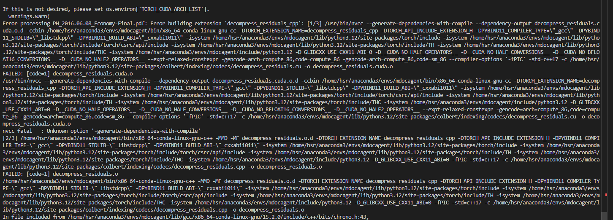
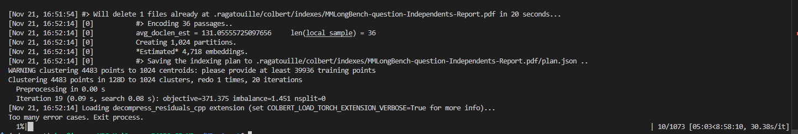
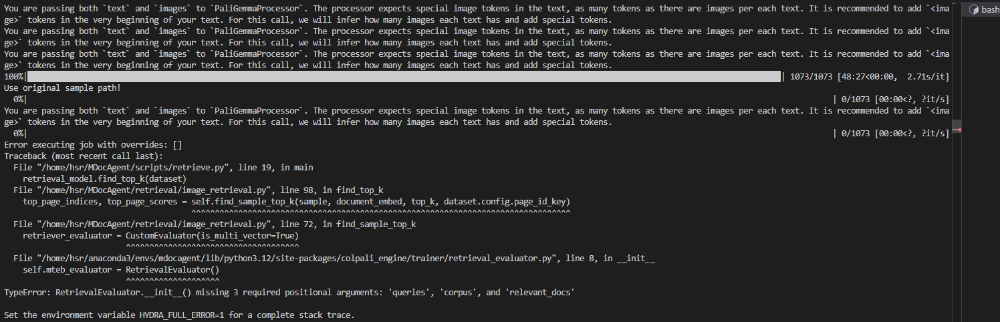
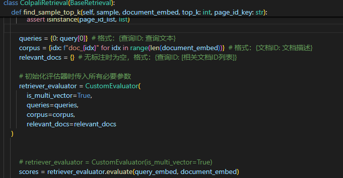
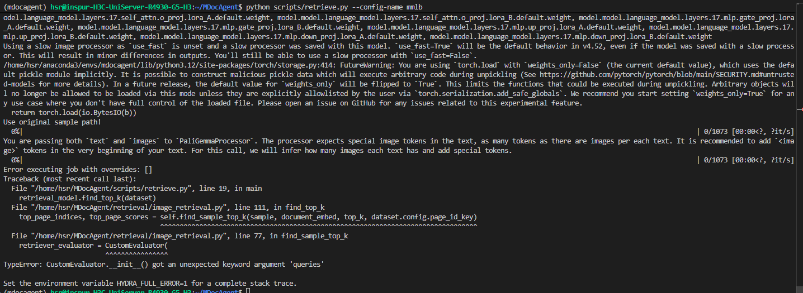

# DAY 5

## 遇到问题
1. text检索：一些报错
   ```
    Error processing PH_2016.06.08_Economy-Final.pdf: module 'decompress_residuals_cpp' has no attribute 'decompress_residuals_cpp' 
    ```
    
    ```
    # 安装的llama-index版本可能有问题，或者ragatouille需要特定版本的llama-index。
    No module named 'llama_index.core.instrumentation'   
    # RAGatouille 0.0.7 需要 llama-index < 0.10.0，但我们有 0.14.8
    # 尝试安装了 RAGatouille 0.0.9 依旧不行
    ERROR: pip's dependency resolver does not currently take into account all the packages that are installed. This behaviour is the source of the following dependency conflicts.
    ragatouille 0.0.7.post1 requires llama-index<0.10.0,>=0.9.24, but you have llama-index 0.14.8 which is incompatible.
    ```
    
     
2. image检索，跑完报错：
    
    修改了一下代码
    
    又报错：
    