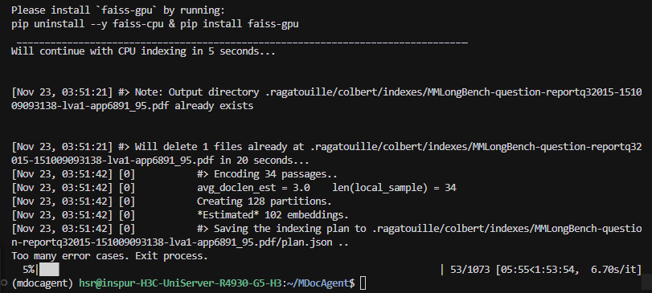

# DAY 7
## 完成任务
从昨晚开始，完成除了MMLongBench以外的四个数据集的text检索（感谢昨天下午师兄的帮忙）
## 遇到问题
1. 
运行  `python scripts/retrieve.py --config-name mmlb` 还是不行
运行以下四个就可以
 ``` 
 python scripts/retrieve.py --config-name feta
 python scripts/retrieve.py --config-name ldu
 python scripts/retrieve.py --config-name ptab
 python scripts/retrieve.py --config-name ptext
 ```
