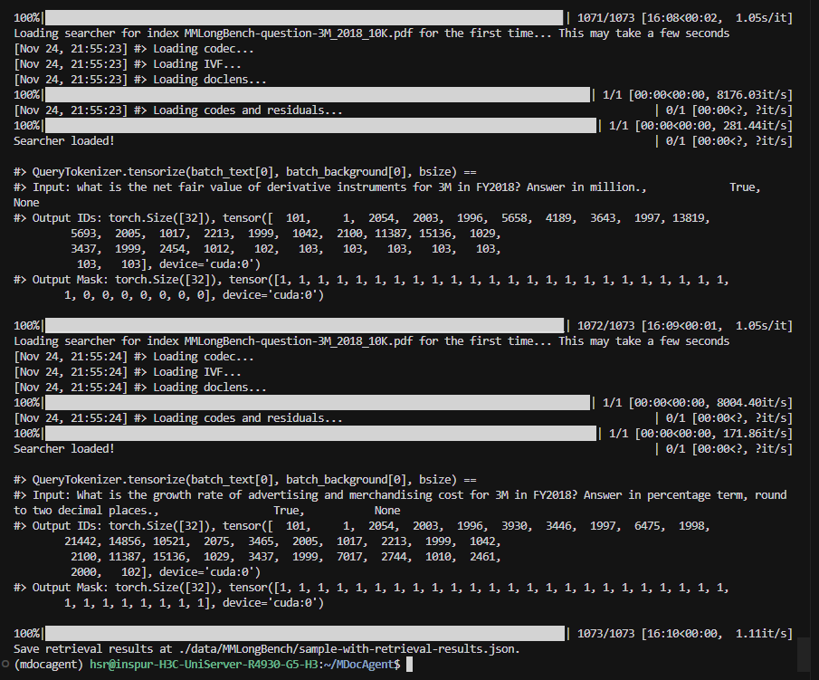

# DAY 8
## 完成任务
完成五个数据集的image检索
## 遇到问题
1.  运行图像检索出现报错
 

```
class CustomEvaluator:
    def __init__(self, is_multi_vector=False, queries=None, corpus=None, relevant_docs=None):
        self.is_multi_vector = is_multi_vector
        if all(arg is not None for arg in (queries, corpus, relevant_docs)):
            self.mteb_evaluator = RetrievalEvaluator(queries, corpus, relevant_docs)
        else:
            self.mteb_evaluator = None

    def compute_metrics(...):
        if self.mteb_evaluator is None:
            raise RuntimeError("RetrievalEvaluator is not initialized. Provide queries/corpus/relevant_docs when creating CustomEvaluator.")
```          
2. Text检索mmlb数据集
```
(mdocagent) hsr@inspur-H3C-UniServer-R4930-G5-H3:~/MDocAgent$ python scripts/retrieve.py --config-name mmlb
/home/hsr/MDocAgent/retrieval/text_retrieval.py:5: UserWarning: 
********************************************************************************
RAGatouille WARNING: Future Release Notice
--------------------------------------------
RAGatouille version 0.0.10 will be migrating to a PyLate backend 
instead of the current Stanford ColBERT backend.
PyLate is a fully mature, feature-equivalent backend, that greatly facilitates compatibility.
However, please pin version <0.0.10 if you require the Stanford ColBERT backend.
********************************************************************************
  from ragatouille import RAGPretrainedModel
[2025-11-24 17:03:36,984][numexpr.utils][INFO] - Note: detected 128 virtual cores but NumExpr set to maximum of 64, check "NUMEXPR_MAX_THREADS" environment variable.
[2025-11-24 17:03:36,984][numexpr.utils][INFO] - Note: NumExpr detected 128 cores but "NUMEXPR_MAX_THREADS" not set, so enforcing safe limit of 16.
[2025-11-24 17:03:36,984][numexpr.utils][INFO] - NumExpr defaulting to 16 threads.
[2025-11-24 17:03:39,819][faiss.loader][INFO] - Loading faiss with AVX2 support.
[2025-11-24 17:03:39,851][faiss.loader][INFO] - Successfully loaded faiss with AVX2 support.
/home/hsr/anaconda3/envs/mdocagent/lib/python3.12/site-packages/colbert/utils/amp.py:12: FutureWarning: `torch.cuda.amp.GradScaler(args...)` is deprecated. Please use `torch.amp.GradScaler('cuda', args...)` instead.
  self.scaler = torch.cuda.amp.GradScaler()
  0%|                                                                                  | 0/1073 [00:00<?, ?it/s]________________________________________________________________________________
WARNING! You have a GPU available, but only `faiss-cpu` is currently installed.
 This means that indexing will be slow. To make use of your GPU.
Please install `faiss-gpu` by running:
pip uninstall --y faiss-cpu & pip install faiss-gpu
 ________________________________________________________________________________
Will continue with CPU indexing in 5 seconds...


[Nov 24, 17:03:46] #> Note: Output directory .ragatouille/colbert/indexes/MMLongBench-question-PH_2016.06.08_Economy-Final.pdf already exists


[Nov 24, 17:03:46] #> Will delete 10 files already at .ragatouille/colbert/indexes/MMLongBench-question-PH_2016.06.08_Economy-Final.pdf in 20 seconds...
[Nov 24, 17:04:07] [0]           #> Encoding 57 passages..
/home/hsr/anaconda3/envs/mdocagent/lib/python3.12/site-packages/colbert/utils/amp.py:15: FutureWarning: `torch.cuda.amp.autocast(args...)` is deprecated. Please use `torch.amp.autocast('cuda', args...)` instead.
  return torch.cuda.amp.autocast() if self.activated else NullContextManager()
[Nov 24, 17:04:07] [0]           avg_doclen_est = 140.19297790527344     len(local_sample) = 57
[Nov 24, 17:04:07] [0]           Creating 1,024 partitions.
[Nov 24, 17:04:07] [0]           *Estimated* 7,990 embeddings.
[Nov 24, 17:04:07] [0]           #> Saving the indexing plan to .ragatouille/colbert/indexes/MMLongBench-question-PH_2016.06.08_Economy-Final.pdf/plan.json ..
/home/hsr/anaconda3/envs/mdocagent/lib/python3.12/site-packages/colbert/indexing/collection_indexer.py:256: FutureWarning: You are using `torch.load` with `weights_only=False` (the current default value), which uses the default pickle module implicitly. It is possible to construct malicious pickle data which will execute arbitrary code during unpickling (See https://github.com/pytorch/pytorch/blob/main/SECURITY.md#untrusted-models for more details). In a future release, the default value for `weights_only` will be flipped to `True`. This limits the functions that could be executed during unpickling. Arbitrary objects will no longer be allowed to be loaded via this mode unless they are explicitly allowlisted by the user via `torch.serialization.add_safe_globals`. We recommend you start setting `weights_only=True` for any use case where you don't have full control of the loaded file. Please open an issue on GitHub for any issues related to this experimental feature.
  sub_sample = torch.load(sub_sample_path)
WARNING clustering 7592 points to 1024 centroids: please provide at least 39936 training points
Clustering 7592 points in 128D to 1024 clusters, redo 1 times, 20 iterations
  Preprocessing in 0.00 s
  Iteration 19 (0.32 s, search 0.29 s): objective=965.155 imbalance=1.466 nsplit=0       
[Nov 24, 17:04:08] Loading decompress_residuals_cpp extension (set COLBERT_LOAD_TORCH_EXTENSION_VERBOSE=True for more info)...
/home/hsr/anaconda3/envs/mdocagent/lib/python3.12/site-packages/torch/utils/cpp_extension.py:1965: UserWarning: TORCH_CUDA_ARCH_LIST is not set, all archs for visible cards are included for compilation. 
If this is not desired, please set os.environ['TORCH_CUDA_ARCH_LIST'].
  warnings.warn(
[Nov 24, 17:04:29] Warning: Failed to load decompress_residuals_cpp extension: Error building extension 'decompress_residuals_cpp': [1/3] /usr/bin/nvcc --generate-dependencies-with-compile --dependency-output decompress_residuals.cuda.o.d -ccbin /home/hsr/anaconda3/envs/mdocagent/bin/x86_64-conda-linux-gnu-cc -DTORCH_EXTENSION_NAME=decompress_residuals_cpp -DTORCH_API_INCLUDE_EXTENSION_H -DPYBIND11_COMPILER_TYPE=\"_gcc\" -DPYBIND11_STDLIB=\"_libstdcpp\" -DPYBIND11_BUILD_ABI=\"_cxxabi1011\" -isystem /home/hsr/anaconda3/envs/mdocagent/lib/python3.12/site-packages/torch/include -isystem /home/hsr/anaconda3/envs/mdocagent/lib/python3.12/site-packages/torch/include/torch/csrc/api/include -isystem /home/hsr/anaconda3/envs/mdocagent/lib/python3.12/site-packages/torch/include/TH -isystem /home/hsr/anaconda3/envs/mdocagent/lib/python3.12/site-packages/torch/include/THC -isystem /home/hsr/anaconda3/envs/mdocagent/include/python3.12 -D_GLIBCXX_USE_CXX11_ABI=0 -D__CUDA_NO_HALF_OPERATORS__ -D__CUDA_NO_HALF_CONVERSIONS__ -D__CUDA_NO_BFLOAT16_CONVERSIONS__ -D__CUDA_NO_HALF2_OPERATORS__ --expt-relaxed-constexpr -gencode=arch=compute_86,code=compute_86 -gencode=arch=compute_86,code=sm_86 --compiler-options '-fPIC' -std=c++17 -c /home/hsr/anaconda3/envs/mdocagent/lib/python3.12/site-packages/colbert/indexing/codecs/decompress_residuals.cu -o decompress_residuals.cuda.o 
FAILED: [code=1] decompress_residuals.cuda.o 
/usr/bin/nvcc --generate-dependencies-with-compile --dependency-output decompress_residuals.cuda.o.d -ccbin /home/hsr/anaconda3/envs/mdocagent/bin/x86_64-conda-linux-gnu-cc -DTORCH_EXTENSION_NAME=decompress_residuals_cpp -DTORCH_API_INCLUDE_EXTENSION_H -DPYBIND11_COMPILER_TYPE=\"_gcc\" -DPYBIND11_STDLIB=\"_libstdcpp\" -DPYBIND11_BUILD_ABI=\"_cxxabi1011\" -isystem /home/hsr/anaconda3/envs/mdocagent/lib/python3.12/site-packages/torch/include -isystem /home/hsr/anaconda3/envs/mdocagent/lib/python3.12/site-packages/torch/include/torch/csrc/api/include -isystem /home/hsr/anaconda3/envs/mdocagent/lib/python3.12/site-packages/torch/include/TH -isystem /home/hsr/anaconda3/envs/mdocagent/lib/python3.12/site-packages/torch/include/THC -isystem /home/hsr/anaconda3/envs/mdocagent/include/python3.12 -D_GLIBCXX_USE_CXX11_ABI=0 -D__CUDA_NO_HALF_OPERATORS__ -D__CUDA_NO_HALF_CONVERSIONS__ -D__CUDA_NO_BFLOAT16_CONVERSIONS__ -D__CUDA_NO_HALF2_OPERATORS__ --expt-relaxed-constexpr -gencode=arch=compute_86,code=compute_86 -gencode=arch=compute_86,code=sm_86 --compiler-options '-fPIC' -std=c++17 -c /home/hsr/anaconda3/envs/mdocagent/lib/python3.12/site-packages/colbert/indexing/codecs/decompress_residuals.cu -o decompress_residuals.cuda.o 
nvcc fatal   : Unknown option '-generate-dependencies-with-compile'
[2/3] /home/hsr/anaconda3/envs/mdocagent/bin/x86_64-conda-linux-gnu-c++ -MMD -MF decompress_residuals.o.d -DTORCH_EXTENSION_NAME=decompress_residuals_cpp -DTORCH_API_INCLUDE_EXTENSION_H -DPYBIND11_COMPILER_TYPE=\"_gcc\" -DPYBIND11_STDLIB=\"_libstdcpp\" -DPYBIND11_BUILD_ABI=\"_cxxabi1011\" -isystem /home/hsr/anaconda3/envs/mdocagent/lib/python3.12/site-packages/torch/include -isystem /home/hsr/anaconda3/envs/mdocagent/lib/python3.12/site-packages/torch/include/torch/csrc/api/include -isystem /home/hsr/anaconda3/envs/mdocagent/lib/python3.12/site-packages/torch/include/TH -isystem /home/hsr/anaconda3/envs/mdocagent/lib/python3.12/site-packages/torch/include/THC -isystem /home/hsr/anaconda3/envs/mdocagent/include/python3.12 -D_GLIBCXX_USE_CXX11_ABI=0 -fPIC -std=c++17 -c /home/hsr/anaconda3/envs/mdocagent/lib/python3.12/site-packages/colbert/indexing/codecs/decompress_residuals.cpp -o decompress_residuals.o 
FAILED: [code=1] decompress_residuals.o 
/home/hsr/anaconda3/envs/mdocagent/bin/x86_64-conda-linux-gnu-c++ -MMD -MF decompress_residuals.o.d -DTORCH_EXTENSION_NAME=decompress_residuals_cpp -DTORCH_API_INCLUDE_EXTENSION_H -DPYBIND11_COMPILER_TYPE=\"_gcc\" -DPYBIND11_STDLIB=\"_libstdcpp\" -DPYBIND11_BUILD_ABI=\"_cxxabi1011\" -isystem /home/hsr/anaconda3/envs/mdocagent/lib/python3.12/site-packages/torch/include -isystem /home/hsr/anaconda3/envs/mdocagent/lib/python3.12/site-packages/torch/include/torch/csrc/api/include -isystem /home/hsr/anaconda3/envs/mdocagent/lib/python3.12/site-packages/torch/include/TH -isystem /home/hsr/anaconda3/envs/mdocagent/lib/python3.12/site-packages/torch/include/THC -isystem /home/hsr/anaconda3/envs/mdocagent/include/python3.12 -D_GLIBCXX_USE_CXX11_ABI=0 -fPIC -std=c++17 -c /home/hsr/anaconda3/envs/mdocagent/lib/python3.12/site-packages/colbert/indexing/codecs/decompress_residuals.cpp -o decompress_residuals.o 
In file included from /home/hsr/anaconda3/envs/mdocagent/lib/gcc/x86_64-conda-linux-gnu/15.2.0/include/c++/bits/chrono.h:43,
                 from /home/hsr/anaconda3/envs/mdocagent/lib/gcc/x86_64-conda-linux-gnu/15.2.0/include/c++/mutex:45,
                 from /home/hsr/anaconda3/envs/mdocagent/lib/python3.12/site-packages/torch/include/c10/util/typeid.h:8,
                 from /home/hsr/anaconda3/envs/mdocagent/lib/python3.12/site-packages/torch/include/c10/core/ScalarTypeToTypeMeta.h:5,
                 from /home/hsr/anaconda3/envs/mdocagent/lib/python3.12/site-packages/torch/include/ATen/core/TensorBody.h:18,
                 from /home/hsr/anaconda3/envs/mdocagent/lib/python3.12/site-packages/torch/include/ATen/core/Tensor.h:3,
                 from /home/hsr/anaconda3/envs/mdocagent/lib/python3.12/site-packages/torch/include/ATen/Tensor.h:3,
                 from /home/hsr/anaconda3/envs/mdocagent/lib/python3.12/site-packages/torch/include/torch/csrc/autograd/function_hook.h:3,
                 from /home/hsr/anaconda3/envs/mdocagent/lib/python3.12/site-packages/torch/include/torch/csrc/autograd/cpp_hook.h:2,
                 from /home/hsr/anaconda3/envs/mdocagent/lib/python3.12/site-packages/torch/include/torch/csrc/autograd/variable.h:6,
                 from /home/hsr/anaconda3/envs/mdocagent/lib/python3.12/site-packages/torch/include/torch/csrc/autograd/autograd.h:3,
                 from /home/hsr/anaconda3/envs/mdocagent/lib/python3.12/site-packages/torch/include/torch/csrc/api/include/torch/autograd.h:3,
                 from /home/hsr/anaconda3/envs/mdocagent/lib/python3.12/site-packages/torch/include/torch/csrc/api/include/torch/all.h:7,
                 from /home/hsr/anaconda3/envs/mdocagent/lib/python3.12/site-packages/torch/include/torch/extension.h:5,
                 from /home/hsr/anaconda3/envs/mdocagent/lib/python3.12/site-packages/colbert/indexing/codecs/decompress_residuals.cpp:7:
/home/hsr/anaconda3/envs/mdocagent/lib/gcc/x86_64-conda-linux-gnu/15.2.0/include/c++/ctime:82:11: error: 'timespec_get' has not been declared in '::'
   82 |   using ::timespec_get;
      |           ^~~~~~~~~~~~
ninja: build stopped: subcommand failed.
. Using GPU mode fallback.
[Nov 24, 17:04:29] Loading packbits_cpp extension (set COLBERT_LOAD_TORCH_EXTENSION_VERBOSE=True for more info)...
/home/hsr/anaconda3/envs/mdocagent/lib/python3.12/site-packages/torch/utils/cpp_extension.py:1965: UserWarning: TORCH_CUDA_ARCH_LIST is not set, all archs for visible cards are included for compilation. 
If this is not desired, please set os.environ['TORCH_CUDA_ARCH_LIST'].
  warnings.warn(
[Nov 24, 17:04:50] Warning: Failed to load packbits_cpp extension: Error building extension 'packbits_cpp': [1/3] /usr/bin/nvcc --generate-dependencies-with-compile --dependency-output packbits.cuda.o.d -ccbin /home/hsr/anaconda3/envs/mdocagent/bin/x86_64-conda-linux-gnu-cc -DTORCH_EXTENSION_NAME=packbits_cpp -DTORCH_API_INCLUDE_EXTENSION_H -DPYBIND11_COMPILER_TYPE=\"_gcc\" -DPYBIND11_STDLIB=\"_libstdcpp\" -DPYBIND11_BUILD_ABI=\"_cxxabi1011\" -isystem /home/hsr/anaconda3/envs/mdocagent/lib/python3.12/site-packages/torch/include -isystem /home/hsr/anaconda3/envs/mdocagent/lib/python3.12/site-packages/torch/include/torch/csrc/api/include -isystem /home/hsr/anaconda3/envs/mdocagent/lib/python3.12/site-packages/torch/include/TH -isystem /home/hsr/anaconda3/envs/mdocagent/lib/python3.12/site-packages/torch/include/THC -isystem /home/hsr/anaconda3/envs/mdocagent/include/python3.12 -D_GLIBCXX_USE_CXX11_ABI=0 -D__CUDA_NO_HALF_OPERATORS__ -D__CUDA_NO_HALF_CONVERSIONS__ -D__CUDA_NO_BFLOAT16_CONVERSIONS__ -D__CUDA_NO_HALF2_OPERATORS__ --expt-relaxed-constexpr -gencode=arch=compute_86,code=compute_86 -gencode=arch=compute_86,code=sm_86 --compiler-options '-fPIC' -std=c++17 -c /home/hsr/anaconda3/envs/mdocagent/lib/python3.12/site-packages/colbert/indexing/codecs/packbits.cu -o packbits.cuda.o 
FAILED: [code=1] packbits.cuda.o 
/usr/bin/nvcc --generate-dependencies-with-compile --dependency-output packbits.cuda.o.d -ccbin /home/hsr/anaconda3/envs/mdocagent/bin/x86_64-conda-linux-gnu-cc -DTORCH_EXTENSION_NAME=packbits_cpp -DTORCH_API_INCLUDE_EXTENSION_H -DPYBIND11_COMPILER_TYPE=\"_gcc\" -DPYBIND11_STDLIB=\"_libstdcpp\" -DPYBIND11_BUILD_ABI=\"_cxxabi1011\" -isystem /home/hsr/anaconda3/envs/mdocagent/lib/python3.12/site-packages/torch/include -isystem /home/hsr/anaconda3/envs/mdocagent/lib/python3.12/site-packages/torch/include/torch/csrc/api/include -isystem /home/hsr/anaconda3/envs/mdocagent/lib/python3.12/site-packages/torch/include/TH -isystem /home/hsr/anaconda3/envs/mdocagent/lib/python3.12/site-packages/torch/include/THC -isystem /home/hsr/anaconda3/envs/mdocagent/include/python3.12 -D_GLIBCXX_USE_CXX11_ABI=0 -D__CUDA_NO_HALF_OPERATORS__ -D__CUDA_NO_HALF_CONVERSIONS__ -D__CUDA_NO_BFLOAT16_CONVERSIONS__ -D__CUDA_NO_HALF2_OPERATORS__ --expt-relaxed-constexpr -gencode=arch=compute_86,code=compute_86 -gencode=arch=compute_86,code=sm_86 --compiler-options '-fPIC' -std=c++17 -c /home/hsr/anaconda3/envs/mdocagent/lib/python3.12/site-packages/colbert/indexing/codecs/packbits.cu -o packbits.cuda.o 
nvcc fatal   : Unknown option '-generate-dependencies-with-compile'
[2/3] /home/hsr/anaconda3/envs/mdocagent/bin/x86_64-conda-linux-gnu-c++ -MMD -MF packbits.o.d -DTORCH_EXTENSION_NAME=packbits_cpp -DTORCH_API_INCLUDE_EXTENSION_H -DPYBIND11_COMPILER_TYPE=\"_gcc\" -DPYBIND11_STDLIB=\"_libstdcpp\" -DPYBIND11_BUILD_ABI=\"_cxxabi1011\" -isystem /home/hsr/anaconda3/envs/mdocagent/lib/python3.12/site-packages/torch/include -isystem /home/hsr/anaconda3/envs/mdocagent/lib/python3.12/site-packages/torch/include/torch/csrc/api/include -isystem /home/hsr/anaconda3/envs/mdocagent/lib/python3.12/site-packages/torch/include/TH -isystem /home/hsr/anaconda3/envs/mdocagent/lib/python3.12/site-packages/torch/include/THC -isystem /home/hsr/anaconda3/envs/mdocagent/include/python3.12 -D_GLIBCXX_USE_CXX11_ABI=0 -fPIC -std=c++17 -c /home/hsr/anaconda3/envs/mdocagent/lib/python3.12/site-packages/colbert/indexing/codecs/packbits.cpp -o packbits.o 
FAILED: [code=1] packbits.o 
/home/hsr/anaconda3/envs/mdocagent/bin/x86_64-conda-linux-gnu-c++ -MMD -MF packbits.o.d -DTORCH_EXTENSION_NAME=packbits_cpp -DTORCH_API_INCLUDE_EXTENSION_H -DPYBIND11_COMPILER_TYPE=\"_gcc\" -DPYBIND11_STDLIB=\"_libstdcpp\" -DPYBIND11_BUILD_ABI=\"_cxxabi1011\" -isystem /home/hsr/anaconda3/envs/mdocagent/lib/python3.12/site-packages/torch/include -isystem /home/hsr/anaconda3/envs/mdocagent/lib/python3.12/site-packages/torch/include/torch/csrc/api/include -isystem /home/hsr/anaconda3/envs/mdocagent/lib/python3.12/site-packages/torch/include/TH -isystem /home/hsr/anaconda3/envs/mdocagent/lib/python3.12/site-packages/torch/include/THC -isystem /home/hsr/anaconda3/envs/mdocagent/include/python3.12 -D_GLIBCXX_USE_CXX11_ABI=0 -fPIC -std=c++17 -c /home/hsr/anaconda3/envs/mdocagent/lib/python3.12/site-packages/colbert/indexing/codecs/packbits.cpp -o packbits.o 
In file included from /home/hsr/anaconda3/envs/mdocagent/lib/gcc/x86_64-conda-linux-gnu/15.2.0/include/c++/bits/chrono.h:43,
                 from /home/hsr/anaconda3/envs/mdocagent/lib/gcc/x86_64-conda-linux-gnu/15.2.0/include/c++/mutex:45,
                 from /home/hsr/anaconda3/envs/mdocagent/lib/python3.12/site-packages/torch/include/c10/util/typeid.h:8,
                 from /home/hsr/anaconda3/envs/mdocagent/lib/python3.12/site-packages/torch/include/c10/core/ScalarTypeToTypeMeta.h:5,
                 from /home/hsr/anaconda3/envs/mdocagent/lib/python3.12/site-packages/torch/include/ATen/core/TensorBody.h:18,
                 from /home/hsr/anaconda3/envs/mdocagent/lib/python3.12/site-packages/torch/include/ATen/core/Tensor.h:3,
                 from /home/hsr/anaconda3/envs/mdocagent/lib/python3.12/site-packages/torch/include/ATen/Tensor.h:3,
                 from /home/hsr/anaconda3/envs/mdocagent/lib/python3.12/site-packages/torch/include/torch/csrc/autograd/function_hook.h:3,
                 from /home/hsr/anaconda3/envs/mdocagent/lib/python3.12/site-packages/torch/include/torch/csrc/autograd/cpp_hook.h:2,
                 from /home/hsr/anaconda3/envs/mdocagent/lib/python3.12/site-packages/torch/include/torch/csrc/autograd/variable.h:6,
                 from /home/hsr/anaconda3/envs/mdocagent/lib/python3.12/site-packages/torch/include/torch/csrc/autograd/autograd.h:3,
                 from /home/hsr/anaconda3/envs/mdocagent/lib/python3.12/site-packages/torch/include/torch/csrc/api/include/torch/autograd.h:3,
                 from /home/hsr/anaconda3/envs/mdocagent/lib/python3.12/site-packages/torch/include/torch/csrc/api/include/torch/all.h:7,
                 from /home/hsr/anaconda3/envs/mdocagent/lib/python3.12/site-packages/torch/include/torch/extension.h:5,
                 from /home/hsr/anaconda3/envs/mdocagent/lib/python3.12/site-packages/colbert/indexing/codecs/packbits.cpp:9:
/home/hsr/anaconda3/envs/mdocagent/lib/gcc/x86_64-conda-linux-gnu/15.2.0/include/c++/ctime:82:11: error: 'timespec_get' has not been declared in '::'
   82 |   using ::timespec_get;
      |           ^~~~~~~~~~~~
ninja: build stopped: subcommand failed.
. Using fallback.
[0.025, 0.028, 0.029, 0.027, 0.031, 0.028, 0.028, 0.027, 0.024, 0.029, 0.027, 0.028, 0.028, 0.032, 0.024, 0.03, 0.026, 0.026, 0.03, 0.032, 0.03, 0.029, 0.028, 0.027, 0.027, 0.03, 0.03, 0.028, 0.029, 0.029, 0.026, 0.031, 0.031, 0.024, 0.026, 0.022, 0.028, 0.029, 0.027, 0.03, 0.031, 0.026, 0.025, 0.029, 0.027, 0.029, 0.028, 0.028, 0.027, 0.027, 0.025, 0.027, 0.029, 0.03, 0.026, 0.029, 0.03, 0.029, 0.032, 0.027, 0.026, 0.029, 0.028, 0.026, 0.028, 0.028, 0.028, 0.028, 0.026, 0.027, 0.026, 0.026, 0.027, 0.03, 0.028, 0.029, 0.029, 0.028, 0.028, 0.03, 0.031, 0.025, 0.029, 0.029, 0.029, 0.024, 0.029, 0.027, 0.029, 0.029, 0.027, 0.027, 0.026, 0.026, 0.029, 0.026, 0.03, 0.027, 0.027, 0.031, 0.03, 0.027, 0.028, 0.027, 0.026, 0.033, 0.025, 0.025, 0.027, 0.025, 0.027, 0.026, 0.028, 0.025, 0.03, 0.032, 0.027, 0.028, 0.025, 0.027, 0.026, 0.027, 0.029, 0.028, 0.024, 0.025, 0.025, 0.03]
/home/hsr/anaconda3/envs/mdocagent/lib/python3.12/site-packages/colbert/indexing/codecs/residual.py:157: FutureWarning: You are using `torch.load` with `weights_only=False` (the current default value), which uses the default pickle module implicitly. It is possible to construct malicious pickle data which will execute arbitrary code during unpickling (See https://github.com/pytorch/pytorch/blob/main/SECURITY.md#untrusted-models for more details). In a future release, the default value for `weights_only` will be flipped to `True`. This limits the functions that could be executed during unpickling. Arbitrary objects will no longer be allowed to be loaded via this mode unless they are explicitly allowlisted by the user via `torch.serialization.add_safe_globals`. We recommend you start setting `weights_only=True` for any use case where you don't have full control of the loaded file. Please open an issue on GitHub for any issues related to this experimental feature.
  centroids = torch.load(centroids_path, map_location='cpu')
/home/hsr/anaconda3/envs/mdocagent/lib/python3.12/site-packages/colbert/indexing/codecs/residual.py:158: FutureWarning: You are using `torch.load` with `weights_only=False` (the current default value), which uses the default pickle module implicitly. It is possible to construct malicious pickle data which will execute arbitrary code during unpickling (See https://github.com/pytorch/pytorch/blob/main/SECURITY.md#untrusted-models for more details). In a future release, the default value for `weights_only` will be flipped to `True`. This limits the functions that could be executed during unpickling. Arbitrary objects will no longer be allowed to be loaded via this mode unless they are explicitly allowlisted by the user via `torch.serialization.add_safe_globals`. We recommend you start setting `weights_only=True` for any use case where you don't have full control of the loaded file. Please open an issue on GitHub for any issues related to this experimental feature.
  avg_residual = torch.load(avgresidual_path, map_location='cpu')
/home/hsr/anaconda3/envs/mdocagent/lib/python3.12/site-packages/colbert/indexing/codecs/residual.py:159: FutureWarning: You are using `torch.load` with `weights_only=False` (the current default value), which uses the default pickle module implicitly. It is possible to construct malicious pickle data which will execute arbitrary code during unpickling (See https://github.com/pytorch/pytorch/blob/main/SECURITY.md#untrusted-models for more details). In a future release, the default value for `weights_only` will be flipped to `True`. This limits the functions that could be executed during unpickling. Arbitrary objects will no longer be allowed to be loaded via this mode unless they are explicitly allowlisted by the user via `torch.serialization.add_safe_globals`. We recommend you start setting `weights_only=True` for any use case where you don't have full control of the loaded file. Please open an issue on GitHub for any issues related to this experimental feature.
  bucket_cutoffs, bucket_weights = torch.load(buckets_path, map_location='cpu')
                  [Nov 24, 17:04:50] [0]                 #> Encoding 57 passages..
/home/hsr/anaconda3/envs/mdocagent/lib/python3.12/site-packages/colbert/utils/amp.py:15: FutureWarning: `torch.cuda.amp.autocast(args...)` is deprecated. Please use `torch.amp.autocast('cuda', args...)` instead.
  return torch.cuda.amp.autocast() if self.activated else NullContextManager()
1it [00:00,  6.81it/s]
1it [00:00,  6.82it/s]                                                                                         /home/hsr/anaconda3/envs/mdocagent/lib/python3.12/site-packages/colbert/indexing/codecs/residual_embeddings.py:86: FutureWarning: You are using `torch.load` with `weights_only=False` (the current default value), which uses the default pickle module implicitly. It is possible to construct malicious pickle data which will execute arbitrary code during unpickling (See https://github.com/pytorch/pytorch/blob/main/SECURITY.md#untrusted-models for more details). In a future release, the default value for `weights_only` will be flipped to `True`. This limits the functions that could be executed during unpickling. Arbitrary objects will no longer be allowed to be loaded via this mode unless they are explicitly allowlisted by the user via `torch.serialization.add_safe_globals`. We recommend you start setting `weights_only=True` for any use case where you don't have full control of the loaded file. Please open an issue on GitHub for any issues related to this experimental feature.
  return torch.load(codes_path, map_location='cpu')
100%|███████████████████████████████████████████████████████████████████████████| 1/1 [00:00<00:00, 1181.49it/s]
[Nov 24, 17:04:50] #> Optimizing IVF to store map from centroids to list of pids..
[Nov 24, 17:04:50] #> Building the emb2pid mapping..
[Nov 24, 17:04:50] len(emb2pid) = 7991
100%|████████████████████████████████████████████████████████████████████| 1024/1024 [00:00<00:00, 35548.77it/s]
[Nov 24, 17:04:50] #> Saved optimized IVF to .ragatouille/colbert/indexes/MMLongBench-question-PH_2016.06.08_Economy-Final.pdf/ivf.pid.pt
Done indexing!
  0%|                                                                       | 1/1073 [01:09<20:38:21, 69.31s/it]New index_name received! Updating current index_name (MMLongBench-question-PH_2016.06.08_Economy-Final.pdf) to MMLongBench-question-Independents-Report.pdf
________________________________________________________________________________
WARNING! You have a GPU available, but only `faiss-cpu` is currently installed.
 This means that indexing will be slow. To make use of your GPU.
Please install `faiss-gpu` by running:
pip uninstall --y faiss-cpu & pip install faiss-gpu
 ________________________________________________________________________________
Will continue with CPU indexing in 5 seconds...


[Nov 24, 17:04:55] #> Note: Output directory .ragatouille/colbert/indexes/MMLongBench-question-Independents-Report.pdf already exists


[Nov 24, 17:04:55] #> Will delete 10 files already at .ragatouille/colbert/indexes/MMLongBench-question-Independents-Report.pdf in 20 seconds...
/home/hsr/anaconda3/envs/mdocagent/lib/python3.12/site-packages/colbert/utils/amp.py:12: FutureWarning: `torch.cuda.amp.GradScaler(args...)` is deprecated. Please use `torch.amp.GradScaler('cuda', args...)` instead.
  self.scaler = torch.cuda.amp.GradScaler()
[Nov 24, 17:05:15] [0]           #> Encoding 36 passages..
[Nov 24, 17:05:16] [0]           avg_doclen_est = 131.05555725097656     len(local_sample) = 36
[Nov 24, 17:05:16] [0]           Creating 1,024 partitions.
[Nov 24, 17:05:16] [0]           *Estimated* 4,718 embeddings.
[Nov 24, 17:05:16] [0]           #> Saving the indexing plan to .ragatouille/colbert/indexes/MMLongBench-question-Independents-Report.pdf/plan.json ..
/home/hsr/anaconda3/envs/mdocagent/lib/python3.12/site-packages/colbert/indexing/collection_indexer.py:256: FutureWarning: You are using `torch.load` with `weights_only=False` (the current default value), which uses the default pickle module implicitly. It is possible to construct malicious pickle data which will execute arbitrary code during unpickling (See https://github.com/pytorch/pytorch/blob/main/SECURITY.md#untrusted-models for more details). In a future release, the default value for `weights_only` will be flipped to `True`. This limits the functions that could be executed during unpickling. Arbitrary objects will no longer be allowed to be loaded via this mode unless they are explicitly allowlisted by the user via `torch.serialization.add_safe_globals`. We recommend you start setting `weights_only=True` for any use case where you don't have full control of the loaded file. Please open an issue on GitHub for any issues related to this experimental feature.
  sub_sample = torch.load(sub_sample_path)
WARNING clustering 4483 points to 1024 centroids: please provide at least 39936 training points
Clustering 4483 points in 128D to 1024 clusters, redo 1 times, 20 iterations
  Preprocessing in 0.00 s
  Iteration 19 (0.12 s, search 0.10 s): objective=371.375 imbalance=1.451 nsplit=0       
[0.026, 0.028, 0.028, 0.023, 0.024, 0.025, 0.029, 0.023, 0.023, 0.026, 0.022, 0.023, 0.024, 0.025, 0.024, 0.025, 0.02, 0.025, 0.024, 0.022, 0.025, 0.028, 0.027, 0.023, 0.023, 0.022, 0.028, 0.024, 0.03, 0.024, 0.023, 0.028, 0.027, 0.023, 0.025, 0.024, 0.027, 0.025, 0.023, 0.028, 0.028, 0.022, 0.026, 0.022, 0.023, 0.028, 0.029, 0.026, 0.027, 0.026, 0.025, 0.025, 0.024, 0.025, 0.025, 0.025, 0.025, 0.024, 0.028, 0.025, 0.023, 0.028, 0.025, 0.024, 0.025, 0.024, 0.027, 0.028, 0.022, 0.024, 0.026, 0.023, 0.026, 0.025, 0.026, 0.028, 0.026, 0.026, 0.026, 0.023, 0.029, 0.023, 0.025, 0.024, 0.025, 0.026, 0.024, 0.026, 0.022, 0.025, 0.027, 0.027, 0.027, 0.023, 0.025, 0.025, 0.026, 0.021, 0.027, 0.027, 0.028, 0.027, 0.025, 0.023, 0.027, 0.028, 0.025, 0.024, 0.024, 0.024, 0.024, 0.022, 0.028, 0.022, 0.026, 0.026, 0.026, 0.025, 0.024, 0.025, 0.025, 0.024, 0.023, 0.026, 0.026, 0.024, 0.026, 0.026]
                  [Nov 24, 17:05:16] [0]                 #> Encoding 36 passages..
1it [00:00, 10.94it/s]
100%|███████████████████████████████████████████████████████████████████████████| 1/1 [00:00<00:00, 1323.54it/s]
[Nov 24, 17:05:16] #> Optimizing IVF to store map from centroids to list of pids..        | 0/1 [00:00<?, ?it/s]
[Nov 24, 17:05:16] #> Building the emb2pid mapping..
[Nov 24, 17:05:16] len(emb2pid) = 4718
100%|████████████████████████████████████████████████████████████████████| 1024/1024 [00:00<00:00, 40462.07it/s]
[Nov 24, 17:05:16] #> Saved optimized IVF to .ragatouille/colbert/indexes/MMLongBench-question-Independents-Report.pdf/ivf.pid.pt
Done indexing!
  1%|▌                                                                       | 8/1073 [01:35<2:51:34,  9.67s/it]New index_name received! Updating current index_name (MMLongBench-question-Independents-Report.pdf) to MMLongBench-question-0e94b4197b10096b1f4c699701570fbf.pdf
________________________________________________________________________________
WARNING! You have a GPU available, but only `faiss-cpu` is currently installed.
 This means that indexing will be slow. To make use of your GPU.
Please install `faiss-gpu` by running:
pip uninstall --y faiss-cpu & pip install faiss-gpu
 ________________________________________________________________________________
Will continue with CPU indexing in 5 seconds...


[Nov 24, 17:05:21] #> Note: Output directory .ragatouille/colbert/indexes/MMLongBench-question-0e94b4197b10096b1f4c699701570fbf.pdf already exists


[Nov 24, 17:05:21] #> Will delete 10 files already at .ragatouille/colbert/indexes/MMLongBench-question-0e94b4197b10096b1f4c699701570fbf.pdf in 20 seconds...
[Nov 24, 17:05:41] [0]           #> Encoding 15 passages..
[Nov 24, 17:05:41] [0]           avg_doclen_est = 27.733333587646484     len(local_sample) = 15
[Nov 24, 17:05:41] [0]           Creating 256 partitions.
[Nov 24, 17:05:41] [0]           *Estimated* 416 embeddings.
[Nov 24, 17:05:41] [0]           #> Saving the indexing plan to .ragatouille/colbert/indexes/MMLongBench-question-0e94b4197b10096b1f4c699701570fbf.pdf/plan.json ..
WARNING clustering 396 points to 256 centroids: please provide at least 9984 training points
Clustering 396 points in 128D to 256 clusters, redo 1 times, 20 iterations
  Preprocessing in 0.00 s
  Iteration 19 (0.03 s, search 0.02 s): objective=16.3144 imbalance=1.551 nsplit=1       
[0.046, 0.055, 0.045, 0.033, 0.025, 0.038, 0.044, 0.038, 0.029, 0.032, 0.033, 0.029, 0.033, 0.042, 0.026, 0.035, 0.028, 0.037, 0.033, 0.036, 0.024, 0.031, 0.025, 0.027, 0.03, 0.029, 0.057, 0.032, 0.027, 0.035, 0.027, 0.039, 0.037, 0.028, 0.043, 0.025, 0.031, 0.027, 0.03, 0.035, 0.037, 0.032, 0.045, 0.042, 0.039, 0.037, 0.041, 0.028, 0.023, 0.03, 0.029, 0.031, 0.034, 0.023, 0.027, 0.027, 0.031, 0.025, 0.031, 0.033, 0.038, 0.032, 0.029, 0.048, 0.03, 0.043, 0.024, 0.027, 0.027, 0.03, 0.026, 0.035, 0.034, 0.033, 0.035, 0.03, 0.029, 0.029, 0.026, 0.039, 0.026, 0.026, 0.032, 0.031, 0.023, 0.031, 0.041, 0.038, 0.036, 0.025, 0.027, 0.031, 0.037, 0.04, 0.031, 0.028, 0.027, 0.05, 0.039, 0.036, 0.042, 0.024, 0.032, 0.026, 0.028, 0.032, 0.038, 0.026, 0.047, 0.031, 0.035, 0.026, 0.033, 0.026, 0.035, 0.024, 0.027, 0.038, 0.029, 0.026, 0.038, 0.034, 0.044, 0.033, 0.036, 0.023, 0.027, 0.03]
                  [Nov 24, 17:05:41] [0]                 #> Encoding 15 passages..
1it [00:00, 25.81it/s]
100%|███████████████████████████████████████████████████████████████████████████| 1/1 [00:00<00:00, 1802.45it/s]
[Nov 24, 17:05:42] #> Optimizing IVF to store map from centroids to list of pids..        | 0/1 [00:00<?, ?it/s]
[Nov 24, 17:05:42] #> Building the emb2pid mapping..
[Nov 24, 17:05:42] len(emb2pid) = 416
100%|██████████████████████████████████████████████████████████████████████| 256/256 [00:00<00:00, 39253.56it/s]
[Nov 24, 17:05:42] #> Saved optimized IVF to .ragatouille/colbert/indexes/MMLongBench-question-0e94b4197b10096b1f4c699701570fbf.pdf/ivf.pid.pt
Done indexing!
  1%|▉                                                                      | 14/1073 [02:00<2:00:31,  6.83s/it]New index_name received! Updating current index_name (MMLongBench-question-0e94b4197b10096b1f4c699701570fbf.pdf) to MMLongBench-question-fdac8d1e9ef56519371df7e6532df27d.pdf
________________________________________________________________________________
WARNING! You have a GPU available, but only `faiss-cpu` is currently installed.
 This means that indexing will be slow. To make use of your GPU.
Please install `faiss-gpu` by running:
pip uninstall --y faiss-cpu & pip install faiss-gpu
 ________________________________________________________________________________
Will continue with CPU indexing in 5 seconds...


[Nov 24, 17:05:47] #> Note: Output directory .ragatouille/colbert/indexes/MMLongBench-question-fdac8d1e9ef56519371df7e6532df27d.pdf already exists


[Nov 24, 17:05:47] #> Will delete 10 files already at .ragatouille/colbert/indexes/MMLongBench-question-fdac8d1e9ef56519371df7e6532df27d.pdf in 20 seconds...
[Nov 24, 17:06:07] [0]           #> Encoding 59 passages..
[Nov 24, 17:06:07] [0]           avg_doclen_est = 158.8474578857422      len(local_sample) = 59
[Nov 24, 17:06:07] [0]           Creating 1,024 partitions.
[Nov 24, 17:06:07] [0]           *Estimated* 9,372 embeddings.
[Nov 24, 17:06:07] [0]           #> Saving the indexing plan to .ragatouille/colbert/indexes/MMLongBench-question-fdac8d1e9ef56519371df7e6532df27d.pdf/plan.json ..
WARNING clustering 8904 points to 1024 centroids: please provide at least 39936 training points
Clustering 8904 points in 128D to 1024 clusters, redo 1 times, 20 iterations
  Preprocessing in 0.00 s
  Iteration 19 (0.33 s, search 0.30 s): objective=1555.68 imbalance=1.496 nsplit=0       
[0.029, 0.034, 0.035, 0.03, 0.029, 0.034, 0.03, 0.029, 0.029, 0.032, 0.031, 0.03, 0.035, 0.028, 0.029, 0.032, 0.029, 0.032, 0.029, 0.036, 0.028, 0.033, 0.031, 0.03, 0.03, 0.031, 0.034, 0.032, 0.029, 0.032, 0.031, 0.034, 0.032, 0.028, 0.029, 0.028, 0.033, 0.032, 0.031, 0.037, 0.031, 0.03, 0.03, 0.032, 0.031, 0.029, 0.029, 0.034, 0.031, 0.028, 0.028, 0.034, 0.031, 0.03, 0.031, 0.032, 0.036, 0.032, 0.037, 0.028, 0.03, 0.033, 0.031, 0.033, 0.032, 0.033, 0.032, 0.034, 0.029, 0.032, 0.034, 0.03, 0.031, 0.03, 0.033, 0.032, 0.036, 0.033, 0.033, 0.034, 0.032, 0.033, 0.032, 0.031, 0.036, 0.03, 0.031, 0.034, 0.028, 0.028, 0.033, 0.039, 0.033, 0.033, 0.031, 0.035, 0.035, 0.03, 0.033, 0.032, 0.032, 0.039, 0.031, 0.031, 0.035, 0.028, 0.031, 0.03, 0.031, 0.027, 0.035, 0.034, 0.034, 0.028, 0.03, 0.027, 0.034, 0.03, 0.032, 0.03, 0.034, 0.033, 0.032, 0.037, 0.031, 0.034, 0.033, 0.029]
                  [Nov 24, 17:06:08] [0]                 #> Encoding 59 passages..
1it [00:00,  9.57it/s]
100%|███████████████████████████████████████████████████████████████████████████| 1/1 [00:00<00:00, 1681.76it/s]
[Nov 24, 17:06:08] #> Optimizing IVF to store map from centroids to list of pids..        | 0/1 [00:00<?, ?it/s]
[Nov 24, 17:06:08] #> Building the emb2pid mapping..
[Nov 24, 17:06:08] len(emb2pid) = 9372
100%|████████████████████████████████████████████████████████████████████| 1024/1024 [00:00<00:00, 40370.79it/s]
[Nov 24, 17:06:08] #> Saved optimized IVF to .ragatouille/colbert/indexes/MMLongBench-question-fdac8d1e9ef56519371df7e6532df27d.pdf/ivf.pid.pt
Done indexing!
  2%|█▍                                                                     | 21/1073 [02:27<1:34:27,  5.39s/it]New index_name received! Updating current index_name (MMLongBench-question-fdac8d1e9ef56519371df7e6532df27d.pdf) to MMLongBench-question-52b3137455e7ca4df65021a200aef724.pdf
________________________________________________________________________________
WARNING! You have a GPU available, but only `faiss-cpu` is currently installed.
 This means that indexing will be slow. To make use of your GPU.
Please install `faiss-gpu` by running:
pip uninstall --y faiss-cpu & pip install faiss-gpu
 ________________________________________________________________________________
Will continue with CPU indexing in 5 seconds...


[Nov 24, 17:06:13] #> Note: Output directory .ragatouille/colbert/indexes/MMLongBench-question-52b3137455e7ca4df65021a200aef724.pdf already exists


[Nov 24, 17:06:13] #> Will delete 10 files already at .ragatouille/colbert/indexes/MMLongBench-question-52b3137455e7ca4df65021a200aef724.pdf in 20 seconds...
[Nov 24, 17:06:33] [0]           #> Encoding 112 passages..
[Nov 24, 17:06:33] [0]           avg_doclen_est = 24.79464340209961      len(local_sample) = 112
[Nov 24, 17:06:33] [0]           Creating 512 partitions.
[Nov 24, 17:06:33] [0]           *Estimated* 2,777 embeddings.
[Nov 24, 17:06:33] [0]           #> Saving the indexing plan to .ragatouille/colbert/indexes/MMLongBench-question-52b3137455e7ca4df65021a200aef724.pdf/plan.json ..
WARNING clustering 2639 points to 512 centroids: please provide at least 19968 training points
Clustering 2639 points in 128D to 512 clusters, redo 1 times, 20 iterations
  Preprocessing in 0.00 s
  Iteration 19 (0.04 s, search 0.03 s): objective=382.462 imbalance=1.557 nsplit=0       
[0.027, 0.032, 0.032, 0.034, 0.037, 0.03, 0.03, 0.031, 0.034, 0.032, 0.026, 0.033, 0.03, 0.036, 0.036, 0.032, 0.031, 0.03, 0.027, 0.033, 0.033, 0.035, 0.035, 0.032, 0.031, 0.033, 0.035, 0.028, 0.029, 0.035, 0.03, 0.031, 0.032, 0.032, 0.033, 0.026, 0.031, 0.034, 0.03, 0.036, 0.031, 0.029, 0.032, 0.025, 0.036, 0.029, 0.031, 0.042, 0.041, 0.028, 0.03, 0.03, 0.03, 0.032, 0.034, 0.035, 0.029, 0.033, 0.035, 0.029, 0.031, 0.026, 0.033, 0.032, 0.033, 0.032, 0.037, 0.034, 0.032, 0.033, 0.036, 0.034, 0.028, 0.03, 0.03, 0.035, 0.03, 0.031, 0.033, 0.031, 0.033, 0.036, 0.033, 0.033, 0.032, 0.029, 0.031, 0.032, 0.033, 0.032, 0.031, 0.035, 0.029, 0.037, 0.034, 0.03, 0.037, 0.027, 0.031, 0.032, 0.034, 0.035, 0.03, 0.025, 0.032, 0.034, 0.031, 0.033, 0.031, 0.033, 0.037, 0.034, 0.037, 0.028, 0.031, 0.028, 0.032, 0.034, 0.032, 0.033, 0.035, 0.028, 0.029, 0.028, 0.035, 0.032, 0.032, 0.028]
                  [Nov 24, 17:06:34] [0]                 #> Encoding 112 passages..
1it [00:00,  9.36it/s]
100%|███████████████████████████████████████████████████████████████████████████| 1/1 [00:00<00:00, 1684.46it/s]
[Nov 24, 17:06:34] #> Optimizing IVF to store map from centroids to list of pids..        | 0/1 [00:00<?, ?it/s]
[Nov 24, 17:06:34] #> Building the emb2pid mapping..
[Nov 24, 17:06:34] len(emb2pid) = 2777
100%|██████████████████████████████████████████████████████████████████████| 512/512 [00:00<00:00, 41657.46it/s]
[Nov 24, 17:06:34] #> Saved optimized IVF to .ragatouille/colbert/indexes/MMLongBench-question-52b3137455e7ca4df65021a200aef724.pdf/ivf.pid.pt
Done indexing!
  3%|█▊                                                                     | 28/1073 [02:53<1:22:06,  4.71s/it]New index_name received! Updating current index_name (MMLongBench-question-52b3137455e7ca4df65021a200aef724.pdf) to MMLongBench-question-earlybird-110722143746-phpapp02_95.pdf
________________________________________________________________________________
WARNING! You have a GPU available, but only `faiss-cpu` is currently installed.
 This means that indexing will be slow. To make use of your GPU.
Please install `faiss-gpu` by running:
pip uninstall --y faiss-cpu & pip install faiss-gpu
 ________________________________________________________________________________
Will continue with CPU indexing in 5 seconds...


[Nov 24, 17:06:39] #> Note: Output directory .ragatouille/colbert/indexes/MMLongBench-question-earlybird-110722143746-phpapp02_95.pdf already exists


[Nov 24, 17:06:39] #> Will delete 1 files already at .ragatouille/colbert/indexes/MMLongBench-question-earlybird-110722143746-phpapp02_95.pdf in 20 seconds...
[Nov 24, 17:06:59] [0]           #> Encoding 41 passages..
[Nov 24, 17:06:59] [0]           avg_doclen_est = 3.0    len(local_sample) = 41
[Nov 24, 17:06:59] [0]           Creating 128 partitions.
[Nov 24, 17:06:59] [0]           *Estimated* 123 embeddings.
[Nov 24, 17:06:59] [0]           #> Saving the indexing plan to .ragatouille/colbert/indexes/MMLongBench-question-earlybird-110722143746-phpapp02_95.pdf/plan.json ..
Error processing earlybird-110722143746-phpapp02_95.pdf: Error in void faiss::Clustering::train_encoded(faiss::idx_t, const uint8_t*, const faiss::Index*, faiss::Index&, const float*) at /project/third-party/faiss/faiss/Clustering.cpp:274: Error: 'nx >= k' failed: Number of training points (117) should be at least as large as number of clusters (128)
  3%|██▏                                                                    | 34/1073 [03:18<1:19:05,  4.57s/it]New index_name received! Updating current index_name (MMLongBench-question-earlybird-110722143746-phpapp02_95.pdf) to MMLongBench-question-earlybird-110722143746-phpapp02_95.pdf
________________________________________________________________________________
WARNING! You have a GPU available, but only `faiss-cpu` is currently installed.
 This means that indexing will be slow. To make use of your GPU.
Please install `faiss-gpu` by running:
pip uninstall --y faiss-cpu & pip install faiss-gpu
 ________________________________________________________________________________
Will continue with CPU indexing in 5 seconds...


[Nov 24, 17:07:04] #> Note: Output directory .ragatouille/colbert/indexes/MMLongBench-question-earlybird-110722143746-phpapp02_95.pdf already exists


[Nov 24, 17:07:04] #> Will delete 1 files already at .ragatouille/colbert/indexes/MMLongBench-question-earlybird-110722143746-phpapp02_95.pdf in 20 seconds...
[Nov 24, 17:07:25] [0]           #> Encoding 41 passages..
[Nov 24, 17:07:25] [0]           avg_doclen_est = 3.0    len(local_sample) = 41
[Nov 24, 17:07:25] [0]           Creating 128 partitions.
[Nov 24, 17:07:25] [0]           *Estimated* 123 embeddings.
[Nov 24, 17:07:25] [0]           #> Saving the indexing plan to .ragatouille/colbert/indexes/MMLongBench-question-earlybird-110722143746-phpapp02_95.pdf/plan.json ..
Error processing earlybird-110722143746-phpapp02_95.pdf: Error in void faiss::Clustering::train_encoded(faiss::idx_t, const uint8_t*, const faiss::Index*, faiss::Index&, const float*) at /project/third-party/faiss/faiss/Clustering.cpp:274: Error: 'nx >= k' failed: Number of training points (117) should be at least as large as number of clusters (128)
  3%|██▎                                                                    | 35/1073 [03:44<1:45:25,  6.09s/it]New index_name received! Updating current index_name (MMLongBench-question-earlybird-110722143746-phpapp02_95.pdf) to MMLongBench-question-earlybird-110722143746-phpapp02_95.pdf
________________________________________________________________________________
WARNING! You have a GPU available, but only `faiss-cpu` is currently installed.
 This means that indexing will be slow. To make use of your GPU.
Please install `faiss-gpu` by running:
pip uninstall --y faiss-cpu & pip install faiss-gpu
 ________________________________________________________________________________
Will continue with CPU indexing in 5 seconds...


[Nov 24, 17:07:30] #> Note: Output directory .ragatouille/colbert/indexes/MMLongBench-question-earlybird-110722143746-phpapp02_95.pdf already exists


[Nov 24, 17:07:30] #> Will delete 1 files already at .ragatouille/colbert/indexes/MMLongBench-question-earlybird-110722143746-phpapp02_95.pdf in 20 seconds...
[Nov 24, 17:07:50] [0]           #> Encoding 41 passages..
[Nov 24, 17:07:50] [0]           avg_doclen_est = 3.0    len(local_sample) = 41
[Nov 24, 17:07:50] [0]           Creating 128 partitions.
[Nov 24, 17:07:50] [0]           *Estimated* 123 embeddings.
[Nov 24, 17:07:50] [0]           #> Saving the indexing plan to .ragatouille/colbert/indexes/MMLongBench-question-earlybird-110722143746-phpapp02_95.pdf/plan.json ..
Error processing earlybird-110722143746-phpapp02_95.pdf: Error in void faiss::Clustering::train_encoded(faiss::idx_t, const uint8_t*, const faiss::Index*, faiss::Index&, const float*) at /project/third-party/faiss/faiss/Clustering.cpp:274: Error: 'nx >= k' failed: Number of training points (117) should be at least as large as number of clusters (128)
  3%|██▍                                                                    | 36/1073 [04:09<2:16:58,  7.93s/it]New index_name received! Updating current index_name (MMLongBench-question-earlybird-110722143746-phpapp02_95.pdf) to MMLongBench-question-earlybird-110722143746-phpapp02_95.pdf
________________________________________________________________________________
WARNING! You have a GPU available, but only `faiss-cpu` is currently installed.
 This means that indexing will be slow. To make use of your GPU.
Please install `faiss-gpu` by running:
pip uninstall --y faiss-cpu & pip install faiss-gpu
 ________________________________________________________________________________
Will continue with CPU indexing in 5 seconds...


[Nov 24, 17:07:56] #> Note: Output directory .ragatouille/colbert/indexes/MMLongBench-question-earlybird-110722143746-phpapp02_95.pdf already exists


[Nov 24, 17:07:56] #> Will delete 1 files already at .ragatouille/colbert/indexes/MMLongBench-question-earlybird-110722143746-phpapp02_95.pdf in 20 seconds...
[Nov 24, 17:08:16] [0]           #> Encoding 41 passages..
[Nov 24, 17:08:16] [0]           avg_doclen_est = 3.0    len(local_sample) = 41
[Nov 24, 17:08:16] [0]           Creating 128 partitions.
[Nov 24, 17:08:16] [0]           *Estimated* 123 embeddings.
[Nov 24, 17:08:16] [0]           #> Saving the indexing plan to .ragatouille/colbert/indexes/MMLongBench-question-earlybird-110722143746-phpapp02_95.pdf/plan.json ..
Error processing earlybird-110722143746-phpapp02_95.pdf: Error in void faiss::Clustering::train_encoded(faiss::idx_t, const uint8_t*, const faiss::Index*, faiss::Index&, const float*) at /project/third-party/faiss/faiss/Clustering.cpp:274: Error: 'nx >= k' failed: Number of training points (117) should be at least as large as number of clusters (128)
  3%|██▍                                                                    | 37/1073 [04:35<2:52:54, 10.01s/it]New index_name received! Updating current index_name (MMLongBench-question-earlybird-110722143746-phpapp02_95.pdf) to MMLongBench-question-earlybird-110722143746-phpapp02_95.pdf
________________________________________________________________________________
WARNING! You have a GPU available, but only `faiss-cpu` is currently installed.
 This means that indexing will be slow. To make use of your GPU.
Please install `faiss-gpu` by running:
pip uninstall --y faiss-cpu & pip install faiss-gpu
 ________________________________________________________________________________
Will continue with CPU indexing in 5 seconds...


[Nov 24, 17:08:21] #> Note: Output directory .ragatouille/colbert/indexes/MMLongBench-question-earlybird-110722143746-phpapp02_95.pdf already exists


[Nov 24, 17:08:21] #> Will delete 1 files already at .ragatouille/colbert/indexes/MMLongBench-question-earlybird-110722143746-phpapp02_95.pdf in 20 seconds...
[Nov 24, 17:08:42] [0]           #> Encoding 41 passages..
[Nov 24, 17:08:42] [0]           avg_doclen_est = 3.0    len(local_sample) = 41
[Nov 24, 17:08:42] [0]           Creating 128 partitions.
[Nov 24, 17:08:42] [0]           *Estimated* 123 embeddings.
[Nov 24, 17:08:42] [0]           #> Saving the indexing plan to .ragatouille/colbert/indexes/MMLongBench-question-earlybird-110722143746-phpapp02_95.pdf/plan.json ..
Error processing earlybird-110722143746-phpapp02_95.pdf: Error in void faiss::Clustering::train_encoded(faiss::idx_t, const uint8_t*, const faiss::Index*, faiss::Index&, const float*) at /project/third-party/faiss/faiss/Clustering.cpp:274: Error: 'nx >= k' failed: Number of training points (117) should be at least as large as number of clusters (128)
  4%|██▌                                                                    | 38/1073 [05:00<3:31:35, 12.27s/it]New index_name received! Updating current index_name (MMLongBench-question-earlybird-110722143746-phpapp02_95.pdf) to MMLongBench-question-earlybird-110722143746-phpapp02_95.pdf
________________________________________________________________________________
WARNING! You have a GPU available, but only `faiss-cpu` is currently installed.
 This means that indexing will be slow. To make use of your GPU.
Please install `faiss-gpu` by running:
pip uninstall --y faiss-cpu & pip install faiss-gpu
 ________________________________________________________________________________
Will continue with CPU indexing in 5 seconds...


[Nov 24, 17:08:47] #> Note: Output directory .ragatouille/colbert/indexes/MMLongBench-question-earlybird-110722143746-phpapp02_95.pdf already exists


[Nov 24, 17:08:47] #> Will delete 1 files already at .ragatouille/colbert/indexes/MMLongBench-question-earlybird-110722143746-phpapp02_95.pdf in 20 seconds...
[Nov 24, 17:09:07] [0]           #> Encoding 41 passages..
[Nov 24, 17:09:07] [0]           avg_doclen_est = 3.0    len(local_sample) = 41
[Nov 24, 17:09:07] [0]           Creating 128 partitions.
[Nov 24, 17:09:07] [0]           *Estimated* 123 embeddings.
[Nov 24, 17:09:07] [0]           #> Saving the indexing plan to .ragatouille/colbert/indexes/MMLongBench-question-earlybird-110722143746-phpapp02_95.pdf/plan.json ..
Error processing earlybird-110722143746-phpapp02_95.pdf: Error in void faiss::Clustering::train_encoded(faiss::idx_t, const uint8_t*, const faiss::Index*, faiss::Index&, const float*) at /project/third-party/faiss/faiss/Clustering.cpp:274: Error: 'nx >= k' failed: Number of training points (117) should be at least as large as number of clusters (128)
  4%|██▌                                                                    | 39/1073 [05:26<4:10:44, 14.55s/it]New index_name received! Updating current index_name (MMLongBench-question-earlybird-110722143746-phpapp02_95.pdf) to MMLongBench-question-earlybird-110722143746-phpapp02_95.pdf
________________________________________________________________________________
WARNING! You have a GPU available, but only `faiss-cpu` is currently installed.
 This means that indexing will be slow. To make use of your GPU.
Please install `faiss-gpu` by running:
pip uninstall --y faiss-cpu & pip install faiss-gpu
 ________________________________________________________________________________
Will continue with CPU indexing in 5 seconds...


[Nov 24, 17:09:12] #> Note: Output directory .ragatouille/colbert/indexes/MMLongBench-question-earlybird-110722143746-phpapp02_95.pdf already exists


[Nov 24, 17:09:12] #> Will delete 1 files already at .ragatouille/colbert/indexes/MMLongBench-question-earlybird-110722143746-phpapp02_95.pdf in 20 seconds...
[Nov 24, 17:09:33] [0]           #> Encoding 41 passages..
[Nov 24, 17:09:33] [0]           avg_doclen_est = 3.0    len(local_sample) = 41
[Nov 24, 17:09:33] [0]           Creating 128 partitions.
[Nov 24, 17:09:33] [0]           *Estimated* 123 embeddings.
[Nov 24, 17:09:33] [0]           #> Saving the indexing plan to .ragatouille/colbert/indexes/MMLongBench-question-earlybird-110722143746-phpapp02_95.pdf/plan.json ..
Error processing earlybird-110722143746-phpapp02_95.pdf: Error in void faiss::Clustering::train_encoded(faiss::idx_t, const uint8_t*, const faiss::Index*, faiss::Index&, const float*) at /project/third-party/faiss/faiss/Clustering.cpp:274: Error: 'nx >= k' failed: Number of training points (117) should be at least as large as number of clusters (128)
  4%|██▋                                                                    | 40/1073 [05:52<4:47:48, 16.72s/it]New index_name received! Updating current index_name (MMLongBench-question-earlybird-110722143746-phpapp02_95.pdf) to MMLongBench-question-earlybird-110722143746-phpapp02_95.pdf
________________________________________________________________________________
WARNING! You have a GPU available, but only `faiss-cpu` is currently installed.
 This means that indexing will be slow. To make use of your GPU.
Please install `faiss-gpu` by running:
pip uninstall --y faiss-cpu & pip install faiss-gpu
 ________________________________________________________________________________
Will continue with CPU indexing in 5 seconds...


[Nov 24, 17:09:38] #> Note: Output directory .ragatouille/colbert/indexes/MMLongBench-question-earlybird-110722143746-phpapp02_95.pdf already exists


[Nov 24, 17:09:38] #> Will delete 1 files already at .ragatouille/colbert/indexes/MMLongBench-question-earlybird-110722143746-phpapp02_95.pdf in 20 seconds...
[Nov 24, 17:09:58] [0]           #> Encoding 41 passages..
[Nov 24, 17:09:58] [0]           avg_doclen_est = 3.0    len(local_sample) = 41
[Nov 24, 17:09:58] [0]           Creating 128 partitions.
[Nov 24, 17:09:58] [0]           *Estimated* 123 embeddings.
[Nov 24, 17:09:58] [0]           #> Saving the indexing plan to .ragatouille/colbert/indexes/MMLongBench-question-earlybird-110722143746-phpapp02_95.pdf/plan.json ..
Error processing earlybird-110722143746-phpapp02_95.pdf: Error in void faiss::Clustering::train_encoded(faiss::idx_t, const uint8_t*, const faiss::Index*, faiss::Index&, const float*) at /project/third-party/faiss/faiss/Clustering.cpp:274: Error: 'nx >= k' failed: Number of training points (117) should be at least as large as number of clusters (128)
  4%|██▋                                                                    | 41/1073 [06:17<5:20:56, 18.66s/it]New index_name received! Updating current index_name (MMLongBench-question-earlybird-110722143746-phpapp02_95.pdf) to MMLongBench-question-earlybird-110722143746-phpapp02_95.pdf
________________________________________________________________________________
WARNING! You have a GPU available, but only `faiss-cpu` is currently installed.
 This means that indexing will be slow. To make use of your GPU.
Please install `faiss-gpu` by running:
pip uninstall --y faiss-cpu & pip install faiss-gpu
 ________________________________________________________________________________
Will continue with CPU indexing in 5 seconds...


[Nov 24, 17:10:03] #> Note: Output directory .ragatouille/colbert/indexes/MMLongBench-question-earlybird-110722143746-phpapp02_95.pdf already exists


[Nov 24, 17:10:03] #> Will delete 1 files already at .ragatouille/colbert/indexes/MMLongBench-question-earlybird-110722143746-phpapp02_95.pdf in 20 seconds...
[Nov 24, 17:10:24] [0]           #> Encoding 41 passages..
[Nov 24, 17:10:24] [0]           avg_doclen_est = 3.0    len(local_sample) = 41
[Nov 24, 17:10:24] [0]           Creating 128 partitions.
[Nov 24, 17:10:24] [0]           *Estimated* 123 embeddings.
[Nov 24, 17:10:24] [0]           #> Saving the indexing plan to .ragatouille/colbert/indexes/MMLongBench-question-earlybird-110722143746-phpapp02_95.pdf/plan.json ..
Error processing earlybird-110722143746-phpapp02_95.pdf: Error in void faiss::Clustering::train_encoded(faiss::idx_t, const uint8_t*, const faiss::Index*, faiss::Index&, const float*) at /project/third-party/faiss/faiss/Clustering.cpp:274: Error: 'nx >= k' failed: Number of training points (117) should be at least as large as number of clusters (128)
  4%|██▊                                                                    | 42/1073 [06:43<5:49:01, 20.31s/it]New index_name received! Updating current index_name (MMLongBench-question-earlybird-110722143746-phpapp02_95.pdf) to MMLongBench-question-ddoseattle-150627210357-lva1-app6891_95.pdf
________________________________________________________________________________
WARNING! You have a GPU available, but only `faiss-cpu` is currently installed.
 This means that indexing will be slow. To make use of your GPU.
Please install `faiss-gpu` by running:
pip uninstall --y faiss-cpu & pip install faiss-gpu
 ________________________________________________________________________________
Will continue with CPU indexing in 5 seconds...


[Nov 24, 17:10:29] #> Note: Output directory .ragatouille/colbert/indexes/MMLongBench-question-ddoseattle-150627210357-lva1-app6891_95.pdf already exists


[Nov 24, 17:10:29] #> Will delete 10 files already at .ragatouille/colbert/indexes/MMLongBench-question-ddoseattle-150627210357-lva1-app6891_95.pdf in 20 seconds...
[Nov 24, 17:10:50] [0]           #> Encoding 63 passages..
[Nov 24, 17:10:50] [0]           avg_doclen_est = 3.0    len(local_sample) = 63
[Nov 24, 17:10:50] [0]           Creating 128 partitions.
[Nov 24, 17:10:50] [0]           *Estimated* 189 embeddings.
[Nov 24, 17:10:50] [0]           #> Saving the indexing plan to .ragatouille/colbert/indexes/MMLongBench-question-ddoseattle-150627210357-lva1-app6891_95.pdf/plan.json ..
WARNING clustering 180 points to 128 centroids: please provide at least 4992 training points
Clustering 180 points in 128D to 128 clusters, redo 1 times, 20 iterations
  Preprocessing in 0.00 s
  Iteration 19 (0.03 s, search 0.01 s): objective=3.60012e-05 imbalance=21.349 nsplit=122       
[0.0, 0.0, 0.0, 0.0, 0.0, 0.0, 0.0, 0.0, 0.001, 0.0, 0.0, 0.0, 0.0, 0.0, 0.0, 0.0, 0.0, 0.0, 0.0, 0.0, 0.0, 0.0, 0.0, 0.0, 0.0, 0.0, 0.0, 0.0, 0.0, 0.0, 0.0, 0.0, 0.0, 0.0, 0.0, 0.0, 0.0, 0.0, 0.0, 0.0, 0.0, 0.0, 0.0, 0.001, 0.0, 0.0, 0.0, 0.0, 0.0, 0.0, 0.0, 0.0, 0.0, 0.0, 0.0, 0.0, 0.0, 0.0, 0.0, 0.0, 0.0, 0.0, 0.0, 0.0, 0.0, 0.0, 0.0, 0.0, 0.0, 0.0, 0.0, 0.0, 0.0, 0.0, 0.0, 0.0, 0.0, 0.0, 0.0, 0.0, 0.0, 0.0, 0.0, 0.0, 0.0, 0.0, 0.0, 0.0, 0.0, 0.0, 0.0, 0.0, 0.0, 0.0, 0.0, 0.0, 0.001, 0.0, 0.0, 0.0, 0.0, 0.0, 0.0, 0.0, 0.0, 0.0, 0.0, 0.0, 0.0, 0.0, 0.0, 0.0, 0.0, 0.0, 0.0, 0.0, 0.0, 0.0, 0.0, 0.0, 0.0, 0.0, 0.0, 0.0, 0.0, 0.0, 0.0, 0.0]
                  [Nov 24, 17:10:50] [0]                 #> Encoding 63 passages..
1it [00:00, 20.74it/s]
100%|███████████████████████████████████████████████████████████████████████████| 1/1 [00:00<00:00, 1831.57it/s]
[Nov 24, 17:10:50] #> Optimizing IVF to store map from centroids to list of pids..        | 0/1 [00:00<?, ?it/s]
[Nov 24, 17:10:50] #> Building the emb2pid mapping..
[Nov 24, 17:10:50] len(emb2pid) = 189
100%|█████████████████████████████████████████████████████████████████████| 128/128 [00:00<00:00, 106797.48it/s]
[Nov 24, 17:10:50] #> Saved optimized IVF to .ragatouille/colbert/indexes/MMLongBench-question-ddoseattle-150627210357-lva1-app6891_95.pdf/ivf.pid.pt
Done indexing!
  4%|██▊                                                                    | 43/1073 [07:09<6:14:15, 21.80s/it]New index_name received! Updating current index_name (MMLongBench-question-ddoseattle-150627210357-lva1-app6891_95.pdf) to MMLongBench-question-reportq32015-151009093138-lva1-app6891_95.pdf
________________________________________________________________________________
WARNING! You have a GPU available, but only `faiss-cpu` is currently installed.
 This means that indexing will be slow. To make use of your GPU.
Please install `faiss-gpu` by running:
pip uninstall --y faiss-cpu & pip install faiss-gpu
 ________________________________________________________________________________
Will continue with CPU indexing in 5 seconds...


[Nov 24, 17:10:55] #> Note: Output directory .ragatouille/colbert/indexes/MMLongBench-question-reportq32015-151009093138-lva1-app6891_95.pdf already exists


[Nov 24, 17:10:55] #> Will delete 1 files already at .ragatouille/colbert/indexes/MMLongBench-question-reportq32015-151009093138-lva1-app6891_95.pdf in 20 seconds...
[Nov 24, 17:11:16] [0]           #> Encoding 34 passages..
[Nov 24, 17:11:16] [0]           avg_doclen_est = 3.0    len(local_sample) = 34
[Nov 24, 17:11:16] [0]           Creating 128 partitions.
[Nov 24, 17:11:16] [0]           *Estimated* 102 embeddings.
[Nov 24, 17:11:16] [0]           #> Saving the indexing plan to .ragatouille/colbert/indexes/MMLongBench-question-reportq32015-151009093138-lva1-app6891_95.pdf/plan.json ..
Error processing reportq32015-151009093138-lva1-app6891_95.pdf: Error in void faiss::Clustering::train_encoded(faiss::idx_t, const uint8_t*, const faiss::Index*, faiss::Index&, const float*) at /project/third-party/faiss/faiss/Clustering.cpp:274: Error: 'nx >= k' failed: Number of training points (97) should be at least as large as number of clusters (128)
  5%|███▌                                                                   | 53/1073 [07:35<1:54:13,  6.72s/it]New index_name received! Updating current index_name (MMLongBench-question-reportq32015-151009093138-lva1-app6891_95.pdf) to MMLongBench-question-reportq32015-151009093138-lva1-app6891_95.pdf
________________________________________________________________________________
WARNING! You have a GPU available, but only `faiss-cpu` is currently installed.
 This means that indexing will be slow. To make use of your GPU.
Please install `faiss-gpu` by running:
pip uninstall --y faiss-cpu & pip install faiss-gpu
 ________________________________________________________________________________
Will continue with CPU indexing in 5 seconds...


[Nov 24, 17:11:21] #> Note: Output directory .ragatouille/colbert/indexes/MMLongBench-question-reportq32015-151009093138-lva1-app6891_95.pdf already exists


[Nov 24, 17:11:21] #> Will delete 1 files already at .ragatouille/colbert/indexes/MMLongBench-question-reportq32015-151009093138-lva1-app6891_95.pdf in 20 seconds...
[Nov 24, 17:11:41] [0]           #> Encoding 34 passages..
[Nov 24, 17:11:41] [0]           avg_doclen_est = 3.0    len(local_sample) = 34
[Nov 24, 17:11:41] [0]           Creating 128 partitions.
[Nov 24, 17:11:41] [0]           *Estimated* 102 embeddings.
[Nov 24, 17:11:41] [0]           #> Saving the indexing plan to .ragatouille/colbert/indexes/MMLongBench-question-reportq32015-151009093138-lva1-app6891_95.pdf/plan.json ..
Too many error cases. Exit process.
  5%|███▌                                                                   | 53/1073 [08:00<2:34:11,  9.07s/it]
(mdocagent) hsr@inspur-H3C-UniServer-R4930-G5-H3:~/MDocAgent$ 
```  
问题分析：
主要错误：某些文档的嵌入向量数量少于聚类中心数，导致 faiss 聚类失败。例如 earlybird-110722143746-phpapp02_95.pdf 只有 117 个训练点，但需要 128 个聚类中心。
无限循环：错误处理中设置 sample[self.config.r_text_index_key] = ""，导致下次循环时 os.path.exists("") 返回 False，再次尝试索引同一文档，重复失败。
修复：改进错误处理逻辑，避免重复处理失败文档。

新的报错
```
(mdocagent) hsr@inspur-H3C-UniServer-R4930-G5-H3:~/MDocAgent$ python scripts/retrieve.py --config-name mmlb
/home/hsr/MDocAgent/retrieval/text_retrieval.py:5: UserWarning: 
********************************************************************************
RAGatouille WARNING: Future Release Notice
--------------------------------------------
RAGatouille version 0.0.10 will be migrating to a PyLate backend 
instead of the current Stanford ColBERT backend.
PyLate is a fully mature, feature-equivalent backend, that greatly facilitates compatibility.
However, please pin version <0.0.10 if you require the Stanford ColBERT backend.
********************************************************************************
  from ragatouille import RAGPretrainedModel
[2025-11-24 19:17:44,283][numexpr.utils][INFO] - Note: detected 128 virtual cores but NumExpr set to maximum of 64, check "NUMEXPR_MAX_THREADS" environment variable.
[2025-11-24 19:17:44,284][numexpr.utils][INFO] - Note: NumExpr detected 128 cores but "NUMEXPR_MAX_THREADS" not set, so enforcing safe limit of 16.
[2025-11-24 19:17:44,284][numexpr.utils][INFO] - NumExpr defaulting to 16 threads.
WARNING: faiss must be imported for indexing
/home/hsr/anaconda3/envs/mdocagent/lib/python3.12/site-packages/colbert/utils/amp.py:12: FutureWarning: `torch.cuda.amp.GradScaler(args...)` is deprecated. Please use `torch.amp.GradScaler('cuda', args...)` instead.
  self.scaler = torch.cuda.amp.GradScaler()
  0%|                                                                                  | 0/1073 [00:00<?, ?it/s]Error processing PH_2016.06.08_Economy-Final.pdf: No module named 'faiss'
  0%|                                                                          | 1/1073 [00:00<08:52,  2.01it/s]New index_name received! Updating current index_name (MMLongBench-question-PH_2016.06.08_Economy-Final.pdf) to MMLongBench-question-Independents-Report.pdf
Error processing Independents-Report.pdf: No module named 'faiss'
New index_name received! Updating current index_name (MMLongBench-question-Independents-Report.pdf) to MMLongBench-question-0e94b4197b10096b1f4c699701570fbf.pdf
Error processing 0e94b4197b10096b1f4c699701570fbf.pdf: No module named 'faiss'
New index_name received! Updating current index_name (MMLongBench-question-0e94b4197b10096b1f4c699701570fbf.pdf) to MMLongBench-question-fdac8d1e9ef56519371df7e6532df27d.pdf
Error processing fdac8d1e9ef56519371df7e6532df27d.pdf: No module named 'faiss'
  2%|█▍                                                                       | 21/1073 [00:00<00:25, 41.32it/s]New index_name received! Updating current index_name (MMLongBench-question-fdac8d1e9ef56519371df7e6532df27d.pdf) to MMLongBench-question-52b3137455e7ca4df65021a200aef724.pdf
Error processing 52b3137455e7ca4df65021a200aef724.pdf: No module named 'faiss'
  3%|█▉                                                                       | 29/1073 [00:00<00:23, 44.20it/s]New index_name received! Updating current index_name (MMLongBench-question-52b3137455e7ca4df65021a200aef724.pdf) to MMLongBench-question-earlybird-110722143746-phpapp02_95.pdf
Error processing earlybird-110722143746-phpapp02_95.pdf: No module named 'faiss'
New index_name received! Updating current index_name (MMLongBench-question-earlybird-110722143746-phpapp02_95.pdf) to MMLongBench-question-ddoseattle-150627210357-lva1-app6891_95.pdf
Error processing ddoseattle-150627210357-lva1-app6891_95.pdf: No module named 'faiss'
  4%|██▉                                                                      | 43/1073 [00:00<00:17, 59.31it/s]New index_name received! Updating current index_name (MMLongBench-question-ddoseattle-150627210357-lva1-app6891_95.pdf) to MMLongBench-question-reportq32015-151009093138-lva1-app6891_95.pdf
Error processing reportq32015-151009093138-lva1-app6891_95.pdf: No module named 'faiss'
New index_name received! Updating current index_name (MMLongBench-question-reportq32015-151009093138-lva1-app6891_95.pdf) to MMLongBench-question-2310.05634v2.pdf
Error processing 2310.05634v2.pdf: No module named 'faiss'
  6%|████▎                                                                    | 63/1073 [00:01<00:12, 78.62it/s]New index_name received! Updating current index_name (MMLongBench-question-2310.05634v2.pdf) to MMLongBench-question-2401.18059v1.pdf
Error processing 2401.18059v1.pdf: No module named 'faiss'
  7%|████▉                                                                    | 73/1073 [00:01<00:12, 81.84it/s]New index_name received! Updating current index_name (MMLongBench-question-2401.18059v1.pdf) to MMLongBench-question-2312.10997v5.pdf
Too many error cases. Exit process.
  7%|█████▏                                                                   | 76/1073 [00:01<00:18, 55.16it/s]
```
缺少 faiss 模块
`pip install faiss-cpu`

提高错误阈值：
   1.  从 1% 改为 5% 的总样本数或 10% 的已处理样本数（取较大值）
   2.  最小阈值为 10 个错误
   3. 对于 1073 个样本，阈值约为 53 个错误（之前是 10 个）
   
添加处理计数器：
   1. 跟踪实际处理的样本数（不包括跳过的）
   2. 基于已处理样本数动态调整阈值

改进错误信息：
1. 显示当前错误数、阈值和错误率
2. 便于诊断问题

```
100%|███████████████████████████████████████████████████████████████████████████████████████| 1/1 [00:00<00:00, 713.20it/s]
[Nov 24, 20:52:27] #> Optimizing IVF to store map from centroids to list of pids..                   | 0/1 [00:00<?, ?it/s]
[Nov 24, 20:52:27] #> Building the emb2pid mapping..
[Nov 24, 20:52:27] len(emb2pid) = 123803
100%|███████████████████████████████████████████████████████████████████████████████| 4096/4096 [00:00<00:00, 37856.55it/s]
[Nov 24, 20:52:27] #> Saved optimized IVF to .ragatouille/colbert/indexes/MMLongBench-question-3M_2018_10K.pdf/ivf.pid.pts]
Done indexing!
100%|███████████████████████████████████████████████████████████████████████| 1073/1073 [42:44<00:00,  2.39s/it]
  0%|                                                                                             | 0/1073 [00:00<?, ?it/s]Loading searcher for index MMLongBench-question-PH_2016.06.08_Economy-Final.pdf for the first time... This may take a few seconds
[Nov 24, 20:52:28] #> Loading codec...
[Nov 24, 20:52:28] #> Loading IVF...
/home/hsr/anaconda3/envs/mdocagent/lib/python3.12/site-packages/colbert/search/index_loader.py:33: FutureWarning: You are using `torch.load` with `weights_only=False` (the current default value), which uses the default pickle module implicitly. It is possible to construct malicious pickle data which will execute arbitrary code during unpickling (See https://github.com/pytorch/pytorch/blob/main/SECURITY.md#untrusted-models for more details). In a future release, the default value for `weights_only` will be flipped to `True`. This limits the functions that could be executed during unpickling. Arbitrary objects will no longer be allowed to be loaded via this mode unless they are explicitly allowlisted by the user via `torch.serialization.add_safe_globals`. We recommend you start setting `weights_only=True` for any use case where you don't have full control of the loaded file. Please open an issue on GitHub for any issues related to this experimental feature.
  ivf, ivf_lengths = torch.load(os.path.join(self.index_path, "ivf.pid.pt"), map_location='cpu')
[Nov 24, 20:52:28] #> Loading doclens...
100%|█████████████████████████████████████████████████████████████████████████████████████| 1/1 [00:00<00:00, 10381.94it/s]
[Nov 24, 20:52:28] #> Loading codes and residuals...                                                 | 0/1 [00:00<?, ?it/s]
                                                                                                                          /home/hsr/anaconda3/envs/mdocagent/lib/python3.12/site-packages/colbert/indexing/codecs/residual_embeddings.py:93: FutureWarning: You are using `torch.load` with `weights_only=False` (the current default value), which uses the default pickle module implicitly. It is possible to construct malicious pickle data which will execute arbitrary code during unpickling (See https://github.com/pytorch/pytorch/blob/main/SECURITY.md#untrusted-models for more details). In a future release, the default value for `weights_only` will be flipped to `True`. This limits the functions that could be executed during unpickling. Arbitrary objects will no longer be allowed to be loaded via this mode unless they are explicitly allowlisted by the user via `torch.serialization.add_safe_globals`. We recommend you start setting `weights_only=True` for any use case where you don't have full control of the loaded file. Please open an issue on GitHub for any issues related to this experimental feature.
  return torch.load(residuals_path, map_location='cpu')
100%|███████████████████████████████████████████████████████████████████████████████████████| 1/1 [00:00<00:00, 660.21it/s]
Searcher loaded!

#> QueryTokenizer.tensorize(batch_text[0], batch_background[0], bsize) ==
#> Input: According to the report, how do 5% of the Latinos see economic upward mobility for their children?,            True,              None
#> Output IDs: torch.Size([32]), tensor([  101,     1,  2429,  2000,  1996,  3189,  1010,  2129,  2079,  1019,
         1003,  1997,  1996,  7402,  2015,  2156,  3171, 10745, 12969,  2005,
         2037,  2336,  1029,   102,   103,   103,   103,   103,   103,   103,
          103,   103], device='cuda:0')
#> Output Mask: torch.Size([32]), tensor([1, 1, 1, 1, 1, 1, 1, 1, 1, 1, 1, 1, 1, 1, 1, 1, 1, 1, 1, 1, 1, 1, 1, 1,
        0, 0, 0, 0, 0, 0, 0, 0], device='cuda:0')

  0%|                                                                                             | 0/1073 [00:01<?, ?it/s]
Error executing job with overrides: []
Traceback (most recent call last):
  File "/home/hsr/MDocAgent/scripts/retrieve.py", line 19, in main
    retrieval_model.find_top_k(dataset)
  File "/home/hsr/MDocAgent/retrieval/text_retrieval.py", line 95, in find_top_k
    top_page_indices, top_page_scores = self.find_sample_top_k(sample, top_k=top_k, page_id_key = dataset.config.page_id_key)
                                        ^^^^^^^^^^^^^^^^^^^^^^^^^^^^^^^^^^^^^^^^^^^^^^^^^^^^^^^^^^^^^^^^^^^^^^^^^^^^^^^^^^^^^
  File "/home/hsr/MDocAgent/retrieval/text_retrieval.py", line 69, in find_sample_top_k
    results = RAG.search(query, k=len(pid_map))
              ^^^^^^^^^^^^^^^^^^^^^^^^^^^^^^^^^
  File "/home/hsr/anaconda3/envs/mdocagent/lib/python3.12/site-packages/ragatouille/RAGPretrainedModel.py", line 315, in search
    return self.model.search(
           ^^^^^^^^^^^^^^^^^^
  File "/home/hsr/anaconda3/envs/mdocagent/lib/python3.12/site-packages/ragatouille/models/colbert.py", line 395, in search
    results = self.model_index.search(
              ^^^^^^^^^^^^^^^^^^^^^^^^
  File "/home/hsr/anaconda3/envs/mdocagent/lib/python3.12/site-packages/ragatouille/models/index.py", line 351, in search
    results = [self._search(query, k, pids)]
               ^^^^^^^^^^^^^^^^^^^^^^^^^^^^
  File "/home/hsr/anaconda3/envs/mdocagent/lib/python3.12/site-packages/ragatouille/models/index.py", line 286, in _search
    return self.searcher.search(query, k=k, pids=pids)
           ^^^^^^^^^^^^^^^^^^^^^^^^^^^^^^^^^^^^^^^^^^^
  File "/home/hsr/anaconda3/envs/mdocagent/lib/python3.12/site-packages/colbert/searcher.py", line 67, in search
    return self.dense_search(Q, k, filter_fn=filter_fn, pids=pids)
           ^^^^^^^^^^^^^^^^^^^^^^^^^^^^^^^^^^^^^^^^^^^^^^^^^^^^^^^
  File "/home/hsr/anaconda3/envs/mdocagent/lib/python3.12/site-packages/colbert/searcher.py", line 129, in dense_search
    pids, scores = self.ranker.rank(self.config, Q, filter_fn=filter_fn, pids=pids)
                   ^^^^^^^^^^^^^^^^^^^^^^^^^^^^^^^^^^^^^^^^^^^^^^^^^^^^^^^^^^^^^^^^
  File "/home/hsr/anaconda3/envs/mdocagent/lib/python3.12/site-packages/colbert/search/index_storage.py", line 120, in rank
    scores, pids = self.score_pids(config, Q, pids, centroid_scores)
                   ^^^^^^^^^^^^^^^^^^^^^^^^^^^^^^^^^^^^^^^^^^^^^^^^^
  File "/home/hsr/anaconda3/envs/mdocagent/lib/python3.12/site-packages/colbert/search/index_storage.py", line 194, in score_pids
    D_packed, D_mask = self.lookup_pids(pids)
                       ^^^^^^^^^^^^^^^^^^^^^^
  File "/home/hsr/anaconda3/envs/mdocagent/lib/python3.12/site-packages/colbert/search/index_storage.py", line 91, in lookup_pids
    return self.embeddings_strided.lookup_pids(passage_ids, out_device)
           ^^^^^^^^^^^^^^^^^^^^^^^^^^^^^^^^^^^^^^^^^^^^^^^^^^^^^^^^^^^^
  File "/home/hsr/anaconda3/envs/mdocagent/lib/python3.12/site-packages/colbert/indexing/codecs/residual_embeddings_strided.py", line 20, in lookup_pids
    embeddings_packed = self.codec.decompress(residual_embeddings.ResidualEmbeddings(codes_packed, residuals_packed))
                        ^^^^^^^^^^^^^^^^^^^^^^^^^^^^^^^^^^^^^^^^^^^^^^^^^^^^^^^^^^^^^^^^^^^^^^^^^^^^^^^^^^^^^^^^^^^^^
  File "/home/hsr/anaconda3/envs/mdocagent/lib/python3.12/site-packages/colbert/indexing/codecs/residual.py", line 272, in decompress
    centroids_ = ResidualCodec.decompress_residuals(
                 ^^^^^^^^^^^^^^^^^^^^^^^^^^^^^^^^^^^
TypeError: 'NoneType' object is not callable

Set the environment variable HYDRA_FULL_ERROR=1 for a complete stack trace.
```
问题：
    &nbsp;当 C++ 扩展 decompress_residuals_cpp 加载失败时，ResidualCodec.decompress_residuals 被设置为 None
    &nbsp;在搜索阶段，decompress 方法仍尝试调用它，导致 TypeError: 'NoneType' object is not callable
修复：
    &nbsp;添加检查：在调用 ResidualCodec.decompress_residuals 前检查是否为 None
    &nbsp;回退逻辑：当扩展不可用且 use_gpu=True 时，将数据移到 CPU 并使用 CPU 模式的回退逻辑
    &nbsp;设备一致性：确保所有张量在正确的设备上处理
结果：
    &nbsp; 即使 C++ 扩展加载失败，搜索也能正常工作
    &nbsp;使用 CPU 模式的回退逻辑进行解压缩
    &nbsp;避免 TypeError

```
RuntimeError: Expected all tensors to be on the same device, but found at least two devices, cuda:0 and cpu!

Set the environment variable HYDRA_FULL_ERROR=1 for a complete stack trace.
```
问题：回退逻辑中，reversed_bit_map、decompression_lookup_table、bucket_weights 可能在 GPU，而 centroids_ 在 CPU，导致设备不一致。修复：确保这些张量在同一设备上。

```
RuntimeError: torch.cat(): expected a non-empty list of Tensors

Set the environment variable HYDRA_FULL_ERROR=1 for a complete stack trace.
```
这个错误好像也没改啥，就能跑了
