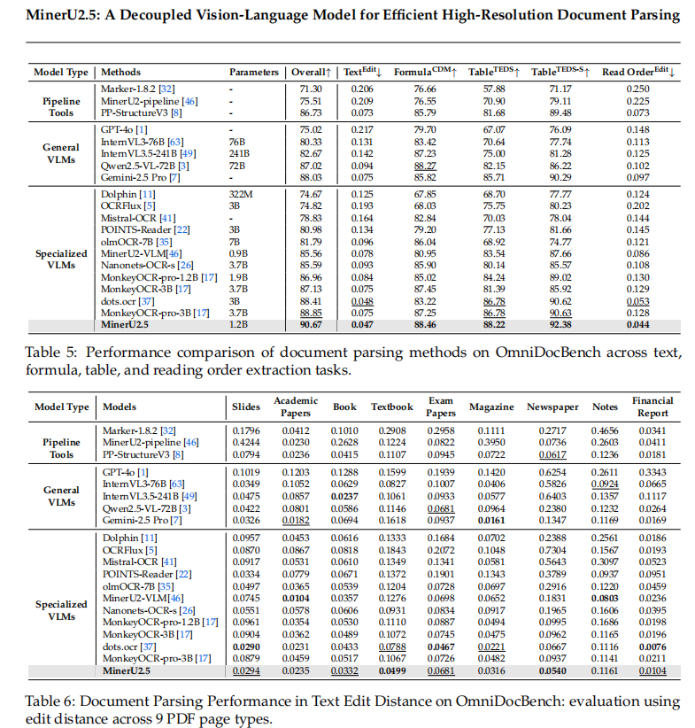
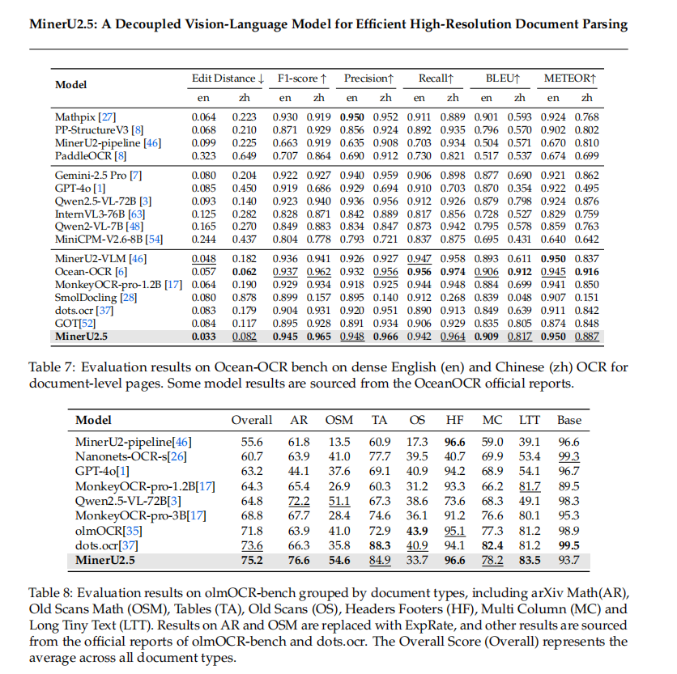

## 一、相关模型调研
测评效果的比对主要采用手头所有的经过挑选的有代表性的共44页6组投标文档，人工进行比对。
### 1.1  MonkeyOCR
 https://github.com/Yuliang-Liu/MonkeyOCR
#### 1.1.1  MonkeyOCR
Demo：http://vlrlabmonkey.xyz:8891
部分解析效果展示：
 
| ||
|--|--|
 | ||
| ||
| ||
 
平均解析速度为3.2s/页
MonkeyOCR在用以测试的投标文件中表现较差，出现内容缺失，页眉跨页表格错误分类，表格覆盖不全的情况，问题较多，除了解析速度并未发现其他比MinerU2.5的vlm解析效果好的地方，故不予采用。
#### 1.1.2  MonkeyOCR v1.5
Demo:https://aiwrite.wps.cn/pdf/parse/web/
11月中旬出的，解析效果较MonkeyOCR有了很大提升，在页眉标题识别这一块的效果优于MinerU2.5和Dolphin v2。
部分解析效果展示（2026.01.22重新测评）：
| ||
|--|--|
| ||
| ||
| ||
| ||
| |

平均解析速度为3.1s/页
分类效果除表格外都没出问题，边界框覆盖很全面，整体效果比MinerU2.5的vlm还好，但跨页表格分类还是不准确，不能进行跨页合并。
MonkeyOCR v1.5出来时demo和代码似乎未更新完全，当时测验效果跟MoonkeyOCR一致，故后续优化MinerU2.5时未考虑该模型。
### 1.2 FluxOCR
Demo：https://ocrflux.pdfparser.io/#/
简单展示用Demo测验的效果。Demo只支持3页，且每日解析数量有上限，所以体现的问题并不全面。
部分解析效果展示：
| ||
|--|--|
|||

解析速度也在3s/页，跨页表格、页眉分类错误，分级有时会出错。跨页表格合并效果不错，但有时又不能合并。

###  1.3  Logics-Parsing 
https://github.com/alibaba/Logics-Parsing
Demo：https://www.modelscope.cn/studios/Alibaba-DT/Logics-Parsing/summary
阿里的，文章里写的是比MinerU2好
1. 部分解析效果展示：
    | ||
    |--|--|
    | ||
    | ||
    | ||
    | ||
    | ||

    解析速度在2.6s/页。基本无大问题，页眉分类结果不稳定，一次能分类出来再识别一次就分类错误了（见最后两张），有的会直接错误分类为页眉（见第7、8张）。因为用的Demo网页，所以倒数第4张的表格转换后看起来空白单元格还在（见倒数第3张），实际Markdown里是没有的。
1.  技术原理:
* 基于 Qwen2.5-VL-7B：Logics-Parsing 以强大的 Qwen2.5-VL-7B 模型为基础，继承了其在视觉和语言处理方面的优势。
* 两阶段训练：第一阶段是监督微调，模型学习生成结构化的 HTML 输出；第二阶段是布局为中心的强化学习，通过文本准确性、布局定位和阅读顺序三个奖励组件优化模型。
* 强化学习优化：通过强化学习，模型能更好地理解文档的布局和内容的逻辑顺序，生成更准确的结构化输出。
*  结构化 HTML 输出：模型能将文档图像转换为结构化的 HTML 格式，保留文档的逻辑结构，每个内容块都有类别、边界框坐标和 OCR 文本标签。
* 高级内容识别：模型能准确识别复杂科学公式、化学结构和手写中文字符，将化学结构转换为标准的 SMILES 格式。
* 自动去除无关元素：模型能自动识别并过滤掉页眉、页脚等无关元素，专注于文档的核心内容。
### 1.4 chandra 
https://github.com/datalab-to/chandra
Demo：https://www.datalab.to/playground
布局分析结果和MinerU的vlm效果一样（Demo演示，只能用基础版的，他还有一个更精确的），跨页表格还是会分类错误。
表格markdown输出直接用的markdown格式而非html，呈现效果一般
目前标题分级里做的最好的了，几乎没有把正文误识别为标题的情况。

### 1.5  Paddlex
https://huggingface.co/PaddlePaddle/PaddleOCR-VL
#### 1.5.1  [PaddleOCR-VL](https://github.com/PaddlePaddle/PaddleOCR)
Demo：https://aistudio.baidu.com/paddleocr
1. 两阶段方案，由layout+VLM组成:
   * 阶段1：PP-DocLayoutV2，负责布局分析，定位语义区域并预测其阅读顺序。PP-DocLayoutV2结构式RT-DETR以及一个具有六个transformer层的轻量级指针网络，以准确预测布局元素的阅读顺序。
   * 阶段2：PaddleOCR-VL-0.9B对文本、表格、公式和图表进行ocr format。模型结构类似LLaVA：
     * 视觉编码器：使用NaViT结构，从keye-vl初始化，支持原生分辨率输入（任意分辨率的图像而不会失真，从而减少幻觉）。
     * 连接器：随机初始化的2层MLP
     * 解码器：ERNIE-4.5-0.3B，引入3D-RoPE进一步增强了位置表示
 
2. [再看两阶段多模态文档解析大模型-PaddleOCR-VL架构、数据、训练方法](https://zhuanlan.zhihu.com/p/1962581920517986232)
        其中的第一阶段布局解析所用工具：[PP-DocLayoutV3](https://www.paddleocr.ai/main/version3.x/pipeline_usage/PP-StructureV3.html)
    https://zhuanlan.zhihu.com/p/1887627016414664307
    这个用解析效果不好，表格输出不换行，会把正文里的一些数字识别成公式。
#### 1.5.2 PP-StructureV3
同一个团队的，专门针对复杂文档的
Demo：https://www.modelscope.cn/studios/PaddlePaddle/PP-StructureV3_Online_Demo
这个演示用不，下代码看
处理速度 5s/页。效果上小问题比较多:
1. 表格识别上，定位分类没问题，未出现右下角日期签名分类错误情况，但是覆盖和具体内容识别会出问题。
2. 标题分级上的效果不理想，依旧有出现把正文内容识别为标题的情况
3. 文字识别会有缺漏的情况
4. 第五张图直接整个表格错乱了，不知是布局分析问题还是表格识别问题
5. 针对两栏的阅读顺序的编排上有些问题
部分解析效果展示：

|||
|--|--|
|||
||
### 1.6 olmOCR
[olmOCR](https://github.com/allenai/olmocr)
Demo：https://olmocr.allenai.org/
主要用于简单布局的文档，在简单布局的PDF上的表现确实比市面上同参数模型要优秀一点。主要还是想看看其在表格上的效果，不过还是一般。
处理速度：0.8s/页，少见的连横线都能给你识别还原出来。不看表格，分类识别效果还是不错的。没出现像minerU的vlm那样把左上角的附件介绍文本当作页眉的情况。
嵌套表格识别效果挺不错：

下一页就不太理想了：

技术原理
   * 文档锚定（Document-anchoring）：基与提取 PDF 页面中的文本块和图像的位置信息，与原始文本结合，形成提示（prompt）。提示与页面的栅格化图像一起输入到视觉语言模型（VLM）中。帮助模型更好地理解文档的结构和布局，减少因图像模糊或布局复杂导致的提取错误。
   * 微调的视觉语言模型（VLM）：基于 Qwen2-VL-7B-Instruct 的 7B 参数视觉语言模型。在包含 26 万页 PDF 的数据集上进行微调，适应文档处理任务。模型输出结构化的 JSON 数据，包含页面的元数据（如语言、方向、是否包含表格等）和自然阅读顺序的文本内容。
   * 高效推理与成本优化：用 SGLang 和 vLLM 等高效推理框架，支持大规模并行处理。基于优化硬件利用和推理流程，olmOCR 的处理成本极低，每百万页仅需 190 美元，远低于其他商业解决方案。
   * 鲁棒性增强：在遇到提取失败或重复生成时，自动重试并调整提示内容。自动检测页面方向并进行旋转校正，确保内容正确提取。

## 二、MinerU2.5
https://github.com/opendatalab/MinerU
Demo:https://mineru.net/OpenSourceTools/Extractor?source=github

### 2.1 背景
1. 文档解析的重要性
文档解析是多模态理解的基础任务，支撑信息抽取、检索增强生成（RAG）、智能文档分析等关键应用。与自然图像不同，文档图像具有分辨率高、内容密集、布局复杂等特点，对模型的细节捕捉和效率平衡提出更高要求。

2. 现有方法的局限性
   * 传统流水线方法：将任务拆解为布局检测、文本识别等独立模块，存在误差传播问题，且模块间依赖复杂，维护成本高。
   * 通用视觉语言模型（VLMs）：如 Gemini-2.5 Pro、Qwen2.5-VL-72B，虽具备一定语义建模能力，但处理高分辨率文档时效率低下，且易产生幻觉。
   * 领域专用端到端模型：如 dots.ocr、MonkeyOCR，虽统一了任务流程，但原生分辨率处理带来 O (N²) 的计算复杂度，长文档解析时性能和效率难以兼顾。
   * 核心挑战：高分辨率文档的细节保留与计算效率的平衡、复杂布局 / 公式 / 表格的精准识别、数据多样性与标注质量不足。

### 2.2 整体介绍
MinerU2.5是上海人工智能实验室联合北京大学、上海交通大学等高校研发的1.2B参数轻量化视觉语言模型，专注于高分辨率文档的高效精准解析，核心围绕“解耦架构+专项优化+闭环训练”三大方向设计，在保证文本、公式、表格等核心元素SOTA识别精度的同时，大幅降低计算开销，支持中英双语及模糊、水印、旋转等复杂场景，适用于学术、金融、教育等多领域的文档结构化处理。

#### 2.2.1 核心关键技术
1. 两阶段解耦解析策略：先将高分辨率文档下采样至1036×1036像素缩略图，快速完成全局布局分析（识别元素位置、类别、旋转角度、阅读顺序）；再基于布局结果，从原始图像中裁剪原生分辨率区域，并行进行局部内容识别，避免计算冗余与细节丢失。
2. 专项任务优化方案：公式识别采用ADR框架（分解复合公式为原子公式，识别后重组为LaTeX）；表格识别通过OTSL中间表示简化结构，再转换为HTML，适配旋转、无边界等复杂表格；布局分析采用多任务融合范式与PageIoU评估指标，提升结构化准确性。
3. 轻量化高效架构：由675M参数NaViT视觉编码器（支持动态分辨率）、Patch Merger（模态对齐与特征聚合）、0.5B参数Qwen2-Instruct语言解码器（M-RoPE编码增强泛化）组成，兼顾性能与部署效率。
4. 闭环数据与三阶段训练：通过数据引擎筛选多样数据、优化标注质量，结合IMIC策略挖掘难例；训练分三阶段递进（模态对齐奠基→6.9M样本预训练构建核心能力→630K样本微调优化复杂场景）。

#### 2.2.2 整体流程
- 推理流程：输入高分辨率文档图像→阶段一（下采样生成缩略图，快速输出全局布局信息，明确各元素的关键属性）→阶段二（按布局裁剪原生分辨率的文本、公式、表格等局部区域，分别完成OCR识别、LaTeX转换、OTSL→HTML解析，并行解码提升效率）→合并结果，输出结构化文档（含完整内容与排版信息）。
- 训练流程：通过闭环数据引擎收集多类型文档数据，经筛选、标注优化、难例挖掘构建高质量数据集→依次完成模态对齐训练、文档解析预训练、复杂场景微调，持续迭代优化模型性能→最终实现文本、公式、表格等元素的SOTA识别精度，且计算开销低，支持中英双语及模糊、水印、旋转等复杂场景，适用于学术、金融、教育等多领域文档结构化处理。
  
### 2.3 核心关键技术详解
#### 2.3.1 整体架构
模型基于 Qwen2-VL 框架优化，由三大核心模块组成，总参数量仅 1.2B，兼顾轻量化与高性能：
* **视觉编码器**：基于 2B参数的Qwen2-VL-Instruct 初始化，替换窗口注意力为全局自适应注意力，避免文档解析中细节丢失；核心为675M 参数的 NaViT 模型，支持动态分辨率输入，采用 2D-RoPE 位置编码，适配不同尺寸和宽高比的文档区域。
* **语言解码器**：0.5B 参数的 Qwen2-Instruct，替换传统1D-RoPE 为 M-RoPE（多维旋转位置编码），增强对不同分辨率裁剪区域的泛化能力，支持最大16384序列长度输出。
* **Patch Merger 模块**：作为视觉编码器与语言解码器的桥梁，通过 2×2 像素重排（pixel-unshuffle）聚合视觉令牌，减少令牌数量的同时保留局部特征关联性；内置MLP适配器，专门负责视觉-语言模态对齐，平衡计算效率与任务性能。

#### 2.3.2 Two-Stage Parsing Strategy 解耦式两阶段解析策略
1. 第一阶段：全局布局分析
   将文档图像下采样至 1036×1036 像素的固定尺寸缩略图，高效完成全局布局分析，识别标题、文本、表格等结构元素，避免直接处理高分辨率图像的 O (N²) 复杂度，同时固定尺寸设计提升边界框定位稳定性。
   输出标准化JSON格式，包含四大核心属性：
   * 位置：通过边界框（x1,y1,x2,y2）定位元素坐标。
   * 类别：区分标题、文本块、表格、公式、图像、页眉、页脚等 18 + 细粒度类别（基于统一标签体系）。
   * 旋转角度：判断元素是否旋转及旋转方向（上、下、左、右），为后续校正做准备。
   * 阅读顺序：预测元素的逻辑阅读顺序，避免解析结果杂乱。
   输出格式示例：`<<|box_start|>163 81 836 129<<|box_end|><<|ref_start|>table_caption<<|ref_end|><<|rotate_up|>`

2. 第二阶段：局部内容识别
   基于布局分析结果，从原始图像中裁剪提取原生分辨率的局部区域，裁剪尺寸上限为 2048×28×28 像素（平衡细节保留与计算量），针对性进行文本、公式、表格的细粒度识别，保留 dense text、复杂公式、表格的关键细节；多个局部区域支持并行解码，提升整体推理效率。

#### 2.3.3 三阶段递进式训练
1. 阶段 0（模态对齐）：奠定视觉-语言对齐与OCR基础
   * 目标：让模型掌握视觉-语言对齐的基础能力，同时具备初步OCR识别能力。
   * 两步训练：
     * 第一步（语言-图像对齐）：冻结视觉编码器和语言解码器，仅训练 Patch Merger 中的 MLP 适配器。使用 558K 图像-文本对，将视觉特征投影到语言模型的嵌入空间，实现模态表示统一。
     * 第二步（视觉指令微调）：解冻所有参数，使用 665K VQA 数据集（涵盖图像描述、视觉对齐、OCR任务），让模型学会遵循文本指令处理视觉任务，强化OCR精度。
   * 关键作用：跳过此阶段会导致模型 OCR 错误率上升 40%，整体性能下降 7.2 分，为后续文档解析能力打基础。

2. 阶段 1（文档解析预训练）：构建核心解析能力
   * 目标：让模型掌握布局分析和各类元素识别的基础能力，形成任务范式。
   * 训练数据：6.9M 大规模样本，按任务拆分：
     * 布局分析：2.3M 样本，覆盖多类文档布局（单栏、多栏、跨页）。
     * 文本块识别：2.4M 样本，包含中英双语、不同字体/字号的文本。
     * 公式识别：1.1M 样本，涵盖原子公式、复合公式等多样形态。
     * 表格识别：1.1M 样本，包含有边界、无边界、旋转等表格类型。
   * 训练策略：
     * 全参数可训练，使用任务特定提示词（如 “Layout Detection:”“Formula Recognition:”）引导模型聚焦任务。
     * 序列长度设为 8192，适配长文档的特征序列处理。
     * 批量大小 256，学习率 4×10⁻⁶，训练 2 个 epoch，确保模型充分学习基础范式。

3. 阶段 2（文档解析微调）：优化复杂场景性能
   * 目标：提升模型在挑战性场景下的性能，同时保留已掌握的基础能力，避免过拟合。
   * 训练数据：630K 高质量样本，兼顾 “泛化性” 与 “针对性”：
     * 基础样本：从预训练数据中筛选 10% 的高质量样本，确保基础能力不退化。
     * 难例样本：通过IMIC（基于推理一致性的迭代挖掘）策略挖掘的复杂场景样本（人工标注），包括旋转表格、模糊公式、多列文本、水印文档等。
   * 训练策略：
     * 全参数微调，序列长度提升至 16384，适配长表格、长公式的输出需求。
     * 批量大小 256，学习率 4×10⁻⁶，训练 3 个 epoch，重点优化难例场景的损失函数。
     * 加入数据增强：对文本块、公式、表格样本施加缩放、网格畸变、旋转等空间变换增强（布局分析样本不增强，避免破坏结构信息），提升模型鲁棒性。

#### 2.3.4 专项任务优化设计
1. 布局分析优化
   * 统一标签体系：覆盖页眉、页脚、代码块、参考文献等18+细粒度元素，包含非正文内容，满足RAG等下游应用的完整信息需求。
   * 多任务融合范式：同步预测元素的位置、类别、旋转角度和阅读顺序，解决旋转元素识别难题，简化流水线，避免误差传播。
   * 评估指标适配：引入PageIoU指标，通过页面级像素覆盖度衡量布局预测准确性，解决传统IoU与视觉评估不一致的问题。

2. 公式识别：ADR（原子分解与重组）框架
   * 核心思路：将复合公式（多线、嵌套）拆分为原子公式（最小语义单元，如单个分数、矩阵），降低识别难度。
   * 处理流程：先通过布局分析定位公式区域并拆分原子公式，再逐一识别为LaTeX格式，最后基于位置信息重组为完整公式，避免结构幻觉，支持中英双语混合公式识别。

3. 表格识别：OTSL（优化表格结构语言）中间表示
   * 核心优化：将传统HTML表示的28+结构令牌缩减至5个，序列长度缩短50%，降低长表格解析的计算压力。
   * 处理流程：先基于布局分析结果校正表格旋转角度，再识别为OTSL格式，最后转换为标准HTML，适配无边界表格、合并单元格、彩色背景表格等复杂场景。

#### 2.3.5 部署优化
* 推理框架：基于vLLM框架构建高效推理管线，支持异步批处理，优化CPU与GPU任务重叠率，提升整体吞吐量。
* 阶段解耦部署：将布局分析与内容识别拆分为独立推理任务，无需等待整批完成即可启动下游处理，降低端到端延迟。
* 动态参数调整：根据布局类型动态调整频率惩罚和存在惩罚参数，抑制文本段落的令牌重复，同时不影响表格、公式等结构化内容的输出。
* 性能表现：在A100显卡下，吞吐量达2.12页/秒，令牌生成速度2337.25 tokens/秒，较dots.ocr快7倍。

### 2.4 数据集
#### 2.4.1 评估数据集
1. OmniDocBench
数据构成：涵盖学术论文、教材、财务报告、幻灯片、考试卷、手写笔记、报纸、杂志、普通文档 9 类核心场景，补充 374 页文档平衡中英分布，强化数学公式覆盖。
评估优化：采用混合匹配算法，统一评估文本、公式、表格、阅读顺序四大核心任务，整体得分通过「(1 - 文本编辑距离)×100 + 表格 TEDS + 公式 CDM」加权计算。
2. Ocean-OCR Benchmark
数据来源：英文数据源自学术论文，中文数据涵盖教材、报告等真实场景，聚焦高密度文本解析需求。
评估重点：核心衡量文本识别的准确性与完整性，指标包括归一化编辑距离、F1-score、精确率、召回率、BLEU、METEOR 等，全面反映 OCR 性能。
3. olmOCR-bench
子集划分：包含 arXiv Math（学术公式）、Old Scans Math（老旧扫描件公式）、Tables（复杂表格）、Old Scans（低质量扫描件）、Headers Footers（页眉页脚）、Multi Column（多列文本）、Long Tiny Text（长微小文本）7 个子集。
评估调整：将 arXiv Math 和 Old Scans Math 的公式评估指标替换为 ExpRate（基于渲染结果的精确匹配率），避免 LaTeX 语法差异导致的评分偏差。
#### 2.4.2 评估环境与标准
* 硬件配置：所有模型统一在 A100 80G、RTX 4090 48G、H200 141G 显卡下测试，确保硬件一致性。
* 推理协议：采用各模型官方推理脚本，基于 vLLM 框架（MinerU2.5）或对应官方后端，排除启动开销，按批处理并行测试。
* 指标统一：针对不同任务采用行业标准指标（文本用编辑距离、公式用 CDM、表格用 TEDS/TEDS-S、布局用 PageIoU），确保跨模型对比的公正性。

### 2.5 核心优势与性能表现
1. 综合性能领先：在OmniDocBench基准中整体得分90.67，超越MonkeyOCR-pro-3B（88.85）、dots.ocr（88.41）等主流模型；文本识别编辑距离0.047、公式识别CDM得分88.46、表格识别TEDS-S得分92.38，均居行业前列。
2. 多场景适配性强：在学术论文、教材、财报、手写笔记等9类文档中，6类取得最佳或次佳表现，支持模糊、水印、旋转等复杂场景，兼容中英双语。
3. 轻量化高效：1.2B参数规模仅为同类模型的40%，部署成本降低50%以上，兼顾精度与落地实用性。

## 三、Dolphin v2
### 3.1 研究背景与核心定位
####  3.1.1 行业痛点
文档图像解析需从包含文本段落、图表、公式、表格等交织元素的图像中提取结构化内容，是下游内容分析的基础能力。现有方案存在明显局限：
- 集成式方法：串联多个专业模型（布局检测、OCR、元素识别等），需独立优化各组件，存在系统复杂度高、跨模型协调难的问题。
- 自回归端到端方法：依赖通用或专家VLMs直接生成页面内容，虽能融合多模态特征，但面临布局结构退化、长文档解析效率低的瓶颈。

####  3.1.2 核心目标
Dolphin系列模型旨在协同两种方案的优势，通过创新范式实现：
1. 高精度解析：兼顾页面级布局还原与元素级内容识别（文本、公式、表格、代码块等）。
2. 高效能运行：轻量化架构降低部署成本，并行处理机制突破效率瓶颈。
3. 强通用性：适配中英双语、复杂布局（单/多列）、多种文档类型（学术论文、商业报告、截图、拍照文档等）。

### 3.2 核心技术架构
####  3.2.1 整体范式：Document-Type-Aware Two-Stage Architecture
基于Qwen2.5-VL骨干网络，采用文档类型感知的两阶段流程，核心是通过可扩展锚点提示（Scalable Anchor Prompting）实现精准与高效的平衡。

#### 3.2.2 Stage 1：联合分类与布局分析
1. 文档类型分类
   - 区分数字原生文档（digital-born）与拍照文档（photographed），针对拍照文档的畸变进行专门处理。

2. 页面图像编码
      - 采用**NaViT（Native Resolution Vision Transformer）**作为视觉编码器，能够处理不同分辨率的输入图像。
      - 输入图像处理：保持宽高比，将长边调整至合适尺寸，避免文本失真。
      - 输出：视觉嵌入，捕捉全局布局与局部文本细节。

3. 布局序列生成
   - 解码器：基于Qwen2.5-VL的自回归解码器。
   - 核心输出：生成符合自然阅读顺序的布局元素序列，支持21类常见文档元素（详见表5，包括新增的代码块等）。
   - 关键设计：使用绝对像素坐标进行更准确的空间定位。

#### 3.2.3 Stage 2：混合内容解析
1. 元素图像编码
   - 基于Stage 1的边界框，从原始图像中裁剪出单个元素的局部视图。
   - 采用与Stage 1相同的NaViT，对所有局部视图进行编码，生成元素专属视觉特征。

2. 混合解析策略
   - **拍照文档**：整体页面级解析，处理现实世界的畸变。
   - **数字文档**：并行元素级解析，使用类型特异性提示策略：
     - 表格：使用专属提示\(P_{table}\)，解析为HTML格式。
     - 文本段落：使用提示\(P_{paragraph}\)，输出纯文本。
     - 公式：使用专属提示\(P_{formula}\)，输出LaTeX格式。
     - 代码块：新增专属提示\(P_{code}\)，解析为带缩进的结构化代码。
   - 优势：并行处理提升效率，聚焦局部上下文降低复杂元素识别误差。

#### 3.2.4 模型关键参数
| 组件 | 配置细节 |
|------|----------|
| 骨干网络 | Qwen2.5-VL-3B |
| 视觉编码器 | NaViT（Native Resolution Vision Transformer） |
| 解码器 | 自回归Transformer解码器 |
| 模型规模 | 3B参数 |
| 优化器 | AdamW，学习率待定 |
| 训练配置 | 大规模分布式训练 |

### 3.3数据集构建（大规模多粒度数据集）
#### 3.3.1 数据构成
延续原Dolphin的数据构建策略，进一步扩展以支持更多元素类型和文档类型，包括拍照文档的合成数据。

#### 3.3.2 数据优势
- 多粒度覆盖：页面级与元素级数据结合。
- 多样性增强：通过合成数据提升视觉多样性，包括拍照文档的畸变模拟。

### 3.4 实验结果与性能分析
#### 3.4.1 评估基准
同原Dolphin，采用OmniDocBench等综合基准。

#### 3.4.2 核心性能表现
1. 综合性能（OmniDocBench v1.5）
    | 模型 | 参数规模 | 总体得分↑ | 文本编辑距离↓ | 公式CDM↑ | 表格TEDS↑ | 表格TEDS-S↑ | 阅读顺序编辑距离↓ |
    |------|----------|-----------|--------------|----------|----------|-------------|------------------|
    | Dolphin（原版） | 0.3B | 74.67 | 0.125 | 67.85 | 68.70 | 77.77 | 0.124 |
    | Dolphin-1.5 | 0.3B | 85.06 | 0.085 | 79.44 | 84.25 | 88.06 | 0.071 |
    | Dolphin-v2 | 3B | **89.78** | **0.054** | **87.63** | **87.02** | **90.48** | **0.054** |

1. 元素级解析
   - 文本段落：继续保持高精度。
   - 公式：专用模块提升LaTeX生成质量。
   - 表格：HTML结构化输出。
   - 代码块：新增支持，保持缩进结构。

2. 额外能力验证
   - 文本框查询：精准解析指定边界框内的文本内容。
   - 文本检测（Text Spotting）：检测并识别图像中所有文本行。
   - 非标准文档适配：成功解析手机截图、购物小票、网页捕获图，以及拍照文档的畸变。

#### 3.4.3 消融实验
验证核心组件的有效性，类似原版但针对v2的混合策略和扩展元素类型。

### 3.5 Dolphin v2架构改进
#### 3.5.1 核心架构升级
1. 骨干网络升级：从原Dolphin的轻量架构升级至Qwen2.5-VL-3B，提供更强的多模态理解能力。
2. 视觉编码器升级：采用NaViT，更好地处理变分辨率输入。
3. 文档类型感知：新增文档类型分类，区分数字与拍照文档。
4. 混合解析策略：针对不同文档类型采用最优解析方式。
5. 元素类型扩展：从15类扩展至21类，新增代码块等专用支持。
6. 跨模态融合增强：基于Qwen2.5-VL的强大融合能力。

#### 3.5.2 阶段优化细节
| 阶段 | 改进点 | 效果 |
|------|--------|------|
| 布局分析（Stage 1） | 联合分类与分析，使用绝对坐标定位 | 提升布局精度，支持更多元素类型 |
| 内容解析（Stage 2） | 混合策略 + 扩展提示体系（新增\(P_{code}\)，优化\(P_{formula}\)，\(P_{table}\)，\(P_{paragraph}\)) | 适配拍照文档，增强代码块解析能力，输出更灵活 |

#### 3.5.3 输出格式增强
支持同步输出多种格式：纯文本、HTML（表格）、LaTeX（公式）、带缩进的代码块、Markdown结构化文档，满足下游多样化应用需求。

### 3.6 局限与未来方向
#### 3.6.1 现有局限
1. 竖排文本解析能力有限。
2. 多语言支持需进一步扩展。
3. 效率仍有优化空间。
4. 手写体识别能力待加强。

#### 3.6.2 未来计划
1. 扩展多语言支持。
2. 增强竖排和手写体处理。
3. 进一步优化并行粒度。
4. 支持3D文档跨页关联解析。

### 3.7 核心资源与贡献
#### 3.7.1 开源资源
- 代码与预训练模型：https://github.com/ByteDance/Dolphin
- 自研基准数据集：OmniDocBench等

#### 3.7.2 核心贡献
1. 提出文档类型感知两阶段范式，平衡集成式与端到端方法的优缺点。
2. 创新可扩展锚点提示与混合解析机制，实现3B参数模型的SOTA性能。
3. 构建大规模数据集，支持21种元素类型的全面解析。
4. Dolphin v2显著提升通用性，特别针对拍照文档和代码块等复杂场景。

